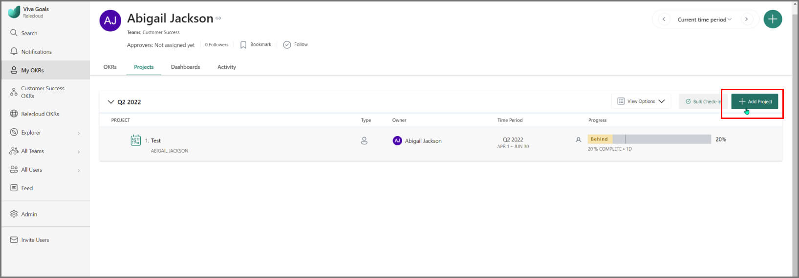
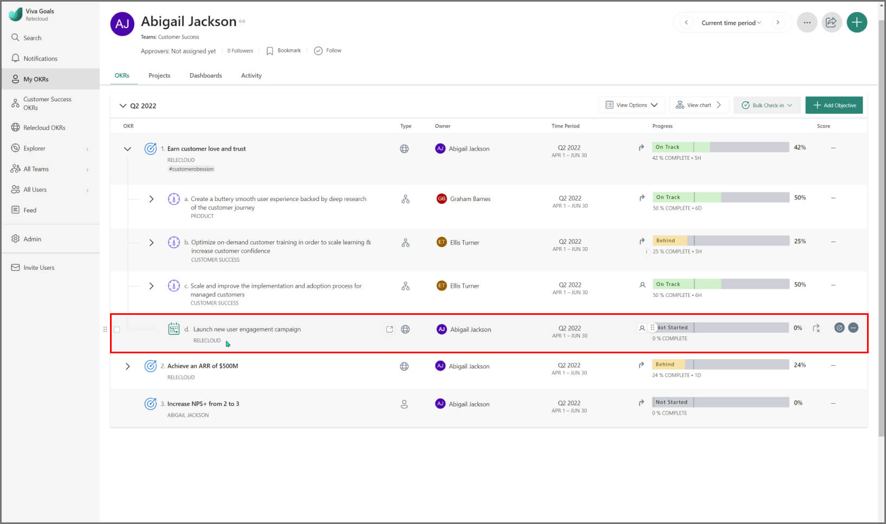
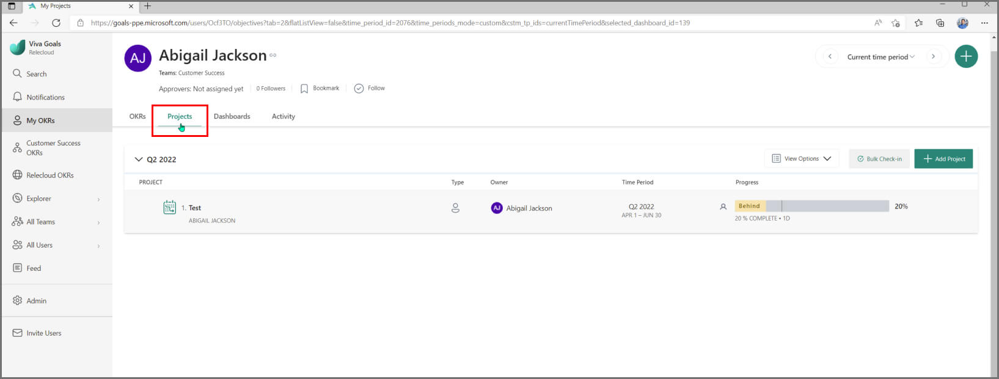
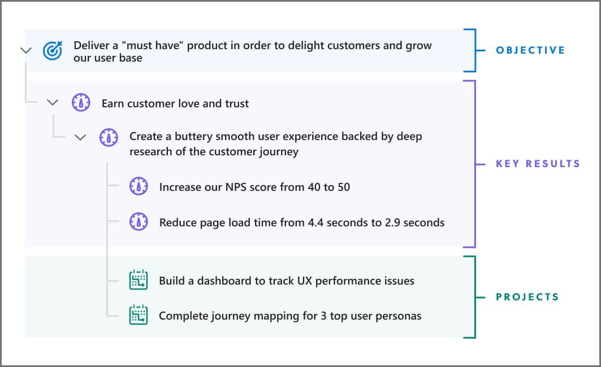
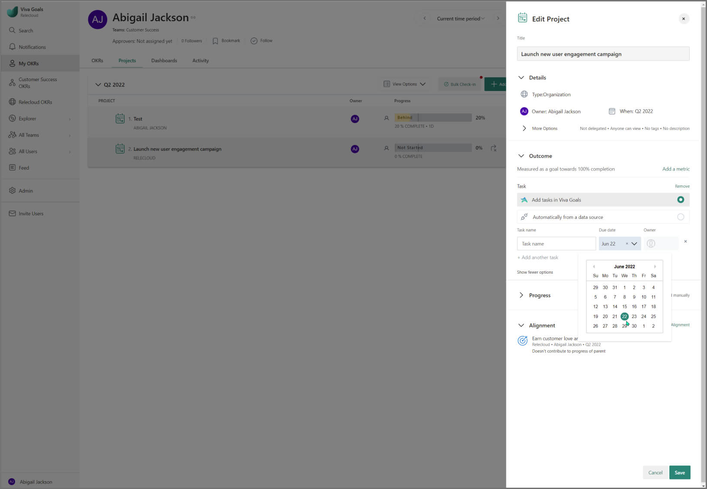

# Projects

> [!IMPORTANT]
> Viva Goals is currently available only for private preview customers, and only in English. The features described here are subject to change. Viva Goals is only being released to WW tenants. It isn't being released to GCC, GCC High, or DoD environments. [Learn more about Viva Goals.](https://go.microsoft.com/fwlink/?linkid=2189933)

Projects help you keep track of all the work your organization is executing to achieve your Objectives and Key Results (OKRs). Like key results, projects can also be created under objectives and other key results in Viva Goals, depending on which outcome they help to achieve. Select **Add project** under the appropriate objective or key result to create a project.

There are **two ways of adding Projects in Viva Goals** – you can bring projects to Viva Goals through an integration with the project management tool you use, or you can create a project with a task list directly in Viva Goals.

## How to add Projects directly in Viva Goals

- From the list view of your OKRs, you will find an option to **Add Project** underneath the corresponding objective or key result.

- Alternately, you can add projects from the **Projects tab** where your entire list of projects will be populated.

- Provide the project details — title, type (individual, team, or organizational project), the project owner, and the time period.

- Under the **Outcome section**, you'll find two options to break down your project — either into milestones or by adding tasks to your project. 

- As for adding tasks to your project, there are two ways in which you can add tasks — either directly in Viva Goals or through an integration.

- You can **add tasks directly** by providing details such as task name, due date and owner.

    > [!NOTE]
    >
    > For key performance indicator (KPI) based projects:
    >
    > - If you are adding a KPI-based project, select **Add a metric** to specify the metrics of your project — the starting and target value, the unit, and what the metric is.
    >
    > - You can add tasks to your KPI-based project by selecting **Add tasks**. The task details you need provide are the task name, the owner, and the due date.
    >
    > - However, these tasks will not roll up to the project. You will still have the option to update the project progress either manually or automatically through an integration but you cannot update the progress automatically based on the completed tasks (though you can add tasks).
    >
    
    >
- Once you've added your tasks, the next step is determining how the progress of the project will be calculated:

  - With tasks — project progress can be calculated either manually or automatically based on the completed tasks.

  - Without tasks — project progress will be calculated automatically from the connected data source.

- Align the project to an objective or key result, and select **Save**.

Native projects can be seen on the OKR and Projects tabs for your entity showing the manual or rollup icon, implying that the progress is being updated either manually or based on the completion of native project tasks.

    
## How to clone Projects
    
Cloning projects is a quicker way of creating new projects while retaining the existing settings, and tasks pertaining to the cloned project. Towards the end of a stipulated time period (for instance, end of a quarter), you might not have been able to make desired progress on a few projects, and might not have been able to get started on a few of them. You can carry unfinished projects in Viva Goals to the subsequent time period by simply cloning them. This is an efficacious method to roll over unfinished projects than editing the time period.

### When to clone Projects

Cloning projects makes sense for you when: 

1. You need to set new projects for the current time period quickly

2. You need to carry over unfinished projects to a new time period

### How to clone Projects

1. Against a specific project, select **More actions** icon, and select **Clone**.

2. From the dialogue box, configure the following:  

    **Time period:** Viva Goals will default to the current time period (useful if you’re duplicating projects). If you're carrying over unfinished projects, select the appropriate time period from the dropdown menu.

    **Owner:** Choose to either retain the original owner, or assign a new one.

    **Entity type:** The Project can be assigned to an organization, a particular team, or a specific user.

    **Alignment:** By default, the cloned project will be unaligned. Select **Add alignment**, if you want the project to align with an objective.

    > [!NOTE]
    > Unaligned OKRs will be displayed only in the Projects dashboard, and not in the current time period view. Unless you align the project to an objective, you will not be able to see the Project in the current time period view.
    
## How to access your Projects Dashboard

In addition to being aligned to OKRs, projects also get their own dashboard in Viva Goals, so that you can monitor your execution. The dashboard is available at the individual, team and organization levels.

    
## How to understand Project progress and status

Progress in Viva Goals is measured either as percentage complete or a key performance indicator (KPI) metric (for example, 10 out of 15 sales calls made). Projects currently use only the percentage complete method, as measured by tasks completed within the project.

By default, project progress does *not* roll up to the parent, to keep the focus on achieving key results (For more information, see: **[Roll Up Process of Key Results](https://help.ally.io/en/articles/1931651-roll-up-of-progress-of-key-results)**). However, this is controlled by an admin setting and can be overridden on a per project level. The admin setting decides the default (whether progress rolls up or not) when projects are created. Should you decide this default doesn't apply to your project, you can always change it from the project's settings.

Viva Goals compared the progress of an item with its expected progress and computes a Status as outlined here **([OKR Status Indicators](https://help.ally.io/en/articles/3065807-okr-status-indicators))**. Status for projects is also computed in the same manner as OKRs.

**Project owners can do manual check-ins to provide the progress values (or) connect to a data integration to automatically update progress.**

You can choose to have a project without any tasks in Viva Goals and check in manually to update the project progress.

If you would like to see the individual tasks in your project, you can create a task list directly in Viva Goals. Viva Goals also supports popular project management systems like JIRA, Asana and Wrike, with many more on the way. When you use a task list in Viva Goals or connect to these systems, progress of the project is automatically computed based on the number of tasks completed vs outstanding. You can edit a project to add an integration after creating it without one. When that happens, project progress will be recomputed based on the tasks, however your previous history of checkins will be maintained. You can read about Viva Goals' support for task lists, and popular integrations here:

- **[Native Projects](https://help.ally.io/en/articles/4397690-native-projects-in-ally)**

- **[Jira Integration with Projects](https://help.ally.io/en/articles/4097674-better-jira-integration-with-projects)**

- **[Asana Projects](https://help.ally.io/en/articles/4238088-asana-projects-in-ally)**

- **[Wrike Projects](https://help.ally.io/en/articles/4510436-wrike-projects-in-ally-io)**
    
## How to structure objectives, key results, and Projects in Viva Goals

The recommended structure for OKRs and projects in Viva Goals is to have key results and projects under the objective. This way, you can see the outcomes needed to meet the outcomes (the key results) and the output needed to achieve those outcomes (the projects). Projects are always placed after all the objectives and key results at each level of the hierarchy. 

## How to manually order the tasks of a Project

Users can sort the tasks by *Name*, *Assignee* or *Due Date*.

Select either **Name**, **Assignee** or **Due Date** columns to expand the sort options.

> [!NOTE]
> This is possible only in the Full View of the Project that contains Tasks.

## How to add a due date for a task within a Project

You can add a due date to a task within a project, even if the task is due after the project time period ends. 

For example, if the project has been created for Q4 2021 (October 2021 to December 2021), the user will be able to add a task with a due date of January 2022.

> [!NOTE]
> While saving the task, the application will indicate **Due date is after project’s end date** to the user but the task can still be saved.
> 

## How to find tasks in Viva Goals

You will find tasks listed under the Projects section.

## The difference between Key Results and Projects

Most key results that aren't KPI metric-based are projects. The main questions to ask are:

- Is this key result really an outcome for the business, or is it an output (something you do) on the way to an outcome (the result)?

- Can I follow the parent objective with **as measured by** and complete it with this key result in a convincing manner?

One good indicator that a key result may really be a project is if it's percentage-completion based and doesn't have any children. Another indicator is if the language is delivery-oriented, look for words like **Ship ...**, **Deliver ...**, **Implement...**.
