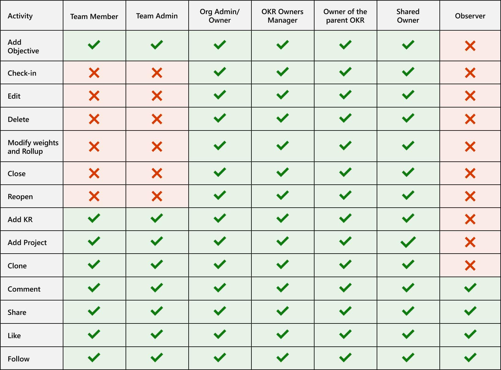
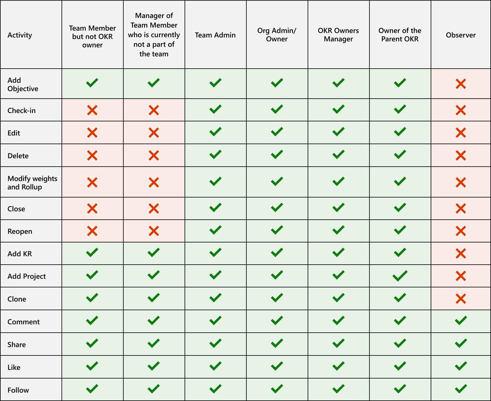
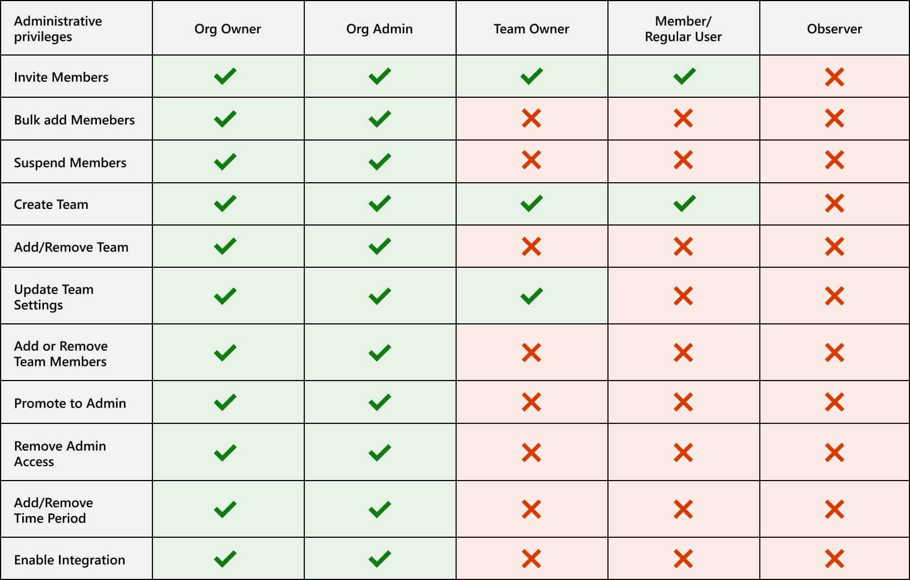
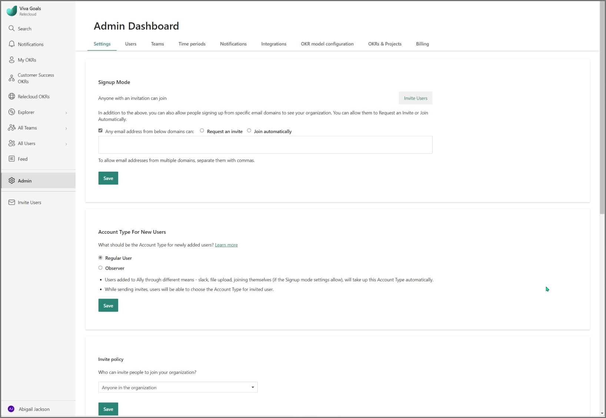
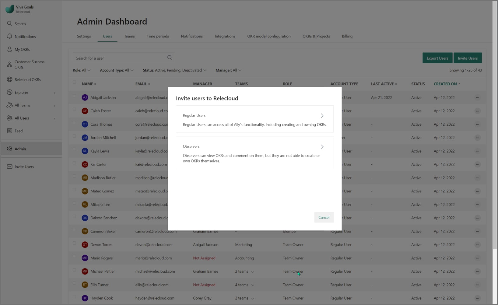
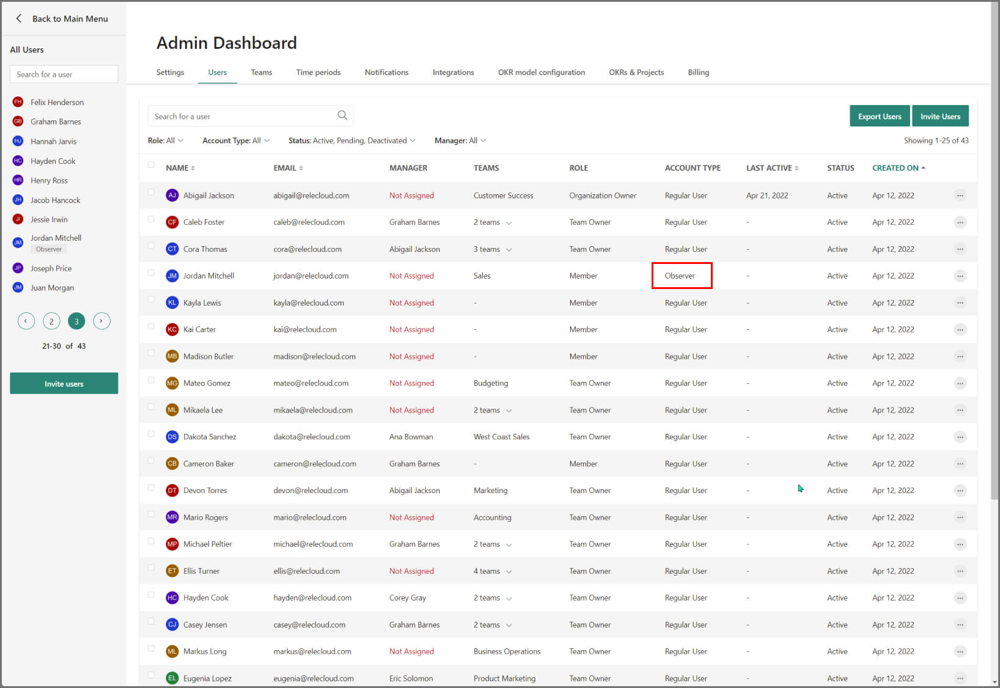
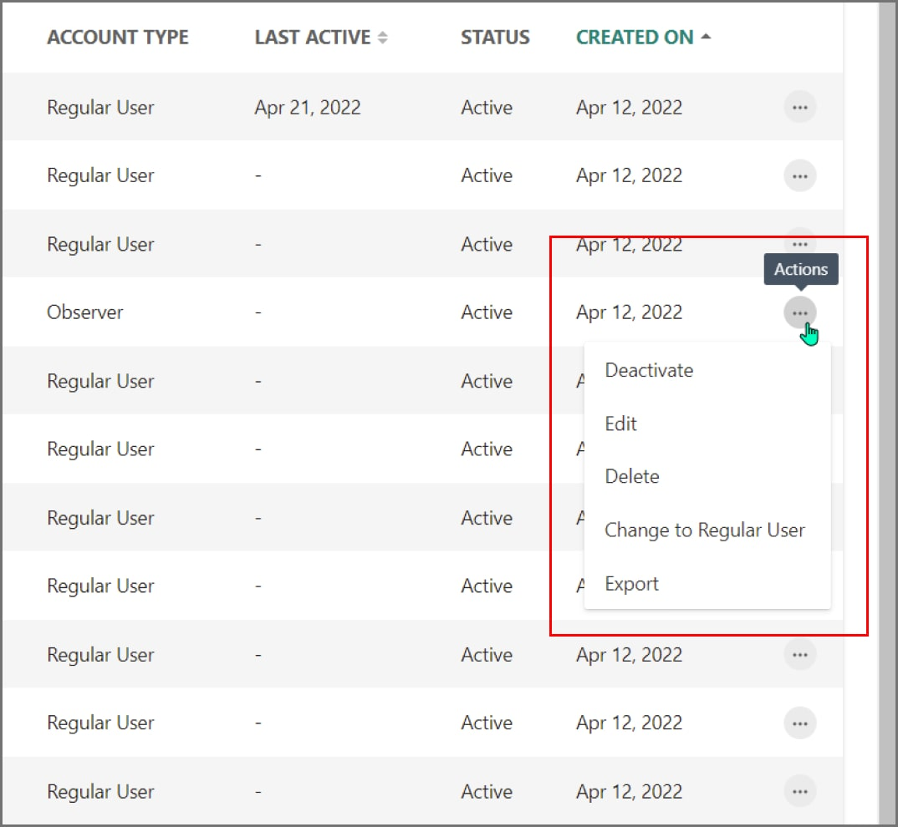

# Roles and permissions in Viva Goals

## Role types in Viva Goals

Let's begin with the basics: 

- In Viva Goals, a *creator* is a member who has created an objective. 
- An *owner* is a member who has been assigned an objective.
- *Organization administrators* and *organization owners* have all OKR permissions and can create, edit, and delete any objectives or check-ins. 
- *Observers* can't create, edit, or own OKRs but can view OKRs. 

Viva Goals supports the following full roster of roles within an organization.

|Role  |Description  |
|---------|---------|
|Members    |    Members (the default role for everyone) can set up and manage their individual OKRs and view all OKRs within the organization.     |
|Observers     |   Observers, as opposed to members, can't create, edit, or own OKRs. They can view all OKRs just like members.      |
|Managers     |    Managers are members who own their OKRs and the OKRs of employees who report to them.     |
|Team owners     |    Team owners are members who own their team members' OKRs.     |
|Team admins     |   Team administrators are members who can manage team members.      |
|Organization admins     |   Organizational administrators are members who manage the setup of the organization and can manage users and teams. An organization can have more than one organization administrator.      |
|Organization owner  |    Organizational owners manage members, teams, setup, and billing for the account. By default, they own organization-level OKRs, but organizational objectives can be owned by other members also.     |

## Permission levels on individual OKRs

The permission levels on individual OKRs are outlined here:

## Permission levels on team OKRs

The permission levels on team OKRs are outlined here:

## Create OKRs

By default, all members in the organization can create OKRs for themselves, other members, teams, or the organization. This privilege reduces the friction in setting up OKRs and facilitates alignment.

For example, a team member can propose a team-level objective by adding an objective of type **Team** and assign it to the team manager. The manager can respond by:

- Doing nothing
- Changing it to an individual's objective
- Deleting it

## Manage OKRs

### Who can edit and delete objectives?

**Individual objectives** 

- Creator
- Owner
- Team manager
- Parent objective owner

**Team objectives**

- Creator
- Owner
- Team manager
- Parent objective owner
- Team owner

**Organization objectives**

- Creator
- Owner
- Team manager
- Parent objective owner

By default, creators can edit and delete objectives that they created. These permissions allow them to correct any errors during creation, like an incorrect assignment.

### Who can check in, close, and reopen objectives?

**Individual objectives** 

- Owner
- Team manager
- Parent objective owner

**Team objectives**

- Owner
- Team manager
- Parent objective owner
- Team owner

**Organization objectives**

- Owner
- Team manager
- Parent objective owner

While the check-in process is largely restricted to members involved in the objective, Viva Goals encourages cross-team collaboration by letting anyone in the organization engage with check-ins, including viewing and liking check-ins, and adding and viewing comments.

## Administrative privileges

By default, all administrative privileges are restricted to members in an organization administrator or organization owner role.

### User management

Organization owners and organization administrators can:

- Invite members
- Bulk-add members
- Suspend members
- Update team member profiles (name, email, profile picture, manager)

Members can also update their own profiles.

### Team management

Organization owners and organization administrators can:

- Create teams
- Update team settings (name, description, team hierarchy)
- Add and remove team members

The team owner can add and remove team members.

### Administrator management

Organization owners and organization administrators can:

- Promote a team member to an administrator
- Revoke administrator access

### Other permissions

Organization owners and organization administrators can:

- Work on the behalf of another team member
- Add and remove time periods
- Enable integrations

Only the organization owner can:

- Manage billing and subscription

## User types in Viva Goals

Viva Goals supports two kinds of accounts:

- **Regular user**: Regular team members/users can access all Viva Goals functionality. They can create, update, and own OKRs. They can take on another responsibilities in Viva Goals, like administrator or manager.

- **Observers**: Observers can't create, edit, or own OKRs, but they can view all OKRs.

### Privileges of an observer

An observer is entitled to the following privileges:

- **See all OKRs:** This privilege enables an observer to be aware of, and aligned to, organization, teams, and user priorities, progress, and updates. 
- **Follow progress:** This privilege enables an observer to receive updates for relevant OKRs. 
- **Like and comment:** This privilege enables an observer to like and comment on OKRs, check in, and offer activity feed updates. 

### Adding users as an observer

You can set a default user type for new users from **Admin Dashboard** > **Settings**. 

If the value is set to **Observer**, users will be set as user type as **Observer** when they're added to an organization. Team members can choose between observer and regular user privileges when they invite a new user. 

### Identifying an observer

If the users have an **Observer** tag next to their name, they're an observer.

If you're an administrator, you can also look at user type from **Admin Dashboard** > **Users** > **User Type** column, as depicted in the following image:

### Changing account type of users

Administrators can change the user type from **Observer** to **Regular** and from **Regular** to **Observer** through **Admin Dashboard** > **Users** tab > user listing > three-dot menu, as shown in the following image:

Alternatively, an observer can be changed into a regular user type when a regular user who owns an OKR assigns that OKR to an observer. During this process, the regular user will get an option to change the observer into a regular user.

> [!NOTE]
> Users can be changed from regular user to observer only if the user doesn't have any OKRs assigned to them.

### Invite other users as observers

An observer can invite others as observers if the Invite Policy in **Admin** > **Settings** is set to **Anyone in the organization**.
