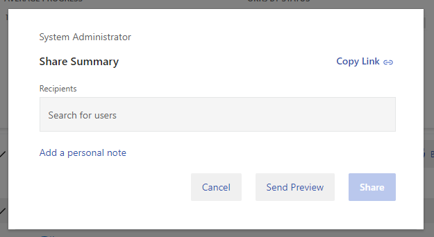

# Share Objectives via email

> [!IMPORTANT]
> Viva Goals is currently available only for private preview customers, and only in English. The features described here are subject to change. [Learn more about Viva Goals.](https://go.microsoft.com/fwlink/?linkid=2189933)

When working in Viva Goals, there may be several scenarios where you want to share an objective, or a list of objectives. You may do this to:

1. **Provide visibility to stakeholders:** Share a quick update on the status and progress of my team's objective(s) to keep the everyone up to date.

2. **Share a win**: Share an update on a shipped feature, closed funding, or winning a deal, directly to a stakeholder over email.

3. **Nudge users**: Get an update from an OKR owner.

## How to share Objectives

1. To share objectives from the OKRs page, select the share icon on the top right corner of the page and select **Share Summary**.

2. Enter emails that you want to share the objectives within the **recipients** field. You can also choose to share the update to all the users who are following the OKRs you're sharing by checking the **Include followers ...** checkbox.

3. Select **Add a personal note** if you want to add more context while sharing the summary of objectives.

> [!NOTE]
> To send yourself a preview of the message that will be shared, select **Send Preview**.

4. Once you're ready, select **Share** and the objectives will be sent to the intended recipients
