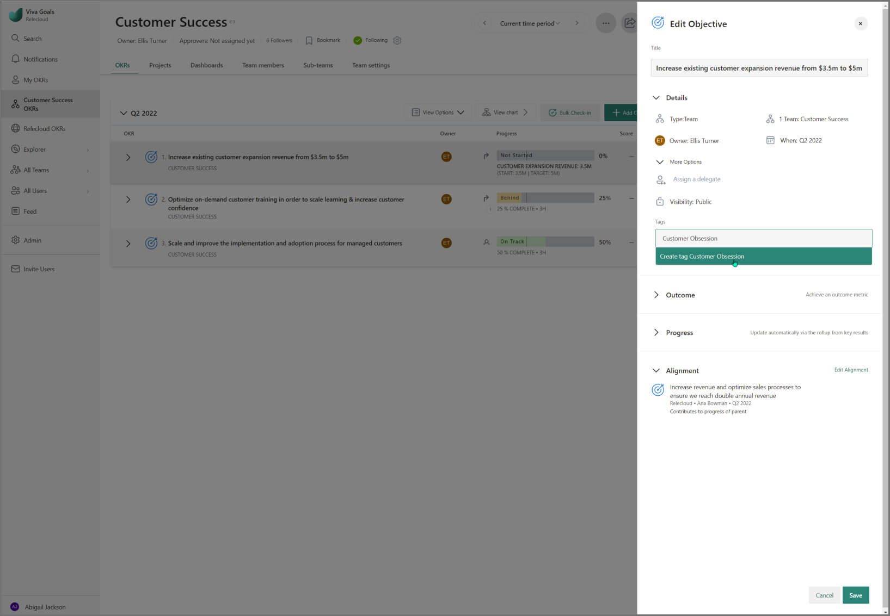
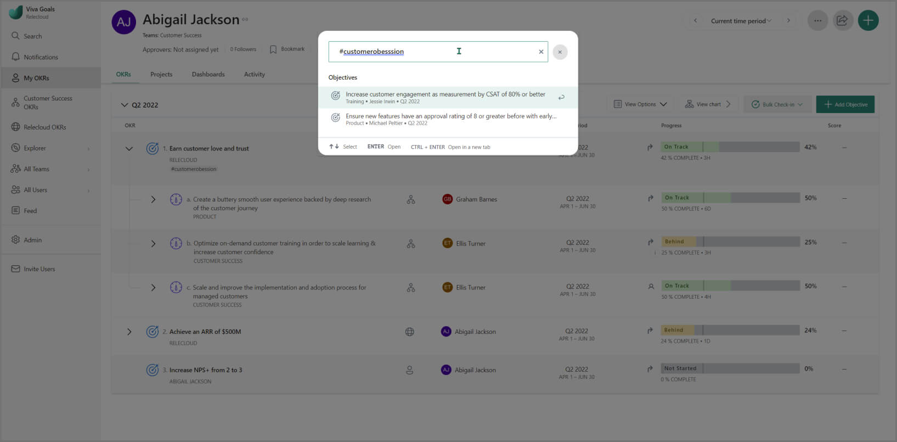
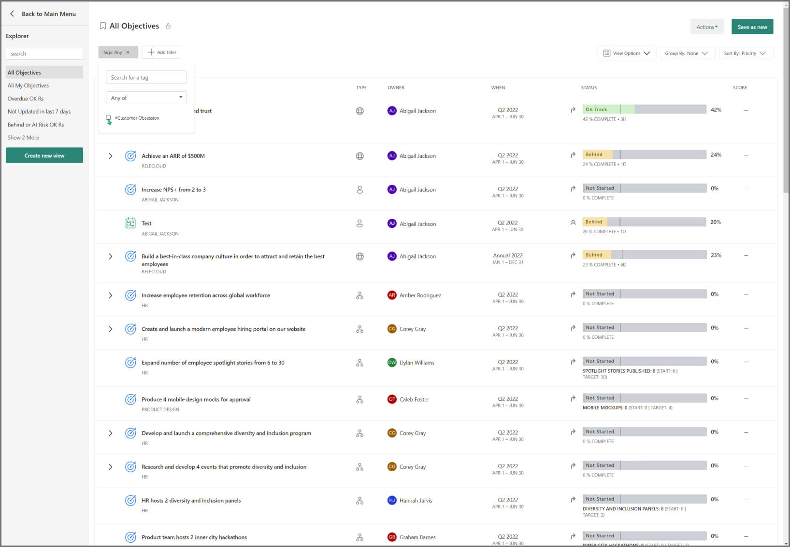
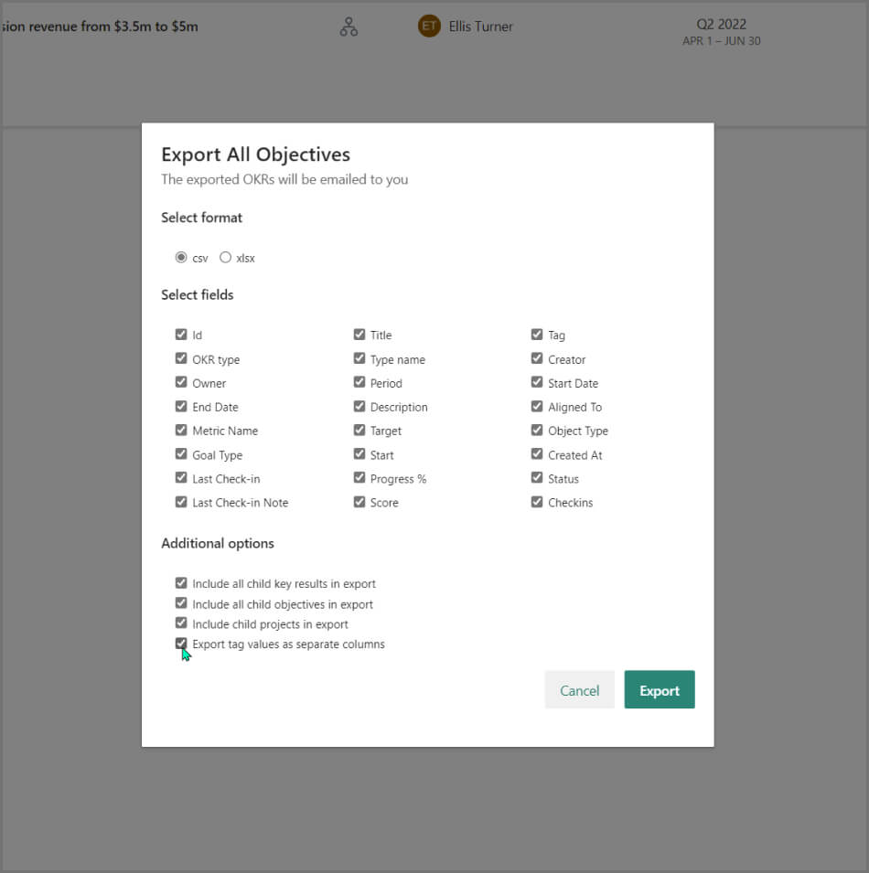

# Tags

You can tag your OKRs and projects in Viva Goals to group similar OKRs and projects under a common identifier or add an extra level of description. Tags make it easier to search for specific OKRs and projects and generate targeted reports.
    
In this article, we will cover how to add tags, search by tag and use the explorer to make reports with the Tags filter.

## Add a Tag

1. Bring up the create or edit objective dialog box and select **Add Tags** under **More Options** beneath the objective name. In the text box, type the desired tag.

2. Add a new tag if it doesn’t exist yet, or select one from the drop-down.

3. You can select **x** to remove the tag at any time.

In this example, we're tagging OKRs related to **Customer Obsession**, the responsibilities for which are distributed across teams and individuals. It becomes strategically valuable to group these related OKRs together.

## Search by Tag

Tags are searchable. To search by a tag, select the search button in the top right and type in the tag.

## Reporting with Tags

Use the explorer to filter by tag and create meaningful reports and views.

1. Navigate to the explorer from the main menu and create a new view.

2. Add the **Tags** filter and select the desired tag.

3. At this point, feel free to add other filters to create the kind of report you need. In this example, we use the **Tags** filter in combination with **Last Updated** to bring up recent progress made toward the Annual Event.

4. To separate tags in the exported report, select **Export tag values as separate columns**.

