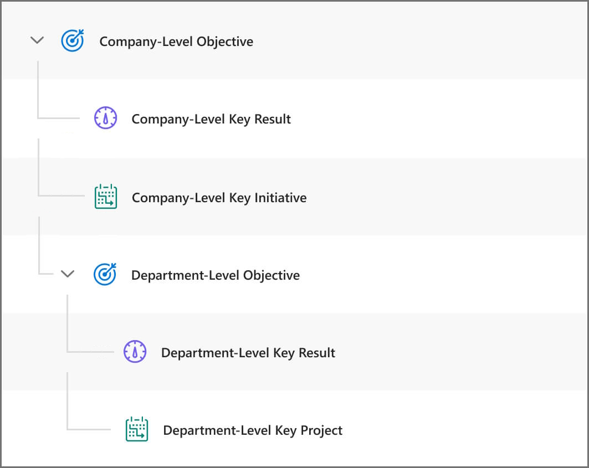

# Understand views in Viva Goals

When you log in to your Viva Goals account, you can view all the information on your objectives and key results (OKRs) page. Use the different views to access your OKRs in different ways for different purposes.

To log in to Viva Goals, visit [https://goals.microsoft.com/](https://goals.microsoft.com).

## What views are available in Viva Goals?

There are three views in Viva Goals:

- **List view** - The list view is the default view in Viva Goals. It lets you create, review, and track progress for OKRs and initiatives across one or more time periods with information like title, type, owner, time period, status, progress, and alignment.

- **Quick view** - Quick view is a panel that appears on the right side of the OKRs page when you select the title of an OKR or initiative. This view provides an overview of progress, details, alignment, children objectives, and activity for an OKR or initiative.

- **Chart view** - The chart view displays all the OKRs and initiatives in a nested tree-like structure, providing a clear picture of the parent-child hierarchy. This view makes it easy to visually grasp the hierarchical structure of the OKRs and their status at a glance.

## List view

The OKRs and initiatives in the list view are displayed in a hierarchical tree structure that you can expand or collapse. When you expand an objective, you can view all the key results, child objectives, and initiatives under that objective.

Child objectives and key results in certain cases can be further expanded so you can view the OKRs and initiatives that are under them.

You can also view the parent objective that a particular objective is aligned to.

### Understanding list view hierarchy

**There are three levels of hierarchy in an organization:**

- Organization OKRs and initiatives

- Team-level OKRs and initiatives

- Individual OKRs and initiatives  

**The typical hierarchical structure in Viva Goals is:**

### Available actions in list view

- **Time periods** - Time periods are the OKR operating periods or cycles. Every OKR or initiative is always tagged to a particular time period and has a start and end date. Time periods help you navigate and find OKRs and initiatives for an organization, team, or  user.

- **Summary panel** - View the progress and status of all your OKRs in that time period, along with the expected-versus-actual progress comparison.

- **KPIs panel** - View the KPIs that are used to track your OKRs.

- **Add objective** - Create an objective of type organization/team/individual.

- **Drag and drop** - Reprioritize and change the order of OKRs and initiatives in the list view.

- **Multi-select** - Use the checkbox on the list view row to select more than one OKR or  initiative to do bulk edit, move, or clone.

- **View options** - From this dropdown, you can select to show more information, expand all OKRs by default, show OKRs in a flat view, and compare to a time period. The *expand* view is a time-saving view option under the list view. When it's enabled, all the top-level objectives listed in the OKRs page show one level of children. The *flat-list* view, another view option under the list view, removes the hierarchical structure on the default view on the OKRs page and displays them all as a flat list. That is, all parent and child OKRs are all on the same level and are listed one after another without nesting.

- **Bulk check-in** - Make check-ins on multiple OKRs that weren't updated since the last check-in reminder in a guided workflow.

- **Group by** - The grouping option lets you streamline your OKR and initiative view even further. You can group your OKR or initiative list in the following categories:

    - Time period
    - Team
    - Owner
    - Status

### OKR or initiative actions within list view

1. Select the (`>`) expand icon next to  an objective to view all the key results, child objectives, and initiatives under it.  

2. Select the objective to open the quick view and make updates to that objective.  

3. Select the check-in icon or select the progress bar for an OKR/initiative to initiate and make a check-in. Learn more about check-ins.

4. Add a key result or an initiative under an objective from the (`...`) more options menu on the row.

5. As an OKR owner, to make edits to an OKR or an initiative inline, select the edit icon next to the title, owner, type, and time period information in the list.

6. Select the more options (`...`) icon on the list-view row to perform additional actions like close, postpone, edit alignment and more on an OKR or an initiative.

## Quick view

When you open the quick view, you'll see it has five tabs:

- Overview

- Key Results

- Initiatives

- Child Objectives

- Activity

Let's look at the content of each of these tabs.

### Overview tab

The Overview tab gives you a quick snapshot of the most important information about OKRs. This includes:

- **OKR Progress** - The progress you've made on the current objective, the expected progress, and your OKR's progress status. You can make progress updates in two ways: drag the progress scroll bar to input your updates or select the **check-in** button and enter your progress.

- **Manage Contributions** - Control how much of a contribution each child makes to the progress of the current objective.

- **Last Check-in Note** - Shows you the most recent check-in on an OKR so you can add extra context to your progress chart. If you don't see any check-in notes, it might be a good idea to add one.

- **Owner** - Shows the owner of the objective.

- **Type** - Shows whether an OKR is for an organization, team, or individual. You can change the type on this tab.

- **Time Period** - Displays the time period that the current objective belongs to.

- **Last Updated** - Shows when the current objective was last updated.

- **Add a description** - Allows you to add a quick blurb that states what the objective is about to provide others with more context.

- **Alignment** - This shows you how the current objective or initiative is aligned to its parent. For example, if you are viewing an objective's quick view, you will see how it is aligned to a parent objective, if any. To edit alignment, select **Edit**.

### Key Results

The Key Results section of the quick view shows you all the key results that have been created for the current objective. You can also see how much progress was made towards these key results, which team owns it, and the individual owner. If you haven't created any key results, you can use the **Add** button to create one.

### Initiatives

Similar to the Key Results section, the Initiatives section shows you all the initiatives that support the current objective. You can also see how much progress has been made on the initiative. If you haven't created any initiatives, you can use the **Add** button to create one.

### Child Objectives

All objectives can have a child objective aligned to them. You can view and navigate to the child objective from this section. If you haven't created any child objective, you can use the **Add** button to create one.

### Activity

In the Activity section, you can quickly catch up on everything that's led to the current status of the OKR.

To view all the information about an OKR and initiative, including progress, details, alignment, children, and activity, select the **open in full view**"** link from the list/quick view or from an objective link inside a notification.

## Chart View

Chart View feature is a powerful tool that provides an easy-to-consume visualization of objectives and the alignment between them. Chart View lets you see at a glance how different teams and the organization's OKRs are structured.

A stacked card indicates that the objective has key results. Select a stacked card to see the key results and navigate further down the hierarchy. Watch organization-level key results turn into department-level objectives, while department-level key results cascade into team-level objectives, and so on.

To view the objective in more detail, select the **See Details** option.

To enable Chart View for the organization’s OKRs or for a team or an individual, select the **View chart** option from the **View Options** dropdown:

:::image type="content" source="../media/goals/2/28/c.jpg" alt-text="Screenshot shows where you select chart view in the OKRs window." lightbox="../media/goals/2/28/c.jpg":::
