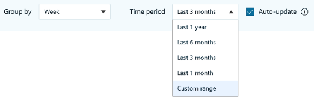

---

title: To create an auto-update query
description: How to create an auto-update query in advanced insights
author: madehmer
ms.author: helayne
ms.topic: article
ms.localizationpriority: medium 
ms.collection: m365initiative-viva-insights 
ms.service: viva 
ms.subservice: viva-insights 
search.appverid: 
- MET150 
---

**To create an auto-update query**

1. In [the app](https://workplaceanalytics.office.com/), select **Analyze** > **Query designer**:

   

2. Select a query type, such as Person query.

3. Name the query and add an optional description.

4. Select a time range of one, three, or six months, or one year:

    

   >[!Note]
   >Auto-update is available only for the predefined time ranges in the Time period drop-down list. If you select **Custom range**, the Auto-update option becomes unavailable.

5. Select **Auto-update**.

6. Select **Run**.
