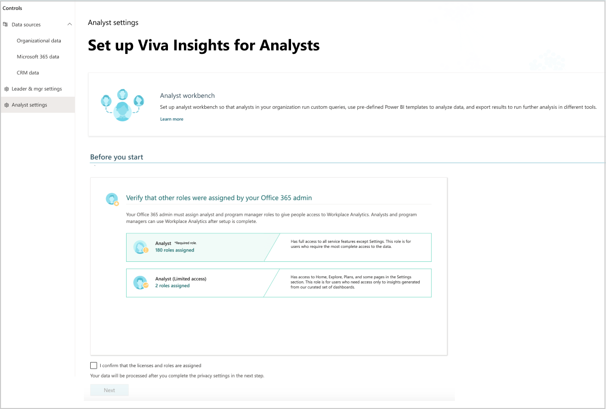
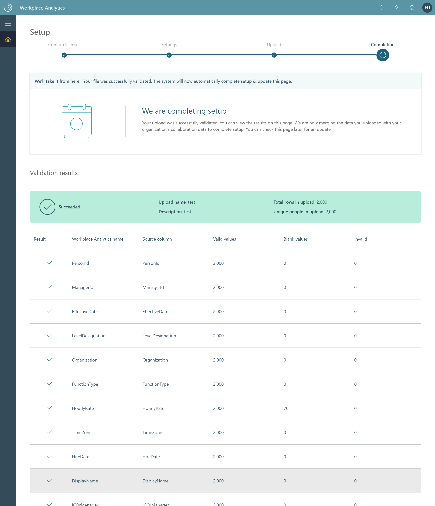

# Set up Viva Insights

Although the Microsoft 365 admin and the Viva Insights Administrator do most of these steps, others in your organization help make decisions that relate to setup. See [Determine key personas and roles for implementation](Determine-key-personas.md) for details.

**Prerequisites** - See [Environment requirements](environment-requirements.md) to learn about Viva Insights licenses and other related requirements.

## Setup steps

* **Owner** - The following key personas do the setup steps:

  * **Viva Insights admin** does most of the setup tasks and is the person referred to as "you" in the following steps.
  * **Microsoft 365 admin** assigns licenses and roles in **Step 2**.  
  * **Viva Insights** processes and validates data in a few of the steps.

* **Task** - Complete steps to set up and configure the Viva Insights applications.  
* **Outcome** - In your organization, people have been assigned licenses and roles. Those roles grant access to data that the people can use to analyze work habits and implement change in how employees spend their time. Also, you've set system defaults and privacy settings and an admin has uploaded organizational data.
<!-- IN THIS VIDEO, MUST FIX A) EARLY SCREENSHOT THAT SHOWS EXPLORE PAGE AND B) END SEQUENCE THAT NO LONGER MATCHES CURRENT FRE. -->
### Video: Overview for admins

<iframe width="640" height="564" src="https://player.vimeo.com/video/282873274" frameborder="0" ></iframe>

**To set up the app**

>[!Note]
>If you need to set up a test environment for regulatory or compliance reasons, follow [these recommendations](#test-setup-recommendations).

1. **[Open the app](https://workplaceanalytics.office.com)**. (If that link doesn't work, try [this link instead](https://workplaceanalytics-eu.office.com/).) If prompted, sign in with your work account. This page begins a sequence that guides you through setup. Under **Required to start**, the page describes the next task, and verifies the assignment of licenses and roles:

      
  
2. **Licenses and roles** - Verify that your Microsoft 365 admin has assigned licenses and roles to people in the organization, and then select **Next**. For more information, see [Assign licenses](assign-licenses-to-population.md) and [Assign roles](assign-roles-to-wpa-admins.md).

   >[!Important]
   >On the **Home** page, under **Required to start**, Viva Insights admins can see the current number of assigned roles and licenses. They can proceed with setup only if the number of assigned licenses is greater than zero. Licenses can take from 24 up to 72 hours to activate after you purchase licenses. Until licenses are provisioned, unlicensed users will  get a [500 error](../Tutorials/wpa-tool-500-error.md) when opening the app.

3. **System defaults** - Set the time zone, week days, weekend days, and working hours. For more information, see [System defaults](../Use/system-defaults.md).

4. **Privacy settings** - Set minimum group size and choose whether to hide subject lines, domains, email addresses, and terms in subject lines. For details, see [Privacy settings](../Use/privacy-settings.md). After you've finished making both the system defaults and the privacy settings, select **Next**.

   >[!Important]
   >At this point, the app automatically extracts collaboration data (data about email usage, meetings, chats, and calls) in the background and keeps it ready for analysis. When the extraction is complete, you'll see a "completed processing" status on the **Setup** page.

5. **Prepare organizational data** - Export organizational data from your HR system into a UTF-8 encoded .csv file. For information about what data to export and how to structure it, see [Prepare organizational data](Prepare-organizational-data.md).

6. **Upload organizational data** - Upload the .csv file. For details, see [Upload organizational data](upload-organizational-data-1st.md). The following steps are part of **Uploading organizational data**:

   1. **Map data** - Map the uploaded data to the applicable field names. For details, see [Field mapping](upload-organizational-data-1st.md#field-mapping).

   2. **Data validation** - When the upload is validated, you'll see a message confirming it. If validation was not successful, you are advised what to do next. For details, see [Data validation](upload-organizational-data-1st.md#data-validation).

   3. **Data processing** - The validated data is processed. When the processing finishes, you'll see a message that setup is complete.

      

## Test setup recommendations

A test environment is not recommended because good analysis requires real-time collaboration data from a comparable population, which is difficult to simulate through a test tenant. However, if your organization requires a test environment for regulatory or compliance reasons, then you can use the following recommendations to set it up.

* Assign a Viva Insights license to your minimum group size (default is five) who have Exchange Online (cloud-hosted) mailboxes.
* Each user has sent messages in their Sent Items folder (preferably to other test users with a Viva Insights license).
* Each user has appointments in their calendars that have occurred in the past month (preferably with other test users with a Viva Insights license).
* After confirming the previous requirements, upload an organizational data file for these test users where their **Organization** and **LevelDesignation** attributes are correct (cannot be *blank*).
* The test users all have managers that lead up to a single hierarchy.

## Product availability

After organizational data is uploaded and validated, no further action by the admin is necessary. After this point, it takes about one day before you can use Viva Insights for analysis. For organizations with many licensed employees, it might take slightly longer.

As soon as Viva Insights is ready, people who are assigned an [applicable  role](../use/user-roles.md#role-descriptions-and-access-levels) will get an email notification about Viva Insights.

## Related topics

[Environment requirements](environment-requirements.md)
