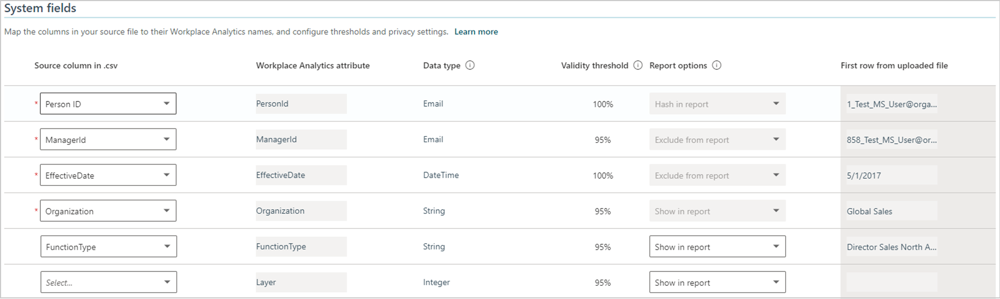
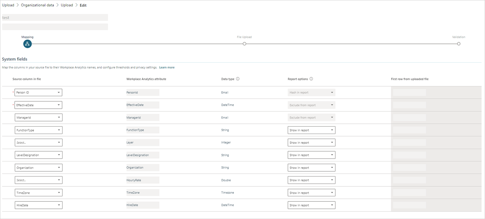
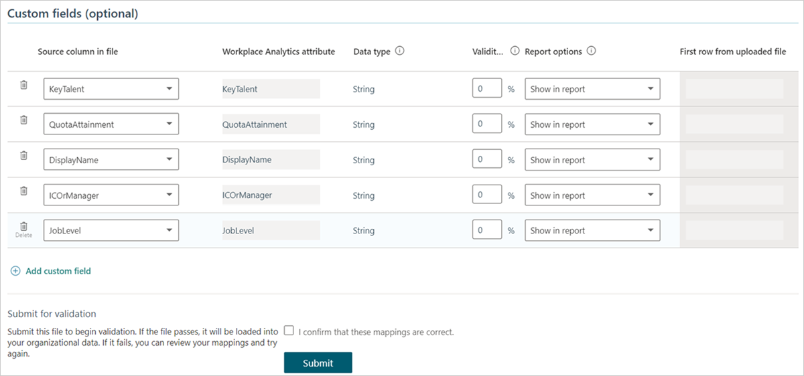

# Subsequent uploads

Administrators can use the following steps for a subsequent upload (import) of organizational data into the advanced insights app. Complete the steps after preparing the data as described in [Prepare organizational data](Prepare-organizational-data.md).

>[!Important]
>Only follow these steps if **this is not** the first time you have uploaded organizational data. If **this is** the first time, follow the steps in [Upload organizational data (first upload)](upload-organizational-data-1st.md).

## Import tasks

Importing organizational data requires the following tasks:

1. [File upload](#file-upload)
2. [Field mapping](#field-mapping)
3. [Data validation](#data-validation)

After you prepare the source data, you can upload the .csv file and map fields. After you map fields, the advanced insights app validates the data. When the data successfully validates, the overall data-import task is complete. If the data validation is not successful, you can choose from a few options that are described in [Validation fails](#validation-fails).

<!--### Video: Upload organizational data

The following video might not represent your exact upload experience that is based on your unique environment and organizational data or might be a different version of the app.

<iframe width="640" height="564" src="https://player.vimeo.com/video/282897809" frameborder="0" allowFullScreen mozallowfullscreen webkitAllowFullScreen></iframe>-->

## File upload

Use the following steps to upload (import) your organizational data as a .csv file.

1. Open [the app](https://workplaceanalytics.office.com). If prompted, enter your organizational credentials.
2. Select **Data sources** > **Organizational data**.
3. Select **Upload** to see your organization's **Upload history**.
4. Select **New upload**.
5. In **Upload**, select **Name your upload**, enter a name, select **Add an optional description**, and enter a description.
6. Select one of the following options to add, change, or replace existing organizational data that’s already been uploaded. You can also select the applicable **Download a sample template** (where attributes can be in any order) to help with file requirements:

   * **Add new employees to existing organizational data** – This option is the same as the legacy _Append data_ option from earlier releases. This adds new employees to your existing organizational data. You can also use this option to add new attribute values and edit existing attribute values in the same upload. However, you must include all required attributes with the upload, including PersonId, ManagerId, Organization, and EffectiveDate. If EffectiveDate is not provided, the process automatically adds the upload date for all EffectiveDate values in the newly uploaded data.
   * **Add new data for existing employees** - Adds new attributes to existing employees' organizational data by uploading the minimum required attributes of PersonId and EffectiveDate (if not provided, the process automatically adds the upload date for all EffectiveDate values). You can also use this option to edit existing attribute values for existing employees in the same upload.
   * **Edit data for existing employees** - Edits the current attribute values for existing employees' organizational data by uploading the minimum required attributes of PersonId and EffectiveDate (if not provided, the process automatically adds the upload date for all EffectiveDate values in the newly uploaded data) along with the edited employee data.
   * **Delete data for existing employees** - Deletes attributes that are not required in the existing organizational data. In **Existing attributes**, select one or more attributes to remove, and then select the **Delete** (trashcan) icon. You cannot delete any required attributes. When you see the message confirming the deletion, select **Confirm** or **Cancel** (only if you want to select different or additional attributes to delete).
   * **Upload a new organizational data file** - Deletes all previously uploaded data and replaces it with a new upload with all the required attributes.

   >[!Important]
   >If you discover that an existing data upload has sensitive, incorrect, or unauthorized data, use **Upload a new organizational data file** to permanently replace it with new employee data.

   :::image type="content" source="../images/wpa/setup/upload-options.png" alt-text="Subsequent upload options":::

7. Select the .csv file with the new employee data you want to upload, and then select **Open** after reviewing the following _important upload considerations_:

   * The .csv file that you upload must be UTF-8 encoded.
   * The field columns can be in any order in the .csv file.
   * Confirm the .csv file is not open in a different program when you begin the upload process.
   * If you see a message about updating existing data, select **Confirm**.
   * After the upload process begins, the process is irreversible.

8. Map the fields as applicable. For details, see [Field column details](#field-column-details).

    1. In **Source column in file**, map the names in the .csv file to the corresponding names for the Advanced insights attributes.
    2. Enter values for the other columns in the table as applicable, such as for **Data type** and **Report options**.

      * When Adding employees or replacing with new data, you’ll see the following types of fields, which *includes* the validity thresholds:

        

      * When editing employee data, you’ll see the following types of fields, which *excludes* the validity thresholds:

        

    3. Map the optional and custom fields, as applicable. You only need to map the columns in the .csv file that your organization considers important for analysis. For example, if "Region" is important and your data contains this field, map it.

      * When Adding employees or replacing with new data, you’ll see the following types of fields, which *includes* the validity thresholds:

        

      * When editing employee data, you’ll see the following types of fields, which *excludes* the validity thresholds:

        

9. In **Submit for validation**, select the checkbox for **I confirm that these mappings are correct**, and then select **Submit** to start the upload and validation process.
10. You’ll then see a message while the data is being validated and then a new message when it is successful or not. The following can cause a warning message:

    * **Omitted columns** - If replacing an existing upload and while mapping fields, you chose to omit one or more columns that are present in the existing upload data schema, and at least one auto-refresh query depends on those (omitted) columns.
    * **Excluded columns** - While setting the **Report options** for attributes on the **Mapping** page, you chose to exclude one or more columns from query results, and at least one auto-refresh query depends on those (excluded) columns.

    If you see a warning message about either of these issues, go to [If expected columns are missing or excluded](#if-expected-columns-are-missing-or-excluded). If you do not, go to [Data validation](#data-validation).

## Field mapping

You need to map the fields (columns) for the source .csv file to the field names that the app recognizes. You map these in **Organizational data > Upload**.

The **Upload** page has System fields and Custom fields that you need to map for the upload file.

When appending new attributes to an existing upload, you need to select all the same required and optional attributes that you mapped before in previous uploads, in addition to the new attributes you want to add (append).

Use the Add new data for existing employees or Edit data for existing employees option to upload new or replace existing data. Make sure your file follows the format for required attributes (such as PersonId and EffectiveDate, which if not provided, the process automatically adds the upload date for all EffectiveDate values) and the new attributes, and then map accordingly.

<!-- TWO OF THE FOLLOWING THREE SECTIONS (system fields tabLe, custom fields table, columns in the fields tables) ARE LONG AND THIS MAKES THE TOPIC HARDER TO NAVIGATE. CONSIDER PRESENTING THEM IN TABS, RATHER THAN CONSECUTIVELY. -->

### System fields

<!-- The following is for "system" fields and is meant only for subsequent uploads, and only temporarily. After the UI changes, switch to the "system default" include file. -->
[!INCLUDE [System fields table](../includes/org-data-sys-fields.md)]
 
### Custom fields

**Custom fields** are optional attributes you can create. Select a column from the .csv file. Name the column, select the data type, set the [validity threshold](#set-validity-threshold-for-custom-fields), and then select the report option. The validity threshold cannot be changed when editing existing data.

### Field column details

* **Source column** corresponds to each of the fields in the uploaded file.
* Advanced insights app name is the name of your organization's version of the app.
* **Data type** is the data type of the fields.

   >[!Note]
   >If the data type is Boolean, the value for the Boolean field must be TRUE or FALSE.

* **Validity threshold** sets the percentage of rows in the uploaded file that must have non-null values (no blanks) for the attribute within the following fields. The source file might still be valid even if some rows have missing values for some columns. This setting is not intended to check or allow invalid values. A single invalid value, such as an incorrect data type, email address, or TimeZone string will cause the file upload to fail.

  * **Required attributes** - Because PersonId and EffectiveDate are required attributes, their Validity threshold value must be 100 percent. This value cannot be changed.
  * **Fields with minimum values** - The threshold for the ManagerId, Organization, and LevelDesignation fields is set to 95 percent by default.
  * **Other system fields** - The Validation threshold for other system fields is set to 95 percent by default, but you can increase or decrease this value.
  * **Custom fields** - For details, see [Set Validity threshold for custom fields](#set-validity-threshold-for-custom-fields).

* **Include in report** - Lets you decide how to treat sensitive data in the report that will be generated about the import operation. It offers the following options for each of the columns in your source data:

    

  * **Show in report** - Lets the actual data value appear in the report just as it was imported in the organizational data file.
  * **Hash in report** - De-identifies sensitive data. If you choose this option, the report will include data that was generated about the import operation, but instead of showing actual values that were taken from the source file, it shows a hashed version of the value – a format that cannot be read.
  * **Exclude from report** - Prevents the data value from appearing in the report. You can select this option for any attribute that you consider highly sensitive. However, for data-privacy reasons, the app _automatically_ assigns **Exclude from report** to particular attributes, such as ManagerId. In those cases, you cannot change this value.

  >[!Note]
  >The visibility of one or more attributes (columns) might be set to **Show in report** or **Hash in report** for previously uploaded data. If you change this setting to **Exclude from report**, any auto-refresh query that depends on the data in that column will experience a schema violation.
  >
  >If so, after you finish mapping fields, you'll see a warning message about "Your upload has certain issues that may affect the auto-refresh of queries." For more details about this message, see [If expected columns are missing or excluded](#if-expected-columns-are-missing-or-excluded).

### If expected columns are missing or excluded

For a query to run successfully, it requires particular attributes (columns) to be present in the organizational data. This is also true for queries for which the [auto-refresh option](../tutorials/query-auto-refresh.md) is turned on. If expected columns are missing, or if visibility settings (which you set by using the **Report options** on the **Mapping** page) exclude expected columns, you'll see a warning message similar to the following:

Below this message, a table in the **Warning details** area lists the affected auto-refresh queries and provides details about issues that were encountered. This information is for review only. You cannot change data or mapping settings on this page.

After you review the issues, if you decide not to continue with the data replacement, select **Back.** This returns you to the field mapping page; continue with [Step 8](#step-8).

To continue with data upload despite the issues, select **Next**. Note that this choice will turn auto-refresh off for queries that were listed in the **Warning Details** area. The results of the last runs of these queries remain available.

## Data validation

After you complete the steps in [Field mapping](#field-mapping), the organizational data file is uploaded and validated. During this phase, you'll see a message about the _File being uploaded_:

In most cases, file validation should complete very quickly. However, if your organizational data file is very large, validation could take a few minutes.

When this phase completes, the file will either pass or fail validation. Go to the applicable section for details:

* [Validation succeeds](#validation-succeeds)
* [Validation fails](#validation-fails)

>[!Note]
>Each tenant can only have one upload in progress at a time. You must complete the workflow of one data file, by either guiding it to a successful validation or abandoning it, before you begin a new upload. The status or stage of the upload shows in the progress bar at the top of the **Upload** page.

>[!Important]
>You must stay logged in and keep the page open in your web browser during the upload. If you close the browser (or browser page), the upload will be canceled.

## Validation succeeds

If validation succeeds, the **Upload** page will indicate it and show the size of the upload and that the overall process is complete. After a successful validation, the app processes your new data.

You can select **Data sources** > **Organizational data** > **Upload** to see **Upload history**. You can then select **Successes** to see the data that was successfully validated and uploaded.

You can do the following for an upload:

* Select the **View** (eye) icon to see a summary of the validation results.
* Select the **Mapping** icon to see the mapping settings for the workflow.
* Select the **Download log** icon to see the log.

>[!Note]
>Each tenant can have only one upload in progress at a time. Therefore you need to complete the workflow of one data file, which means you either guide it to a successful validation or abandon it, before you begin the upload of another data file. The status or stage of the upload is shown on the progress bar at the top of the **Upload** page.

## Validation fails

If data validation fails, the **Validation** page shows a "Validation failed" notification. It also shows details about the validation attempt and presents you with options:

After a failed validation, it's best to first gain an understanding of the errors by scanning the error summary table. You can also select **Download issues** to examine the error log.

The information about the errors helps you decide which path to choose next, such as whether to fix the source data, change the mapping, or abandon the current upload. The following table describes these options.

### Guidelines for correcting errors in data

| Nature of errors | Recommended selection | Description |
| ----- | ----- | ----- |
| Minor errors, small in number | Select **Edit mapping** | This displays the **Field Mapping** page, on which you can change how you map source-file fields to app attributes, optionally change validation thresholds, and then re-attempt validation. You can do these things without changing and re-uploading the source file. This is best for minor errors such as having mapped the wrong column in the source file or assigned a too-high validation threshold to a particular attribute. |
| Major errors | Select **Upload file** | This displays the first **File upload** page. Consider this option in the case of major errors in the originally uploaded data. First, edit the source-data file to fix those errors and then re-attempt the upload and validation process with the corrected file.|

There is also an option to select **Abandon**, a button on the top right of the page. Select this to cancel the current upload. You can abandon your upload for any reason, related or unrelated to errors in the upload file.

>[!Note]
>
>* The app does not modify or fill in data that is missing from HR uploads, such as for TimeZone. The administrator is responsible for correcting such errors or omissions.
>* When any data row or column has an invalid value for any attribute, the entire upload will fail until the source file is fixed (or the mapping changes the validation type of the attribute in a way that makes the value valid). Lowering a threshold does not ignore or skip an invalid value.

The following can help correct data in an uploaded source file that might be causing the validation errors.

When any data row or column has an invalid value for any attribute, the entire upload will fail until the source file is fixed (or the mapping changes the validation type of the attribute in a way that makes the value valid). Lowering a threshold does not ignore or skip an invalid value.

[!INCLUDE [Valid values and formats](../includes/org-data-upload-tips.md)]

### Addition of a new data column

If you've already uploaded at least 13 months of snapshot data, which included the required columns for all employees. And now you want to upload a new data column, such as an engagement score value for each employee that you want to apply to all of the historical data. When you upload to append the new EngagementScore data column, remember to upload the minimum required fields (such as PersonId) again along with the new field.

### Set Validity threshold for custom fields

The threshold checks for non-null values, so it depends on the intended use of the custom field. If you intend to use this data in much of your analysis, consider setting it to a high percentage. You can set a lower threshold for data that applies, for example, to only a small subset of people in your organization.

#### Set a high value

Generally, you should set the Validity threshold to a high value. This is especially important if your analysis will focus on that field.

For example, you might include a SupervisorIndicator attribute. At first, you might think that you're not planning to analyze manager behavior and be  tempted to omit this attribute. However, the organization hierarchy is used implicitly by the advanced insights analyses, such as for differentiating different work groups, for determining high- and low-quality meetings based on how many levels attend, and more.

#### Set a lower value

The goal of your analysis might be to determine sales effectiveness. Your data might include an attribute for sales attainment that only makes sense for members of your sales force, who constitute about 10 percent of the company. This number doesn't apply to engineers or program managers, but it is critical for high-performers in sales.  

### Related topics

* [Prepare organizational data](prepare-organizational-data.md)
* [First upload of organizational data](upload-organizational-data-1st.md)
