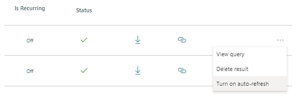
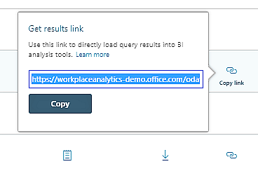

---

title: Query auto-refresh in Viva Insights
description: Describes the query auto-refresh option in Viva Insights
author: madehmer
ms.author: helayne
ms.topic: article
ms.localizationpriority: medium 
ms.collection: viva-insights-advanced 
ms.service: viva 
ms.subservice: viva-insights 
search.appverid: 
- MET150 
manager: scott.ruble
audience: Admin
---

# Query auto-refresh

As an analyst, you can run different kinds of query data in Viva Insights, such as person, meeting, group-to-group, person-to-group, and network queries to get a snapshot of workplace behavior.

## One-time snapshot

You can run a query as a one-time event where you set it up, run it one time, and get the results. To visualize workplace patterns uncovered by a one-time query, you can load the results into a data analysis tool, such as Power BI or Excel.

## Auto-refresh shows trends over time

Query results, especially when viewed in a data analysis tool, can uncover dynamic patterns because employee workplace behavior evolves over time. To isolate one instance of evolving behavior over time, you can use the applicable query multiple times, on a regular schedule. To do this, you can use the auto-refresh feature for Viva Insights data.

## Create a query with the auto-refresh option

>[!Note]
>Generally, an organization can have a maximum of 20 auto-refresh queries. For more information, see [Maximum number of auto-refresh queries](#maximum-number-of-auto-refresh-queries).

[!INCLUDE [To create an auto-refresh query](../Includes/to-create-auto-refresh-query.md)]

## Stop auto-refresh

Follow these steps only for a query that has already run and for which auto-refresh is currently in effect.

1. In the advanced insights app, go to **Query designer** > **Results**.
2. In the query's row, select the **ellipsis**.
3. In the **More options** menu, select **Turn off auto-refresh**:

   

## Start or restart auto-refresh

Follow these steps only for results that have already run and for which auto-refresh is not currently in effect.  

1. In the advanced insights app, open **Query designer** > **Results**.
2. In the query's row, select the **ellipsis**.
3. In the **More options** menu, select **Turn on auto-refresh**:

   

Alternatively, you can renew an auto-refresh query within the [notifications panel](../use/wpa-notifications.md) in the advanced insights app.

## Auto-refresh details

* When you create the query, you run it for the first time. As it runs, it uses data from the exact date range that you defined.
* The query automatically runs again, once for every time period that you selected (such as week or month). Each run coincides with the date on which the advanced insights app refreshes mail and calendar data from Microsoft Exchange.
* Each time the query runs automatically, its date range advances by one unit of the time period that you selected (such as week or month). That is,both its start date and its end date shift shift to a later date by the same amount of time.  

### Auto-refresh stop, restart, and expiration

* You can start or stop auto-refresh for a query at any time. See [Stop auto-refresh](#stop-auto-refresh) and [Start or restart auto-refresh](#start-or-restart-auto-refresh).
* The auto-refresh option of a query expires after two months. This expiration period applies after your _initial_ setting of the auto-refresh option and also after each _renewal_ of the auto-refresh option.

The **Is Recurring** column in **Query designer** > **Results** shows whether auto-refresh is currently turned on for the results represented by that row:

* After auto-refresh expires for a query, you can renew it. See [Start or restart auto-refresh](#start-or-restart-auto-refresh).  
* Deleting results for which auto-refresh is turned on, stops all future auto-refresh runs for those results.

### Maximum number of auto-refresh queries

Generally, an organization can have a maximum of 20 auto-refresh queries. If your organization has already reached this limit and you need a new auto-refresh query, you have the following options:

* Delete an existing auto-refresh query or turn auto-refresh off for a query (in **Query designer** > **Results**). Then, create your new auto-refresh query.
* Contact Viva Insights to request additional auto-refresh queries. To do this, follow the instructions for "Viva Insights Support" in [Get support](../overview/getting-support.md).

### System turns off a query's auto-refresh option

Two circumstances can cause the advanced insights app to turn off the auto-refresh option for a query:

* [Columns missing from organizational data](#columns-missing-from-organizational-data)
* [Excluded or hashed columns](#excluded-or-hashed-columns)

Both of these circumstances present opportunities for admins and for analysts to respond, as described in the following sections:

* [Options for admins](#options-for-admins)
* [Options for analysts](#options-for-analysts)

#### Columns missing from organizational data

Admins regularly upload files that contain organizational data. In one of the upload steps, they choose whether to append the new organizational data to the existing data, or to replace the existing organizational data with the new data.

If the admin chooses "replace," they can retain the existing data schema or use a new one. Introducing a new data schema can cause a schema mismatch with the original schema. This happens, for example, when the new schema is missing one or more columns that were present in the old schema.

If a query that is set to auto-refresh uses a column that is missing in the new schema, the advanced insights app turns the auto-refresh option for this query to off.

#### Excluded or hashed columns

While uploading organizational data, admins can set report options in ways that affect the inclusion and display of data columns. For example, they can set a column to "Exclude from report" (which omits the column) or to "Hash in report" (which masks the true value with a meaningless value).

If a query set to auto-refresh uses a column that becomes excluded or hashed, the advanced insights app turns the auto-refresh option for this query to off.

#### Options for admins

If either of these schema-mismatch situations arises, after you finish mapping fields, you'll see a warning message about your "upload has certain issues that might affect execution of the auto refresh queries."

If you see this message, go to [If expected columns are missing or excluded](/viva/insights/setup/upload-organizational-data2?toc=/viva/insights/use/toc.json&bc=/viva/insights/breadcrumb/toc.json#if-expected-columns-are-missing-or-excluded) for more information.

#### Options for analysts

If either of these schema-mismatch situations arises, the advanced insights app notifies you in various ways. You can then change the affected auto-refresh queries to run them again or access the most recently completed results.

* In **Results**, a red "stopped" icon shows in the **Status** column when a query has been stopped. A yellow icon shows for non-auto refresh queries that, as a result of the schema changes, also cannot run.
* In the **Select filters** and **Organizational data** sections of a query-authoring page, the current filters and the output columns that are no longer present are shown:

  

  In many cases, you can still manually run the queries for which auto-refresh has been turned off, but if columns are missing, the query's results will not contain the attributes that were removed. 

## View query results with the auto-refresh option

In **Analyze** > **Query designer** > **Results**, find your query in the results table, which includes the following:

* The results (a .csv file) of the _latest_ weekly run. You can select **Download** to download an archived file of these results.
* The date of when the query last ran.
* An icon that indicates it as a query with the auto-refresh option.

## Auto-refresh query results in Power BI

In **Results**, you can copy a link to the results and then use them in Power BI.

1. To the right of the results, select **Copy link**:

   

2. Select **Copy**. The Get results link dialog box displays the word "Copied."
3. In Power BI, on the Home tab, select **Get Data**, and then select **OData feed**.
4. In the **OData feed** dialog box, paste the link that you copied into the URL field:

   

5. Select **OK**.
6. Enter your client credentials, and then select **Connect**.

After you do this, Power BI maintains a connection to this query in the advanced insights app. In the future, to visualize the query's current results, open the Viva Insights project in Power BI and select **Refresh**.

### Related topics

[View, download, and export query results](../use/view-download-and-export-query-results.md)
