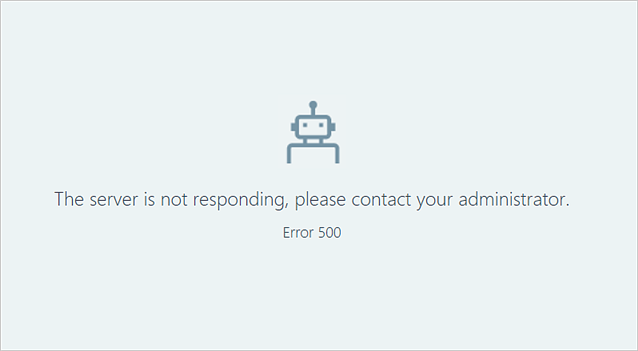

---

title: Viva Insights 500 error
description: This explains why users receive a 500 error when using the advanced insights app 
author: madehmer
ms.author: helayne
ms.topic: troubleshooting
ms.localizationpriority: medium 
ms.collection: viva-insights-advanced 
ms.service: viva 
ms.subservice: viva-insights 
search.appverid: 
- MET150 
manager: scott.ruble
audience: Admin
---

# Viva Insights 500 error

**I am receiving a 500 Error when I try to access the advanced insights app**

**Example error message**

"The server isn't responding. Contact your admin. Error 500."

 

**Why is this happening?**

You'll see this error message for one of the following issues:

* You haven't yet activated a subscription to Viva Insights for advanced insights with Microsoft Viva Insights.
* You've activated a subscription but the service hasn't yet been provisioned, which can take a few hours and sometimes extend up to three days.

**Escalation process** 

To escalate this issue, contact [Microsoft support](https://support.microsoft.com/contactus/).
