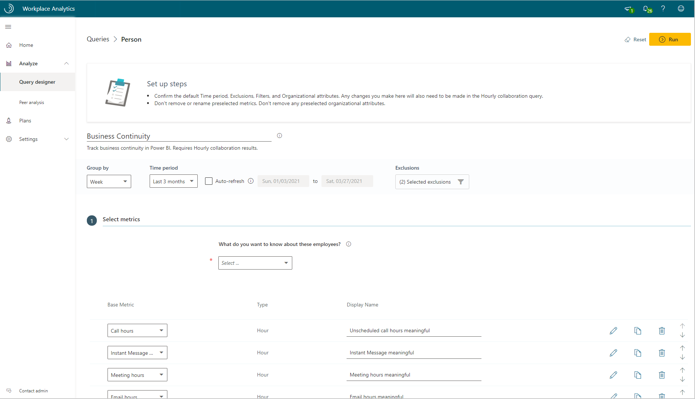
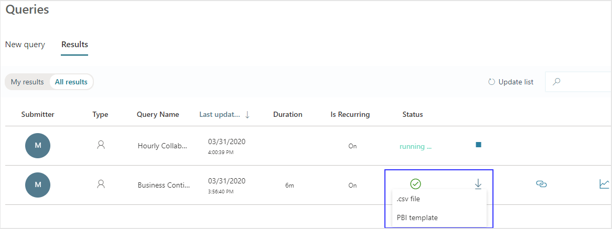

---

title: Business continuity dashboard
description: Use the Business continuity dashboard to visualize predefined query data from Viva Insights in Power BI
author: madehmer
ms.author: v-lilyolason
ms.topic: article
ms.localizationpriority: medium 
ms.collection: viva-insights-advanced 
ms.service: viva 
ms.subservice: viva-insights 
search.appverid: 
- MET150 
manager: helayne
audience: Admin
---

# Business continuity

The Business continuity dashboard uses a Template that’s populated by Viva Insights data to gain insights into how your organization and your employees are being impacted by the shift to remote work.

This dashboard directionally highlights where the shift to remote work might have the largest impacts, offering a measurable starting point for helping leaders understand where they might use tools and processes to support and sustain new ways of working.

The dashboard enables you to visualize and explore the following top-level business questions asked by leaders:

* How are collaboration activities changing?
* What are the impacts of work-life integration?
* Are external relationships being maintained?
* Are employees engaged and connected?
* How are work patterns evolving?
* How can remote work effectiveness be improved?

To populate the dashboard in Power BI, you must set up and successfully run the predefined **Business continuity** and **Hourly collaboration** queries in the advanced insights app. The results of these queries will refresh your downloaded Power BI dashboard on a weekly basis.  

After you successfully run these required queries, you'll see the Template as an available download option for the Business continuity query. This template is required to create the dashboard in Power BI. After you download the Template, you can then connect the query data from the advanced insights app to the dashboard in Power BI.

When the Business continuity dashboard is populated with your data, you can use it to visualize, explore, and report about your organization's workplace patterns and trends.

## Demonstration

The following demo uses sample data that is only representative of this dashboard and might not be exactly what you see in a live dashboard specific to your organization's unique data.

 <iframe width="800" height="486" src="https://msit.powerbi.com/view?r=eyJrIjoiM2ZiY2Y4M2YtMTMyNi00NWY1LWEyMjctYTY2OTdlOWQzNDhhIiwidCI6IjcyZjk4OGJmLTg2ZjEtNDFhZi05MWFiLTJkN2NkMDExZGI0NyIsImMiOjV9&embedImagePlaceholder=true&pageName=ReportSectionbbd7dee40bcdeee460e6" frameborder="0" allowFullScreen="true"></iframe>

To find the template for the Business continuity dashboard, go to the [Query designer](https://workplaceanalytics.office.com/en-us/Analyze/QueryDesigner/NewQuery)(if that link doesn't work, try [this link instead](https://workplaceanalytics-eu.office.com/en-us/Analyze/QueryDesigner/NewQuery)). For complete steps, see [Set up the dashboard](#set-up-the-dashboard).

## Prerequisites  

Before you can run the queries and populate the dashboard in Power BI, you must:

* Be assigned the role of [Analyst](/viva/insights/use/user-roles?toc=/viva/insights/use/toc.json&bc=/viva/insights/breadcrumb/toc.json).
* Have the latest version of Power BI Desktop installed. If you have an earlier version of Power BI installed, uninstall it before installing the new version. Then go to [Get Power BI Desktop](https://www.microsoft.com/p/power-bi-desktop/9ntxr16hnw1t?activetab=pivot:overviewtab) to download and install the latest version.

## Template update

The Business continuity dashboard is being updated on a frequent cadence to address evolving remote work business questions. To ensure you are using the latest version of the dashboard, download the template from your most recently run the Business continuity query, then repeat **Steps 8-15** in [Set up the dashboard](#set-up-the-dashboard). You don't have to run the queries again for template updates.

If you started using the Business continuity dashboard in April or May 2020 and you selected to use six months of data for your queries, you need to repeat **Steps 1-7** in [Set up the dashboard](#set-up-the-dashboard) to run new queries that include data for the last one year, which will encompass activity before and during the shift to remote work in March. To continue to use your custom version of the Business Continuity dashboard and not update to the latest version of the template, do the following instead of **Steps 8-15** in [Set up the dashboard](#set-up-the-dashboard): 

1. After both queries successfully run, open your existing Business continuity dashboard in Power BI Desktop.
2. In **Transform data**, select **Edit parameters**.
3. Replace the existing URLs for Business continuity and Hourly collaboration query URLs with the new query URLs, and then select **OK**.
4. A best practice that reduces future query processing time is to turn off the auto-refresh or delete the preexisting queries that the dashboard is no longer using. See [Stop the auto-refresh option](../Tutorials/Query-auto-refresh.md#stop-auto-refresh) for details.

## Dashboard setup video

> [!Important]
> Where the video shows selecting **Last 6 months** when running the queries, be sure you select **Last 1 year** instead. The queries will then have data that includes activity before and during the shift to remote work in March 2020.

<iframe width="640" height="564" src="https://player.vimeo.com/video/402717048" frameborder="0" allowFullScreen></iframe>

## Set up the dashboard

>[!Note]
>This dashboard supports the [same languages](../overview/supported-languages.md#supported-languages) that the advanced insights app supports.

1. In [the app](https://workplaceanalytics.office.com/)(if that link doesn't work, try [this link instead](https://workplaceanalytics-eu.office.com/)), select **Analyze** > **Query designer**.
2. In **Create** > **Other templates**, select **Business continuity** to see more details and the required setup steps, and then in step 2, select **Set up** next to **Business Continuity** (or **Hourly Collaboration** per **Step 6**).

   

3. When prompted for **Select filters**, select **Active only** for "**Which measured employees do you want to include?**" Optionally, you can further filter the employees in scope for the dashboard. For more details about filter and metric options, see [Create a person query](/viva/insights/tutorials//person-queries?toc=/viva/insights/use/toc.json&bc=/viva/insights/breadcrumb/toc.json#create-a-person-query).

   

4. In **Organizational data**, keep the preselected **Organization**, **LevelDesignation**, and **TimeZone** attributes that the dashboard requires. You can then select any other attributes (columns) to include in the dashboard.

   >[!Important]
   >LevelDesignation is a reserved optional attribute when uploading your organizational data. If this attribute was not uploaded and is unavailable in the advanced insights app, charts and data relating to LevelDesignation will not show in the query output or in Power BI reports.

5. Select **Run** to run the query, which might take a few minutes to complete.
6. When prompted, return to Query designer, and then repeat  **Steps 2-5** for the **Hourly collaboration** query, which requires the same selections as for Business continuity.
7. When prompted, continue to **Results**. After both queries successfully run, select the **Download** icon for the **Business continuity** query results, select **PBI template**, and then select **OK** to download the template.

   

8. Open the downloaded **Business continuity template**.
9. If prompted to select a program, select **Power BI**.
10. When prompted by Power BI, copy and paste the OData links for both queries into their respective fields.

    1. In **Query designer** > **Results**, select the **Link** icon for each query, and select to copy the generated OData URL link.
    2. In Power BI, paste each copied link into its respective field.
    3. Set the **Minimum group size** for data aggregation within this report's visualizations in accordance with your company's policy for viewing Viva Insights data.
    4. Select **Load** to import the query results into Power BI. Loading these large files may take some time to complete.

    

11. If you're already signed in to Power BI with your Viva Insights organizational account, the dashboard visualizations will populate with your data. You are done and can skip the following steps. If not, proceed to the next step.
12. If you're not signed in to Power BI, or if an error occurs when updating the data, sign in to your organizational account again. In the **OData feed** dialog box, select **Organizational account**, and then select **Sign in**. See [Troubleshooting](/viva/insights/tutorials/power-bi-templates?toc=/viva/insights/use/toc.json&bc=/viva/insights/breadcrumb/toc.json#troubleshooting) for more details.

    

13. Select and enter credentials for the organizational account that you use to sign in to Viva Insights, and then select **Save**.

    >[!Important]
    >You must sign in to Power BI with the same account you use to access Viva Insights.

14. Select **Connect** to prepare and load the data, which can take a few minutes to complete.
15. If you have preexisting query results that the dashboard is no longer using, a best practice that reduces processing time is to turn off the auto-refresh or delete the queries that the dashboard is no longer using. See [Stop auto-refresh](../Tutorials/Query-auto-refresh.md#stop-auto-refresh) for details.

## Dashboard settings

After the Business continuity dashboard is set up and populated with Viva Insights data, as a first step to viewing data in the dashboard, view and set the following parameters on the **Settings** page.

* **Earlier time frame** - This is the baseline for your analysis and all changes will be compared with this time frame.

    >[!Note]
    >The **Earlier time frame** must precede and not overlap with the **Current time frame**. If the two timeframes overlap, you'll get a warning about the timelines overlapping.

* **Current time frame** - This is the timeframe you want to compare with the earlier timeframe.
* **Organizational attribute to view the report by** - The primary “group-by” attribute shown in all subsequent reports. You can change this attribute at any time and all subsequent report pages will show group values by the new attribute.
* **Organizational attribute to filter by** – To filter the measured employee population, you can filter by any selected Organizational attribute, and then filter by any of the values for these attributes. If you filter, the measured employees count will reflect a reduced number. To clear an existing filter, select **Ctrl** while clicking the **Clear filter arrow** (or with a touchscreen, select the **Clear filter arrow**). Measured employees reflect the number of employees in the filtered population who were active in the specified time period. Active employees are those who sent at least one email or instant message in the work week included in the current timeframe.

  

After confirming the settings, check the number of measured employees to confirm this is the population you want to analyze.

>[!Important]
>As new data is processed on a weekly basis, select **Refresh** in the Power BI Home ribbon to view the most recent data.

## About the reports

The dashboard reports directionally highlight where a shift to remote work is having the largest impact. They also give you a measurable starting point for identifying where leaders can use tools and processes to support employees in a new way of working. All metrics are defined in the **Glossary**. A “why it matters” interpretation is also included in a text box for each report.

The following describes each report with specific nuances to consider for each.

* **How are collaboration activities changing?** – Shows how employee collaboration patterns are changing in response to a shift in work patterns, and which collaboration tools people are substituting for in-person interactions.  
* **What are the impacts of work-life integration? [1]** - Helps you assess if some employees are disproportionately affected. You can select from multiple values to view the percentage of employees whose collaboration hours increased or decreased by more than the specified number of hours.
* **What are the impacts of work-life integration? [2]** - Shows changes in after-hours collaboration activity. You can select from multiple values to view the percentage of employees whose after-hours work increased or decreased by more than the specified number of hours.  You can also examine the activity by time of day for meetings, emails and instant messages.
* **Are external relationships being maintained?** - Quantifies changes in communication with customers, partners, and other people outside the organization.  
* **Are employees engaged and connected?** - Unlike the other reports that show changes between the baseline and the current timeframes, *this report only shows metrics for the last two weeks of the current time frame*. This view enables you to assess if manager 1:1 meetings and organizational collaboration, which are keys to fostering employee engagement and community, are still occurring virtually.

  >[!Note]
  >The report’s metrics are based solely on the last two weeks of the **Current time frame** and not on a comparison with the **Earlier time frame**. Also, these charts are based on small group meetings of less than eight people and only analyze meeting, call, and instant-message activity, excluding email activity. For more details on metrics, see the Glossary in the dashboard.

### Training opportunity

Learn how to set up and interpret the results from the Power BI Business continuity dashboard: [Evaluate shifts in work patterns with the Business continuity dashboard in Microsoft Viva Insights](/training/modules/workplace-analytics-business-continuity/)

## Power BI tips, troubleshooting, and FAQs

For details about how to share the dashboard and other Power BI tips, troubleshoot any issues, or review the FAQ, see [Power BI tips, FAQ, and troubleshooting](/viva/insights/tutorials/power-bi-templates?toc=/viva/insights/use/toc.json&bc=/viva/insights/breadcrumb/toc.json).

## Related topic

[View, download, and export query results](/viva/insights/use/view-download-and-export-query-results?toc=/viva/insights/use/toc.json&bc=/viva/insights/breadcrumb/toc.json)
