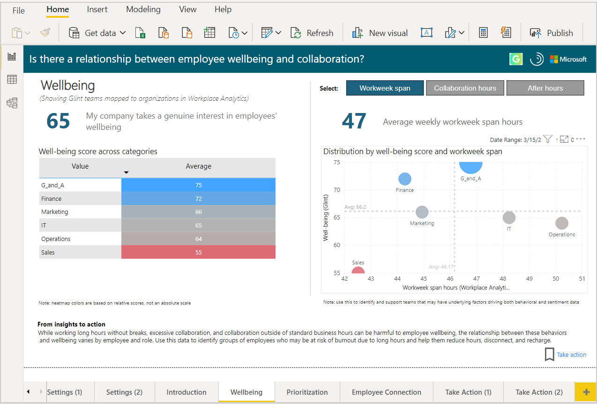
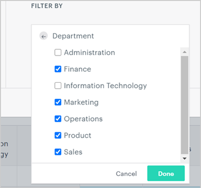
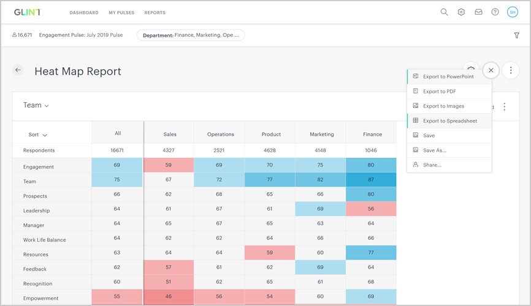
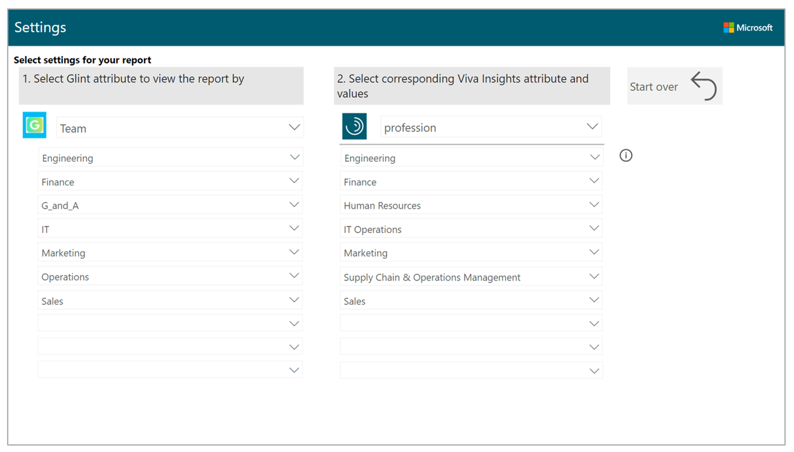
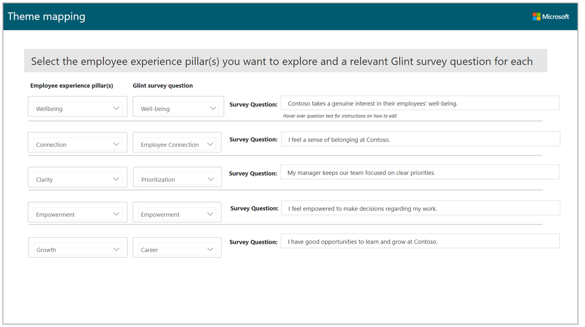

# Behavior patterns for Glint

>[!Note]
>This dashboard currently only supports Glint reports that are in English. For example, if you are a customer with data in Japanese, export the Glint report in English before you upload it to PBI. If you encounter errors even with the report exported in English, delete and then manually type in the column headers in English.

The Behavior patterns for Glint dashboard uses a template to combine sentiment data from Glint with behavioral data from Viva Insights. Leaders get insights into underlying factors that might be contributing to both how their employees feel and how they work. The analysis helps identify opportunities to influence behavior and improve business outcomes.

This analysis uses survey scores and working patterns to identify outlying teams who might need attention. Even for leaders who are already aware of team issues, the dashboard creates high-level visibility enabling them to use research-based and data-driven actions to change or improve workplace behaviors.

The dashboard combines the following data.

|Theme |Representative Glint survey question |Viva Insights metrics |
|------------|------------|------------|
|Wellbeing |My company takes a genuine interest in their employees' wellbeing. |<ul><li>After hours metrics</li><li>Burnout risk</li><li>Focus hours</li></ul>|
| Connection | I feel a sense of belonging at my company. | <ul><li>Internal network size</li><li>Small group meeting hours</li></ul>|
| Clarity | My manager keeps our team focused on clear priorities. | Manager one-on-one hours |
| Empowerment | I feel empowered to make decisions regarding my work. | <ul><li>Co-attendance rate</li><li>Time in self-organized meetings</li></ul>|
| Growth | I have good opportunities to learn and grow at my company. |<ul><li>Internal network size</li><li>External network size</li><li>Time in skip-level collaboration</li></ul>|

:::image type="content" source="../images/wpa/tutorials/pbi-glint-wellbe-2.png" alt-text="Power BI Glint Wellbeing report.":::

<!-- SWITCHING TO NEW IMAGE STYLE. FORMERLY HERE:
 -->

The dashboard includes the following reports.

* **Wellbeing** &ndash; Compares wellbeing scores for the selected HR attributes, such as organization or level designation, and shows how after-hours work, focus hours, and burnout risk might be affecting wellbeing for specific teams. You'll also see research-based, actionable strategies to help change behaviors that might be contributing to low wellbeing scores.
* **Connection** &ndash; Compares employee connection scores for the selected HR attribute to show how small group meeting hours and internal network size might be affecting employees’ feeling of connection. Helps leaders identify and support teams who might have underlying conditions that are affecting both their connection scores and collaboration patterns.
* **Clarity** &ndash; Compares prioritization scores for the selected HR attribute to show how manager one-on-one time might be affecting employees’ ability to focus on and prioritize their work. Gives teams easy-to-implement plans that create opportunities for employees to more regularly meet with their managers one-on-one and prioritize their work.
* **Empowerment** &ndash; Compares empowerment scores for the selected HR attribute to show how manager co-attendance and time in self-organized meetings might affect employee empowerment. Helps leaders understand how meeting behaviors impact autonomy and effectiveness.
* **Growth** &ndash; Compares growth scores for the selected HR attribute to show how network sizes and time in skip-level collaboration might affect team growth scores. It reveals the impact of network size and leadership interactions on development.
* **How can I take action to improve employee experience?** &ndash; Summarizes opportunities to improve employee experience by addressing related behaviors for individual, collective, and environmental interventions. After any interventions are started, leaders can use Viva Insights data to measure real-time change in collaboration behaviors and track improvement with subsequent Glint survey scores.

## Demonstration

This uses sample data that is only representative of the dashboard and might not be exactly what you see in a live dashboard specific to your organization's unique data.

<iframe width="800" height="486" src=https://msit.powerbi.com/view?r=eyJrIjoiZTYwMWI3MDctYTU3Mi00N2MxLWE4NmYtNjU4YzhlYmMxMGQ4IiwidCI6IjcyZjk4OGJmLTg2ZjEtNDFhZi05MWFiLTJkN2NkMDExZGI0NyIsImMiOjV9&embedImagePlaceholder=true frameborder="0" allowFullScreen="true"></iframe>

## Setup video

The following video describes how to set up the dashboard, which might not be exactly what you experience with data that's unique to your organization.

<iframe src="https://player.vimeo.com/video/571969511" width="800" height="486" frameborder="0" allow="autoplay; fullscreen" allowfullscreen></iframe>

## High-level steps

The high-level steps required to populate the dashboard in Power BI:

1. [Get Glint data](#get-the-glint-data) &ndash; In Glint, select the corresponding survey questions and the population to analyze in Power BI, including the HR attributes you want to analyze, such as team and position. Then export a Heat Map report file with this data.
2. [Get the Viva Insights data](#get-the-viva-insights-data) &ndash; Set up the predefined **Behavior patterns for Glint** template in the advanced insights app. After the results successfully run, download the template for the Glint query on the **Results** page. This template is required to create the dashboard in Power BI.
3. [Load both into Power BI](#load-the-data-in-power-bi) &ndash; Connect to and load both the query data from the advanced insights app and the Heat map from Glint into Power BI.

## Prerequisites

The following is required before you can run the query in the advanced insights app and populate the dashboard in Power BI.

* Your company uses Glint with the same measured population that the advanced insights app has data for:

  * The population reflected in the Glint Heat Map report is the same as the filtered population in the Behavior patterns for Glint template.
  * You have Glint survey content for the last three to six months that includes questions on one or more of the following themes of employee wellbeing, connection, clarity, empowerment, and growth.

* Be assigned the role of Analyst in the advanced insights app.
* Have the latest version of Power BI Desktop installed. If you have an earlier version of Power BI installed, uninstall it before installing the new version. Then go to [Get Power BI Desktop](https://www.microsoft.com/p/power-bi-desktop/9ntxr16hnw1t?activetab=pivot:overviewtab) to download and install the latest version.
* Have at least one of the following organizational attributes already uploaded and processed in the advanced insights app.

  * **Level designation** - Each employee's level in the organization.
  * **Organization or team** - Each employee’s team assignment, which reflects the organization or business division they're in.

## Get the Glint data

1. In Glint, select **Reports** > **Heat Map**, and then select the reports that have questions on wellbeing, prioritization, and connectivity. If the questions spread across different pulse dates, select the **Multiple Pulses** option.

   

2. In **Filter By**, select the applicable departments for the population you want to analyze in Power BI, and then select **Done**.

   

3. Select the grouping attributes that are also used in the advanced insights app for the report.

   

4. In **Add section**, select (up to five) other grouping attributes to analyze by, which must also be present in the advanced insights app.
5. Select **Export to spreadsheet** to download the report.

   

6. Save the spreadsheet in an accessible location.

## Get the Viva Insights data

>[!Note]
>This dashboard is currently only available in English and will only work with data generated from the English version of the app. Before running the required queries, confirm the browser language in the app's URL includes **en-us**, or change it to include **en-us**: ...office.com/en-us/...

1. In [the app](https://workplaceanalytics.office.com/)(if that link doesn't work, try [this link instead](https://workplaceanalytics-eu.office.com/)), select **Analyze** > **Query designer**.
2. In **Create** > **Other templates**, select **Behavior patterns for Glint** to see the required setup steps, and then in step 2, select **Set up**.
3. When prompted, select or confirm the following settings:

   * **Name** &ndash; Customize or keep the default name
   * **Group by** &ndash; Week
   * **Time period** &ndash; Select the time period that corresponds to the time period that the Glint survey questions ask about
   * **Auto-refresh** &ndash; Keep this setting disabled
   * **Meeting and attendee exclusions** &ndash; Select the preferred rules for your tenant

   >[!Important]
   >If you try to delete a predefined metric, you'll see a warning that the deletion might disable portions of the Power BI dashboard and reduce query results. In turn, this can limit your ability to visualize collaboration patterns. Depending on the metric you delete, you might disable a single Power BI chart, several charts, or all the charts. Select **Cancel** to retain the metric.

4. In **Select filters**, select **Active only** for "**Which measured employees do you want to include?**" and then, optionally, you can further filter for the population of interest for the dashboard. For more details about filter and metric options, see [Create a Person Query](./person-queries.md).
5. In **Organizational data**, keep the preselected **Organization** and **LevelDesignation** attributes that the dashboard requires and up to three more that match up with the attributes included in your Glint data.

   >[!Important]
   >If you remove the required, preselected **Organizational data** attributes, you might disable one or more Power BI charts.

6. Select **Run** to run the query, which can take a few minutes up to a few hours to complete.
7. When prompted, select to go to **Results**. After the results successfully run, select the **Download** icon for the **Behavior patterns for Glint** query results, select **PBI template**, and then select **OK** to download the template.

## Load the data in Power BI

1. Open the downloaded **Behavior patterns for Glint** template.
2. If prompted to select a program, select **Power BI**.
3. When prompted by Power BI, enter the following, and then select **Load** to import the query results into Power BI.

    * In **Query designer** > **Results**, select the **Link** icon, and then select to copy the generated OData URL link.
    * In Power BI, paste the copied OData link for the query data.
    * In the **Glint Heat Map report**, copy and paste the Heat Map file path.
    * In **Minimum group size**, enter a number for data aggregation within this report's visualizations that complies with your company's policy for viewing advanced insights data.

4. If you're already signed in to Power BI with your the organizational account for the advanced insights app, the dashboard visualizations will populate with your data. You are done and can skip the following steps. If not, proceed to the next step.
5. If you're not signed in to Power BI, or if an error occurs when updating the data, sign in to your organizational account again. In the **OData feed** dialog box, select **Organizational account**, and then select **Sign in**. See [Troubleshooting](../tutorials/power-bi-templates.md#troubleshooting) for more details.

    

6. Select and enter credentials for the organizational account that you use to sign in to the advanced insights app, and then select **Save**.

     >[!Important]
     >You must sign in to Power BI with the same account that you use to access Viva Insights.

7. Select **Connect** to prepare and load the data, which can take a few minutes to complete.

## Dashboard settings

After the Behavior patterns dashboard is set up and populated with both the Glint and Viva Insights data in Power BI and before viewing data in the dashboard, set the following parameters on the **Settings** and **Theme mapping** pages.

1. **Select the Glint attribute to view the report by** &ndash; In **Settings**, select the primary “group-by” attribute that represents the teams in Glint. To clear an existing mapping, select the **Reset** arrow.
2. **Select corresponding attributes or values for the Viva Insights data** &ndash; For each Glint value, select the matching field value (ideally one to one) that is used in Viva Insights data.

   

3. **Select the employee experience pillars to explore** &ndash; Map the employee themes to their corresponding Glint survey question themes, and then enter the actual question asked in Glint.

   

## Power BI tips, troubleshooting, and FAQs

For details about how to share the dashboard and other Power BI tips, troubleshoot any issues, or review the FAQ, see [Power BI tips, FAQ, and troubleshooting](../tutorials/power-bi-templates.md).

## Related topic

[View, download, and export query results](../use/view-download-and-export-query-results.md)

