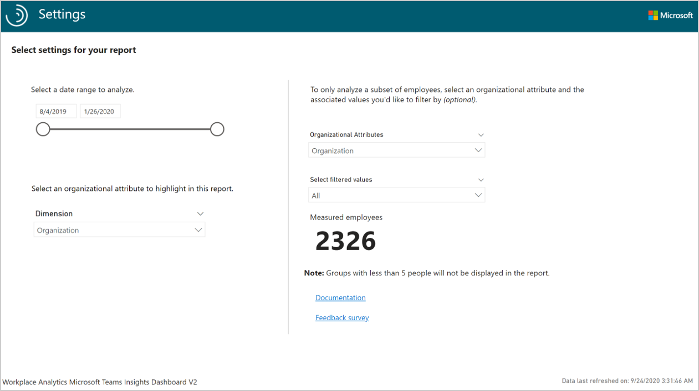

---

title: Power BI Microsoft Teams dashboard
description: Use the Power BI Microsoft Teams insights dashboard to visualize predefined data from Viva Insights in Power BI
author: madehmer
ms.author: helayne
ms.topic: article
ms.localizationpriority: medium
ms.collection: viva-insights-advanced 
ms.service: viva 
ms.subservice: viva-insights 
search.appverid: 
- MET150 
manager: scott.ruble
audience: Admin
---

# Microsoft Teams insights

As employees shift to remote work and to digital only collaboration, Viva Insights can help you stay on track and make data-driven decisions that can help your employees do their best work.

The Power BI Microsoft Teams insights dashboard directionally highlights where a shift to remote work might have the largest impacts, offering a measurable starting point for helping leaders understand where they might use tools and processes to support and sustain new ways of working.

This dashboard enables you to visualize and explore your company’s current activity in Teams and learn how you can help your team be successful moving forward. The dashboard includes the following reports that answer these business questions, along with a **Why it matters** interpretation.

* **What does adoption look like so far?** - Shows how groups are adopting Teams for collaborating and productivity over the selected time period. Groups who adopt Teams at a moderate to high level can more productively collaborate.
* **How can Teams help employees speed up communication?** – Teams can help employees find the right mode of communication for what they want to accomplish. For example, group communications on Teams enables faster file sharing and easy-to-follow conversation records.
* **How does Teams help employees network and build connections?** – Shows the internal network size and depth of Teams usage within your organization and their efficiency in building and maintaining connections by using Teams.
* **Where should you focus training and education for Teams adoption?** – Shows who is using Teams and how much time they’re spending in Teams calls and instant messages. This gives you a holistic view of how different groups in your organization are currently using Teams and who could benefit from additional Teams training.
* **How can community influencers help drive the adoption of Teams?** – Shows a recommended teams adoption plan for different groups based on their level of community influence, as described in more detail on this page. The phased plans provide ways employees can make meaningful changes in their work patterns, including communication, wellbeing, and meeting culture recommendations and best practices.
* **Are employees working after hours in Teams?** – Shows the average workweek span and averages for the spread of activity during the day and outside of the group’s set working hours. As collaboration moves digitally, it’s important to establish communication guidelines and boundaries to encourage employees to balance work and life and maintain good wellbeing.

The dashboard also includes a page with **Opportunity areas to get more out of Teams** that shows ways your employees can use Teams, such as:

* Increase channel use and chats to speed up communication.
* Protect wellbeing.
* Drive adoption with influencers.

The **Glossary** page describes all the report metrics.

To populate the dashboard in Power BI, you must set up **Microsoft Teams insights** and **Influence insights** in the advanced insights app. The results will refresh your downloaded Power BI dashboard on a weekly basis.

## Demonstration

This uses sample data that is only representative of the dashboard and might not be exactly what you see in a live dashboard specific to your organization's unique data.

 <iframe width="800" height="486" src="https://msit.powerbi.com/view?r=eyJrIjoiYWNlOTU0YjAtMjNkOC00OTQ2LTkwY2UtNzQ1ZDQ5YWZkYmJjIiwidCI6IjcyZjk4OGJmLTg2ZjEtNDFhZi05MWFiLTJkN2NkMDExZGI0NyIsImMiOjV9&embedImagePlaceholder=true" frameborder="0" allowFullScreen="true"></iframe>

To find the template for the Power BI Teams Insights dashboard, go to the [Query designer](https://workplaceanalytics.office.com/en-us/Analyze/QueryDesigner/NewQuery). (If that link doesn't work, try [this link instead](https://workplaceanalytics-eu.office.com/en-us/Analyze/QueryDesigner/NewQuery).) For complete steps, see [Set up the dashboard](#set-up-the-dashboard).

## Prerequisites  

Before you can run the results and populate the dashboard in Power BI, you must:

* Be assigned the role of [Analyst](/viva/insights/use/user-roles?toc=/viva/insights/use/toc.json&bc=/viva/insights/breadcrumb/toc.json) in the advanced insights app.
* Have the latest version of Power BI Desktop installed. If you have an earlier version of Power BI installed, uninstall it before installing the new version.
Then go to [Get Power BI Desktop](https://www.microsoft.com/p/power-bi-desktop/9ntxr16hnw1t?activetab=pivot:overviewtab) to download and install the latest version.

## Set up the dashboard

>[!Note]
>This dashboard supports the [same languages](../overview/supported-languages.md#supported-languages) that Viva Insights supports.

1. In [the app](https://workplaceanalytics.office.com/)(if that link doesn't work, try [this link instead](https://workplaceanalytics-eu.office.com/)), select **Analyze** > **Query designer**.
2. In **Create** > **Other templates**, select **Microsoft Teams insights** to see the required setup steps, and then in step 2, select **Set up** next to **Microsoft Teams insights** (or select **Influence insights**, per **Step 7**).
3. When prompted, select or confirm the following settings:

   * **Name** - Customize or keep the default name
   * **Group by** - Select **Week** for Teams insights and **Aggregated** for Influence insights
   * **Time period** - Select the time period for this analysis
   * **Auto-refresh** - Enable this setting
   * **Exclusions** - Select the preferred rules for your tenant, which are only available for Teams insights

   >[!Important]
   >If you try to delete a predefined metric, you'll see a warning that the deletion might disable portions of the Power BI dashboard and reduce results. In turn, this can limit your ability to visualize collaboration patterns. Depending on the metric you delete, you might disable a single Power BI chart, several charts, or all the charts. Select **Cancel** to retain the metric.

4. In **Select filters**, for "**Which measured employees do you want to include?**," you can filter the employees in scope for the dashboard. For more details about filter and metric options, see [Create a Person Query](/viva/insights/Tutorials/person-queries?toc=/viva/insights/use/toc.json&bc=/viva/insights/breadcrumb/toc.json).
5. In **Organizational data**, keep the preselected organizational data attributes that the dashboard requires. You can then select any other attributes (columns) to include in the dashboard.

   > [!Important]
   > If you remove the required, preselected organizational data attributes, you might disable one or more Power BI charts.

6. Select **Run** to run the query, which might take several minutes to complete.
7. When prompted, return to the Query designer and repeat **Steps 2-6** for the **Influence insights**. Make the same selections as for Teams insights but for the few exceptions, as noted in **Step 3**.
8. When prompted, select to go to **Results**. After the results successfully run, select the **Download** icon for the **Microsoft Teams insights** results, select **PBI template**, and then select **OK** to download the template.

   

9. Open the downloaded **Microsoft Teams insights template**.
10. If prompted to select a program, select **Power BI**.
11. When prompted by Power BI:

    1. In **Query designer** > **Results**, select the **Link** icon for each result, and select to copy the generated OData URL link.
    2. In Power BI, paste each copied link into its respective URL field.
    3. Set the **Minimum group size** for data aggregation within this report's visualizations in accordance with your company's policy for viewing Viva Insights data.
    4. Select **Load** to import the results into Power BI. Loading these large files may take some time to complete.

    

12. If you're already signed in to Power BI with your Viva Insights organizational account, the dashboard visualizations will populate with your data. You are done and can skip the following steps. If not, proceed to the next step.
13. If you're not signed in to Power BI, or if an error occurs when updating the data, sign in to your organizational account again. In the **OData feed** dialog box, select **Organizational account**, and then select **Sign in**. See [Troubleshooting](/viva/insights/tutorials/power-bi-templates?toc=/viva/insights/use/toc.json&bc=/viva/insights/breadcrumb/toc.json#troubleshooting) for more details.

    

14. Select and enter credentials for the organizational account that you use to sign in to the advanced insights app, and then select **Save**.

    >[!Important]
    >You must sign in to Power BI with the same account you use to access the advanced insights app.

15. Select **Connect** to prepare and load the data, which can take a few minutes to complete.

## Dashboard settings

After the Microsoft Teams insights dashboard is set up and populated with Viva Insights data in Power BI, as a first step to viewing data in the dashboard, view and set the following parameters on the **Settings** page.

* **Date range** - Select the date range that you want to analyze.
* **Organizational attribute to highlight in this report** - The primary “group-by” attribute shown in all subsequent reports. You can change this attribute at any time and all subsequent report pages will show group values by the new attribute.
* **Organizational attribute to filter by** – To filter the measured employee population, you can filter by any selected organizational attribute, and then filter by any of the values for these attributes. If you filter, the measured employees count will reflect a reduced number. To clear an existing filter, select the **Eraser** icon to clear the selections.
* **Measured employees** - Represents the number of employees in the filtered population who were active in the specified time period. Active employees are those who sent at least one email or instant message in the work week included in the current date range.

After confirming the settings, check the number of measured employees to confirm this is the population you want to analyze.

> [!Important]
> As new data is processed on a weekly basis, select **Refresh** in the **Power BI Home** ribbon to view the most recent data.

## Power BI tips, troubleshooting, and FAQs

For details about how to share the dashboard and other Power BI tips, troubleshoot any issues, or review the FAQ, see [Power BI tips, FAQ, and troubleshooting](/viva/insights/tutorials/power-bi-templates?toc=/viva/insights/use/toc.json&bc=/viva/insights/breadcrumb/toc.json).

### Training opportunity

Learn how to generate useful data using the Teams insights dashboard and analyze Teams adoption trends from populated reports: [Measure Teams collaboration with the Microsoft Teams insights dashboard](/learn/modules/workplace-analytics-teams-insights)

## Related topic

[View, download, and export query results](/viva/insights/use/view-download-and-export-query-results?toc=/viva/insights/use/toc.json&bc=/viva/insights/breadcrumb/toc.json)
