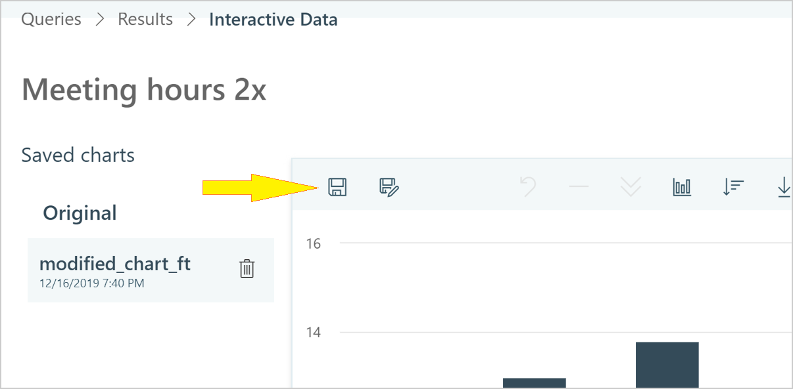

# Visualize person queries

Analysts can be tasked with finding ways to improve teamwork in their organization. For example, you might want to discover teams whose members regularly work longer after hours or who don't seem to have enough focus time. The [Person query](person-queries.md) can help you with this task, which includes a number of standard and custom metrics that can help you perform analyses of this kind.  

After you create and run a Person query, you can view its results (in the form of charts) without leaving the advanced insights app. You can refine your results view by having the charts focus on any of the metrics that you used in the query or on any organizational data attributes that have been uploaded. These steps are described in the following sections.

* [Run a query and view results](#run-a-query-and-view-results)
* [Save your charts](#save-your-charts)
* [Customize your data visualization](#customize-your-data-visualization)
* [Optionally create a plan](#optionally-create-a-plan)

In addition to these capabilities, you can also export results to a data visualization tool, such as [Power BI](../use/view-download-and-export-query-results.md). 

>[!Note]
>Your query results might indicate groups of employees that could benefit from a targeted [change plan](solutionsv2-intro.md) plan. You can create such a plan by starting with the query results display. For more information, see [Optionally create a plan](#optionally-create-a-plan).

## Run a query and view results

**Role** - Analyst

1. Open [the advanced insights app](https://workplaceanalytics.office.com/). If prompted, enter your work credentials.
2. In **Analyze** > **Query designer**, and then select **Get started** under **Query**.
3. Select **Person query**, and then define and run it. For details, see [Person queries](person-queries.md).
4. After the results are ready, go to **Query designer** > **Results**.
5. For the results, select **Visualization**.
6. In **Interactive Data**, you can use the charts to explore the data. A default visualization of results is automatically created and saved as a chart with the name "Original." This is a column chart that is formatted according to the default values in [Settings and filters](../use/explore-page-settings.md). All saved charts, including "Original," are listed in the **Saved charts** area.

To change how the results are presented, see [Customize your data visualization](#customize-your-data-visualization). After you have modified a visualization, you can save the modified version. See [Save your charts](#save-your-charts) for details.

## Customize your data visualization

**Role** - Analyst

The following steps are all optional. You can use them to refine your view of the query results in various ways.

1. **Modify filters and metrics** - Use **Settings and filters** to modify the date range, the filters that are applied, the metrics that you want included in your chart, and the number of groups that are displayed. Note that the kind of chart you are viewing could affect the view options that are available to you. For more information about using these settings, see [Settings and filters](../use/chart-types.md#settings-and-filters).

2. **Change chart attributes** - Use the chart toolbar to change the chart type or the chart’s sort order. Some options are available only with certain chart types.  

3. **Investigate groups** - Select particular groups in the chart to activate options for drilling down or for excluding. The groups that you select will be reflected in both the chart display and also in the settings panel. Groups will reset if you change the chart type or the sort order.  

As you add and apply filters and select groups, the chart section of the results page updates its overview of the population that you are working with.

## Save your charts

**Role** - Analyst

In **Interactive Data**, as you [customize visualizations](#customize-your-data-visualization) to reflect the results of a query in various ways, you can save those visualizations as charts. All changes are saved, including modifications to the chart type, the results of drilling down, or the application of [Settings and filters](../use/explore-page-settings.md).

1. In **Query designer** > **Results** > **Interactive Data**, select **Save as** to save a chart that you have created.  

   After you name the chart, it appears as a new item in the **Saved charts** list to the left of the chart area.

   

2. To save new modifications to a chart that you have already saved, select **Save**.

   

>[!Note]
>If your web browser stops responding while you are modifying a chart, you will not lose your progress. This is because changes are auto-saved as you work. They will be available to you the next time you open **Interactive Data**.

## Optionally create a plan  

Queries can serve as a means to identify opportunities for improvement and the groups who would benefit. Query visualization lets you find and save opportunities that you've discovered in the query results. Then, you can act on those opportunities by using them to create a plan in with **Plans** in the advanced insights app.

For more information about plans, see [Plans](solutionsv2-intro.md).  

**Role** - Analyst

1. While visualizing a query result, select one or more groups in the chart. In the following example, five finance groups are selected (selected groups are shown in light gray).

   

   Note the size of the selected groups. In this case, the total size of the selected groups is 71 members.

   

   The group size is important because query visualization adheres to the [minimum group size](../use/privacy-settings.md#minimum-group-size) that has been set for your organization. If you've selected a group smaller than the minimum group size, you see a warning that the "filter group is below the minimum size."

2. After you have a group or groups selected that meet or exceed the minimum group size, select **Submit group**.
3. In **Set up new plan**, select an appropriate plan type for the group that you designated and select **Start now**.
4. Select **Validate** to validate the selected group. You'll see warnings if the email addresses of plan participants are faulty or if participants' licenses are missing. (For more information, see [Validation](solutionsv2-conceptual.md#validation).)

   If validation fails, you can return to your query results and select a different group or additional groups, or start over. After any subsequent group selection, you must select **Validate** again. After validation succeeds, go to the next step.

5. With your group validated, you can now start a change plan. See the [Start the plan](solutionsv2-task.md#start-the-plan) section of [Plan walkthrough](solutionsv2-task.md).
6. After the plan starts and is underway, you can track its progress; for more information, see [Track plans](solutionsv2-task.md#track-plans). To learn about the plan from the participants' perspective, see [The experience of plan participants](solutionsv2-participants.md).

## Related topics

* [Person query](person-queries.md)
* [Plan walkthrough](solutionsv2-task.md)
