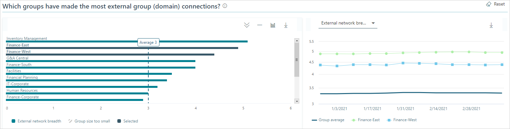

---

title: Explore external collaboration data in Viva Insights
description: An overview of external collaboration data available in Viva Insights
author: madehmer
ms.author: helayne
ms.topic: article
ms.localizationpriority: medium 
ms.collection: viva-insights-advanced 
ms.service: viva 
ms.subservice: viva-insights 
search.appverid: 
- MET150 
manager: scott.ruble
audience: Admin
---

# External collaboration

**External collaboration** shows a summary of your employees' network patterns with people outside the company. You can use this to understand how certain groups of people within your company spend their time interacting with people in external domains. Interaction with external domains typically implies collaboration with customers, business partners, or suppliers.  

>[!Note]
> All data is reported at a group level and cannot be traced back to any individual.

External collaboration has a number of graphs that help you analyze data based on what's selected for the graph or for the page in [Settings and filters](#settings-and-filters). For example, the following graph has an option of showing the data based on either total collaboration hours or total collaboration cost.

## Access to External collaboration

**External collaboration** data is available through **Home** > **Increase customer focus** > **Optimize time with customers** > **See your insights** > **Explore the stats**. Or sign in to [the advanced insights app](https://workplaceanalytics.office.com)(if that link doesn't work, try [this](https://workplaceanalytics-eu.office.com/))
, and then open [External collaboration](https://workplaceanalytics.office.com/en-us/Home/Agility/ExternalCollaboration)(if that link doesn't work, try [this](https://workplaceanalytics-eu.office.com/en-us/Home/Agility/ExternalCollaboration))
 to view it.

## Summary data

External collaboration includes the following summary information.

* **Weekly averages** shows the date range for the data, which is based on the date range set in [Settings and filters](#settings-and-filters).
* **Measured employees** is the number of people in your company who have been assigned a Viva Insights license. Any filters applied in [Settings and filters](#settings-and-filters) do not change this number.
* **In filter group** is the number of employees who had collaboration activity during the date range and are included in the filter applied in [Settings and filters](#settings-and-filters).
* **Estimated cost of external collaboration** is the total external collaboration hours multiplied by the average hourly wage, which is based on salary data provided in your organizational data. If salary data is not available, the calculation uses the average hourly default of $75.
* **Percentage of measured employees with external contacts** is the percentage of your measured employees who had one or more interactions with people outside the company during the set date range.
* **Percentage of total hours spent in external collaboration** and the number of external collaboration hours as compared to the total collaboration hours that employees spent collaborating with people outside the company as compared to all collaboration, which is defined by at least one interaction during the set date range.
* **External collaborators** is the number of people outside your company whom the measured employees collaborated with at least one time during the set date range. This number does not change with applied filters in [Settings and filters](#settings-and-filters).

## External domain collaboration

The first graph shows the top external domains that people in your company spend the most time with. You can change what the top domains are based on, including total collaboration hours, total collaboration cost, and total number of engaged employees.

>[!Note]
>Personal email domains, such as live.com, are included in overall metric calculations but are hidden from the top external domains chart to reduce noise.  

## External group collaboration

The second graph shows which groups in your company have the most people collaborating with external people. External people is defined by the group-by attribute for **Time investors** in [Settings and filters](explore-page-settings.md#time-investors). By default, the group-by attribute is **Organization** for time investors.

## Weekly average collaboration

This graph shows the top groups who collaborated with external domains based on weekly average number of either total collaboration hours or cost. The top groups are based on the total number of people who had one or more interactions (meetings or email) with people outside the company within the selected date range. The external domains are defined by the group-by attribute for **Time investors** in [Settings and filters](explore-page-settings.md#time-investors).

## External network size

**External network size** is the number of people external to the company with whom a person had at least two [meaningful interactions](glossary.md#meaningful-interaction-define) with in the last 28 days (or if reported by month, in the last month). For example, a sales person tends to have a greater external network size and breadth than a person whose company role is mainly internal.

## External network breadth

The graph for **External network breadth** is the number of distinct external groups or domains with whom an employee had at least two [meaningful interactions](glossary.md#meaningful-interaction-define) with in the last 28 days (or if reported by month, in the last month).

## Small groups with large external networks

The graph compares the external network breadth and size of small groups in the company (based on the Time investor group-by attribute in Settings and filters) to the company medians. The size of the bubble in the chart represents the size of the group (organization).

* **External network breadth** shows the number of unique external domains that groups in the company have connected with. For example, if a group only talked to people with the Contoso.com domain, then that group's external network breadth would be equal to one. If they talked to people in both the Contoso.com and Adatum.com domains, their external network breadth would be two.
* **External network size** shows the number of external people that groups in the company have connected with. If a group talked to 20 people in the Contoso.com domain, then their external network size would be 20.

This graph can help you determine whether small groups in your company are making a significant number of external connections. Conversely, the graph can also show whether big groups are making relatively few external connections.

In the graph, if the bubble for your group is found at the top right, then your group made the most external connections and contacted the greatest number of unique domains in the selected date range.  

## Settings and filters

 For External collaboration data, you can use **Settings and filters** to change the date range or to apply or change filters for what data is shown in the charts and graphs. For more details, see [Settings and filters for Explore the stats](explore-page-settings.md).

## Related topics

* [Settings and filters for Explore the stats](../use/explore-page-settings.md)
* [Advanced insights charts](../use/chart-types.md)
