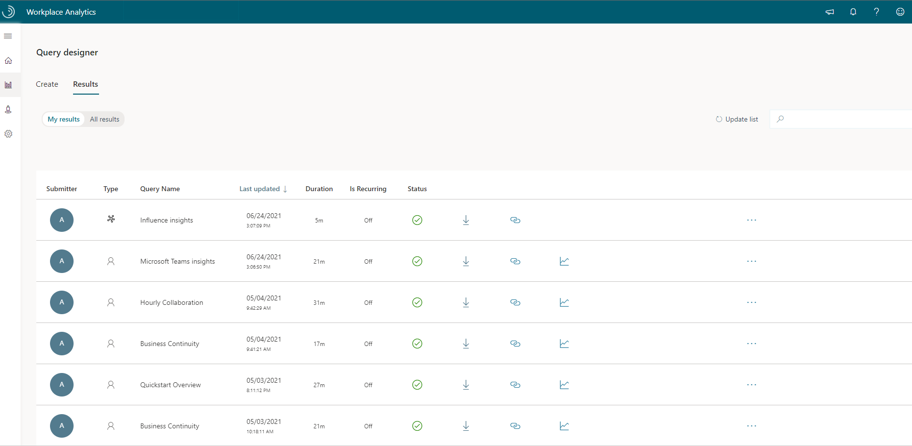

# View, download, and export query results

**Role** - The Analyst role for the advanced insights app is required to view, download, or export query results
  
In the advanced insights app, the **Analyze** > **Query designer** > **Results** > **All results** page lists all the results available for your organization.

In addition to seeing basic information about each, you can view results, download query results as a .csv file, delete results, or get a link to access them as data in Power BI or Excel.

## View query results

In Query designer results, you can switch between **All results** (includes results created by all analysts) and **My results** (only results that you created, as an analyst).

1. In the app, go to **Analyze** > **Query designer** > **Results** > **All results**.
2. Next to the result you want to view, select the **Ellipsis** (**...**) > **View query**.

## Supported languages for column headers

When you define a query, you select metrics and organizational-data attributes. After the query runs, its results are organized into columns and rows. The column headers in the results match the attribute names and metric names that you selected while defining the query. However, note this difference in the way attributes and metrics show in column headers:

* **Names of organizational-data attributes** - Attribute names must be in English when organizational data is uploaded. They remain in English while and after the data is processed in the advanced insights app. This means that they appear in English in OData output and in query results.

* **Metric names** - Any UTF-8-encoded characters are allowed in metric names, which means that metric names are always preserved and returned intact in both query and OData outputs, regardless of the language, or even the character set, in which you input them.

In the following example of a query-result file that's been opened in Excel, metric names were input in Japanese and remain in Japanese, while attribute names were uploaded in English and remain in English:

  
>[!Note]
>Metric names in character sets other than the Latin character set are retained in their original languages (as described here) for all query types but two: the [Peer comparison query](../tutorials/comparison-query.md) and the [ONA Person-to-person query](../tutorials/ona-person-to-person-query.md). In the results for these query types, metrics in non-Latin-character-set text appear in column headers as garbled characters.

>[!Important]
>If your organization has custom applications or clients that use or process query-result data, these downstream apps or clients must be prepared to accept query output with column headers as described here, namely with metric names in their original language and with organizational-data attribute names in English.

## Use Viva Insights data in Power BI, Excel, or other data-analysis tool

You can use the following options to access and use Viva Insights query data in a different data-analysis tool to create visuals and reports outside of the advanced insights app.

|Option | Description |
|------ | ----------- |
|[Download and import query results](#download-and-import-query-results) | Exports *static raw data* from a Advanced insights query as a .csv file, which you can then import into a tool of your choice.   When sharing analysis in the other tool, take caution to ensure that only authorized users can access the raw data. |
|[Get a link for an OData feed to use in Power BI](#get-a-link-for-an-odata-feed-to-use-in-power-bi) | Automatically imports dynamic, raw query data from the advanced insights app into Power BI.  When sharing analysis in Power BI, take caution to ensure that only authorized users can access the raw data.   If the query is set up to auto-refresh in the advanced insights app, your Power BI visuals will automatically update on the same schedule.|
|[Connect through the Power BI Connector](#connect-through-the-power-bi-connector) | Automatically connects Power BI to dynamic, aggregated data from within Person or Meeting queries.   Automatically enforces data privacy by keeping the raw data in the advanced insights app. As you create visuals in Power BI, the Connector dynamically provides the aggregated data to support them (in DirectQuery mode).   If the query is set up to auto-refresh in the advanced insights app, your Power BI visuals will automatically update on the same schedule. |

### Download and import query results

The following steps are for Excel 2016. For other versions of Excel, open **Help** within Excel and search and use Excel's instructions on how to import a .csv file.

1. In **Analyze** > **Query designer** > **Results** > **All results**, next to the results you want, select the **Download** icon.
2. If prompted, select to download the results as a .csv file.
3. Select to open and right-click the zip file, which contains a .csv version of the data, and then select **Extract All** and extract the .csv to a local folder.
4. Open **Excel**, select to open **a new document**, and then open **a blank workbook**.
5. In the blank Excel workbook, select the **Data** tab at the top, and then select **Get Data** > **From File** > **From Text/CSV**.

    

6. Locate, select, and open the .csv file you unzipped in step 3.
7. In the **Text Import Wizard**, in **File Origin**, select **Unicode (UTF-8)**, and in **Preview**, confirm the data (including multi-byte characters) are shown correctly.​
8. In **Delimiter**, select **Comma**, and in **Data Type Detection**, select the applicable option, and then select **Load**.
9. Select **File** > **Save As** and save the file as an Excel (.xlsx) file to maintain the data in its currently formatted form, including multi-byte characters.​

### Get a link for an OData feed to use in Power BI

>[!Note]
>You can share Power BI dashboards. For details, see [Share your Power BI dashboards and reports with coworkers and others](/power-bi/service-share-dashboards).

1. Next to the query you want, select the **Copy link** icon.
2. In Power BI, paste the URL into the **OData feed** dialog box.
3. Select **Organizational account** and then select **Sign in**:

   

4. When the **Microsoft 365** dialog box prompts you, select the account and enter the password that you use to sign in to the advanced insights app. You'll then see: "You are currently signed in."
5. In the **OData feed** dialog box, select **Connect**. A "Refresh" dialog box might appear and display the status of the preparation of your data for import.

   After Power BI finishes importing your Viva Insights data, use Power BI tools to create visualizations of the data.

   >[!Important]
   >The OData link is not available for query results that were created before March 22, 2018.

   >[!Note]
   >The auto-refresh option for queries determines whether the data in the OData feed is static or dynamic:
   >* If the URL is tied to a query that is set to auto refresh, the data in the Odata feed updates on a regular schedule. For more information, see [Auto-refresh option for queries](../tutorials/query-auto-refresh.md).
   >* If the URL is tied to a query that is not set to auto refresh, the data in the OData feed is not automatically updated. This means that if you want new or different data, you must run a new query and get a new corresponding URL.

### Use an OData link to view data in Excel

1. In **the advanced insights app**, go to **Analyze** > **Query designer** > **Results**.
2. Next to the results you want to view, select the **Copy link** icon and select **Copy**:

   

3. Open Excel and select **Blank workbook**.
4. In the new Excel workbook, in the **Data** menu, select **Get Data > From Other Sources > From OData Feed**:

   

5. In Excel, paste the copied OData link into the **OData feed** dialog box and select **OK**:

   

6. Select **Organizational account** and then select **Sign in**:
7. When the Microsoft 365 dialog box prompts you, select the account and enter the password that you use to sign in to the advanced insights app. You'll then see: "You are currently signed in."
8. In the **OData feed** dialog box, select **Connect**. Before the query-results data is imported into your Excel workbook, a **Refresh** dialog box might appear that shows the status of preparation of the data for import.

After Excel finishes importing your Viva Insights data, use Excel to explore and create visualizations of the data.

### Connect through the Power BI Connector

The Power BI Connector automatically enforces the privacy rules configured in the advanced insights app by providing aggregated query data in Power BI. It also automatically updates your Power BI visuals by using the same auto-refresh schedule set for the query in the advanced insights app.  

You can connect to aggregated, auto-refreshed data from custom Person or Meeting queries, which include the metrics and attributes that you want to dynamically analyze and visualize within Power BI.

#### Prerequisites

* **Power BI Desktop** - Confirm you have the latest version of [Power BI Desktop](https://powerbi.microsoft.com/desktop/) installed.
* **Partitions access** - To import query data into Power BI, you need access to the partition in the advanced insights app that contains the metrics and attributes you want to analyze in Power BI. To access partition data, use the following steps to sign in to your organizational account and select the partition ID.

#### Use the Power BI Connector

1. In Power BI Desktop, select **Get Data**.
2. Select **Online Services**, select **Workplace Analytics**, and then select **Connect**.
3. Locate and copy the identifier of the currently selected Viva Insights partition. To do this, select the user icon in the top right of the page in the advanced insights app, select **My information**, and then highlight and copy the **Partition identifier**.

    

4. In **Connect to Workplace Analytics Data**, paste the copied partition identifier.

    

   * If you only enter a Partition Identifier and no Query Name or Query Identifier, you will get a general set of Person metrics for the Power BI reports. For details, see [Power BI Connector metrics](power-bi-metrics.md).

   * If instead you want to connect to a custom Person or Meeting query, follow these steps:

     * Enter the exact query name in **Query Name** as shown in **Query results**.
     * Or do the following to enter the query's ID in **Query Identifier**.

       1. In the advanced insights app, select **Analyze** > **Query designer** > **Results**, and then select the **Copy link** icon next to the query you want to connect to in Power BI.
       2. Only highlight and copy the **32-digit ID** just before the query type at the end of the link (as shown in the following graphic), and then paste it into **Query Identifier** in the Power BI.

          

       3. You can add up to two results at a time by adding two IDs, separated by a comma. When two results are added at the same time, they are combined into a single table in Power BI.

5. In **Schema Type**, you can _optionally_ select one of the following:

   * **Pivoted (Default)** - The organizational attribute data is imported by using the default data schema that is used in Viva Insights.
   * **Unpivoted** - Currently only available for person queries. Select to ‘unpivot’ the imported organizational data into two columns named **Attribute Name** and **Attribute Value** for easier comparisons across attributes.

6. Select a data connectivity mode, and then select **OK**. For details, see [Use DirectQuery in Power BI Desktop](/power-bi/desktop-use-directquery).

   * **DirectQuery** (*recommended*) – As you create Power BI visuals, the Connector will provide the aggregated data to support them.  
   * **Import** – Requires you to identify how you want to aggregate the data first. That data is then imported into Power BI and from there you can create your visualizations.  
7. The first time you use the Power BI Connector for a partition ID, or when your authentication token expires, and you're prompted to sign in, select **Sign in**, enter your Microsoft 365 credentials, and then select **Connect**.
8. In the **Power BI Navigator**, select the query name or standard person metrics that you want to analyze, and then select **Load**.

    

In Power BI, you can use the **Power Query Editor** to shape and combine data and create visualizations with the available fields. For details about how to use Power BI, see [Power BI documentation](/power-bi/).

The following is an example of a chart that shows an organization-wide analysis of collaboration hours and meeting hours trend.

After you have finished creating visuals, you can publish your reports to Power BI online and share them with others in your organization. For more information, see [Share your Power BI dashboards and reports with coworkers and others](/power-bi/service-share-dashboards).

## Related topics

* [Connect to OData feeds in Power BI Desktop](/power-bi/desktop-connect-odata)
* [Power BI tips, FAQ, and troubleshooting](../tutorials/power-bi-templates.md)
* [User roles in Viva Insights](../use/user-roles.md)
* [Auto-refresh option for queries](../tutorials/query-auto-refresh.md)
* [Supported languages and guidelines](../overview/supported-languages.md)
