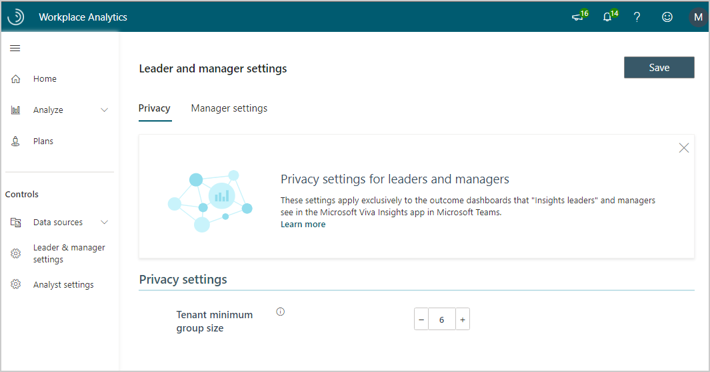

---

title: Leader and manager settings for Viva Insights
description: Learn about Leader & manager settings that only administrators can configure and edit in the advanced insights app for Microsoft Viva Insights
author: madehmer
ms.author: helayne
ms.topic: article
ms.localizationpriority: medium 
ms.collection: viva-insights-advanced 
ms.service: viva 
ms.subservice: viva-insights 
search.appverid: 
- MET150 
manager: scott.ruble
audience: Admin
---

# Leader and manager settings

As the Microsoft Viva Insights Administrator, you can use **Leader & manager settings** to configure the following.

* **Privacy settings** - Applies exclusively to the outcome data that leaders see in the Viva Insights app in Microsoft Teams. Use the **Tenant minimum group size** setting to set the minimum number of people in a group, which must be at least five, before **Insights Business Leaders** can see any data in **My organization**.
* **Manager settings** - Enable all or specific people managers to see team insights on the **My team** page within Viva Insights in Teams. For details, see [Manager settings](manager-settings.md).

**Owner** – Viva Insights Administrators can access these settings. For details, see [Assign roles](../setup/assign-roles-to-wpa-admins.md).

## To access the settings

1. Open [the app](https://workplaceanalytics.office.com). If prompted, enter your admin credentials.
2. In the left navigation pane, select **Leader & manager settings**.

## Related topic

[Assign roles](../setup/assign-roles-to-wpa-admins.md)
