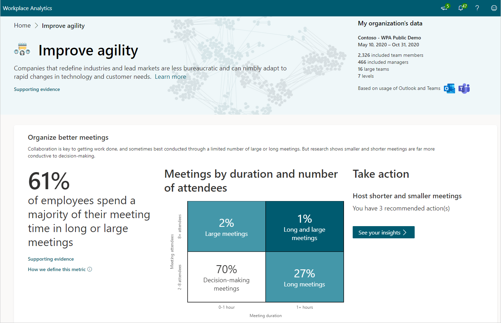
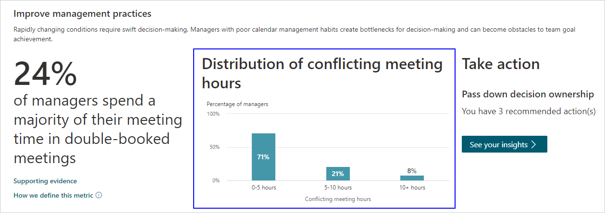

# Improve organizational agility

Companies that redefine industries and lead markets are less bureaucratic and nimbly adapt to rapid changes in technology and customer needs. Each of the behaviors listed show how your organization compares with others based on industry research and your specific organizational data.

## Calculations

The following are the percentage insights, their underlying metrics, and a little about the calculations used for them.

|Behavior |Percentage insight | Metrics |Calculations |
|---------|--------|--------------------|----------------------|
|Organize better meetings |Percentage of employees who spend a majority of their meeting time in long or large meetings | [Attendees](metric-definitions.md#attendees-define), [Attendee meeting hours](metric-definitions.md#attendee-meeting-hours-define), [Long meetings](glossary.md#long-meeting-define), [Large meetings](glossary.md#large-meeting-define)| Percentage of employees who spend more than 50 percent of their meeting hours in long or large meetings. The insight is calculated weekly and averaged over the entire time period.  |
|Accelerate decision making |Percentage of employees who could be empowered to make faster decisions | [Influence](metric-definitions.md#influence-define)  |Employees whose influence score is within 25 percent of their manager's influence score are considered empowered employees. This insight calculates the number of employees who are empowered as compared to all measured employees.  |
|Improve management practices |Percentage of managers who spend a majority of their meeting time in double-booked meetings | [Attendees with conflicting meeting](metric-definitions.md#attendees-with-conflicting-meeting-define) |Percentage of managers who spend more than 50 percent of their time in overlapping meetings. The count includes the entire duration of the overlapping meetings, not just the amount of time that overlaps. This counts all non-declined meetings, including accepted, tentative, and no responses to meeting invitations on their calendars. This insight is calculated weekly and averaged over the entire time period. |

The following defines the organizational data shown in the visual behavioral insights.

|Behavior |Visual insight | Definition |
|---------|--------|----------------------|
|Organize better meetings | Meetings by duration and number of attendees | Shows the percentages of meetings that are [long](glossary.md#long-meeting-define), [large](glossary.md#large-meeting-define), [long and large](glossary.md#long-and-large-meeting-define), and [decision-making meetings](glossary.md#decision-making-meeting-define). |
| Accelerate decision making | Employee empowerment | [An organizational network graph](insight-ona-measures.md) that shows the distribution of empowered employees and less empowered employees in your organization. This helps identify information sharing patterns, and where they are well represented in your organization. You can use this insight to understand at a high level which parts of your organization could benefit from better information sharing practices. This graph uses the [influence metric](metric-definitions.md#network-metrics). |
|Improve management practices | Distribution of conflicting meeting hours | Shows the percentage of managers according to the number of their [conflicting meeting](glossary.md#conflicting-meeting-define) hours. These percentages are calculated weekly and averaged over the entire time period. |

## Take action

You can select **See your insights** to see ways you can drive change or simply maintain organizational agility. Depending on your role, the following are available in addition to the recommendations within Take action.

* **Opportunity groups** - Lists the groups who are most affected and would benefit the most from these recommended best practices or [Plans](/viva/insights/Tutorials/solutionsv2-intro?toc=/viva/insights/use/toc.json&bc=/viva/insights/breadcrumb/toc.json), which are based on your organizational data and industry research.
* **Explore the stats** – The following recommendations link to more in-depth data about your organization's [meetings](explore-metrics-meetings-overview.md), [internal networks](explore-metrics-internal-networks.md), or [teamwork](/viva/insights/tutorials/teamwork-solution?toc=/viva/insights/use/toc.json&bc=/viva/insights/breadcrumb/toc.json). In the **Take action** section for each of the following behaviors, select **See your insights** > **Explore the stats** to access them:

  |Behavior |Recommendation |Explore the stats|
  |---|---|---|
  |Organize better meetings |Try shorter and smaller meetings |[Meetings overview](https://workplaceanalytics.office.com/en-us/Home/Agility/MeetingsOverview)(if that link doesn't work, try [this link instead](https://workplaceanalytics-eu.office.com/en-us/Home/Agility/MeetingsOverview))|
  |Accelerate decision making |Increase information sharing |[Internal networks](https://workplaceanalytics.office.com/en-us/Home/ChangeManagement/InternalNetworks)(if that link doesn't work, try [this link instead](https://workplaceanalytics-eu.office.com/en-us/Home/ChangeManagement/InternalNetworks))|
  |Improve management practices |Pass down decision ownership |[Teamwork](https://workplaceanalytics.office.com/en-us/Plans/Teamwork)(if that link doesn't work, try [this link instead](https://workplaceanalytics-eu.office.com/en-us/Plans/Teamwork)) |

* **Explore in Power BI** - If available, links to [Power BI reports](/viva/insights/tutorials/power-bi-intro?toc=/viva/insights/use/toc.json&bc=/viva/insights/breadcrumb/toc.json) for more advanced analysis for one or more of the recommendations.
* **Plans** - Opens a new [Plan](/viva/insights/Tutorials/solutionsv2-intro?toc=/viva/insights/use/toc.json&bc=/viva/insights/breadcrumb/toc.json) you can set up relating to one or more of the recommendations.

## Best practices

This section describes why each of the following behaviors matter and the top best practices that can help improve agility.

* [Organize better meetings](#organize-better-meetings)
* [Accelerate decision making](#accelerate-decision-making)

### Organize better meetings

Long and large meetings are costly and often considered a waste of time. Shorter and smaller meetings provide the conditions for effective decision making.

[The condensed guide to running meetings](https://insights.office.com/collaboration/how-to-run-effective-meetings-and-stop-wasting-time/) suggests: "Always set an agenda out ahead of time—and be clear about the purpose of the meeting." Other ways to reduce meeting size or length:

* When composing a meeting invitation with a duration of one hour, note the [inline suggestion](../personal/use/mya-notifications.md#shorten-a-meeting) to shorten the meeting by 15 minutes.
* When preparing the agenda, include the purpose of each participant's attendance. This exercise can reveal unnecessary invitees, including people who are optional or only require meeting notes.

For more best practices, see [Best practices for meetings](../tutorials/gm-meetings.md).

### Accelerate decision making

Agile organizations are transparent and freely share information to avoid miscommunication and enable smart and timely decision making.

According to [Five ways to empower your team to make decisions](https://insights.office.com/management-strategy/five-ways-to-empower-your-team-to-make-decisions/): “Employee empowerment is directly tied to results. A study by Zenger Folkman found 4 percent of employees are willing to put in more effort when empowerment is low, while 67 percent are willing to go above and beyond when empowerment is high.” Ways to empower decision making:

* Provide wide access to [Teams meeting recordings](https://support.microsoft.com/office/record-a-meeting-in-teams-34dfbe7f-b07d-4a27-b4c6-de62f1348c24) and [meeting notes](https://support.microsoft.com/office/add-a-onenote-notebook-to-teams-0ec78cc3-ba3b-4279-a88e-aa40af9865c2) in public channels whenever possible to increase the rate of information sharing.
* Use [Teams channels](/microsoftteams/teams-channels-overview) to share information as it emerges both formally through notes and files and informally through chats.
* Use [Viva Insights in Outlook](../personal/use/use-the-insights.md) for calendar management and to increase awareness of conflicting meetings and meetings that inform you of decisions.

For more best practices and change strategies, see [Best practices for meetings](../tutorials/gm-meetings.md).

### Improve management practices

When managers are needed in more meetings than they can attend, they become obstacles to team goal attainment and create bottlenecks in decision making.

The level of day-to-day collaboration between managers and their employees can indicate whether employees feel empowered to take initiative and work independently, or if they struggle to separate themselves from their manager.

[Collaboration overload is a symptom of a deeper organizational problem](https://insights.office.com/collaboration/collaboration-overload-is-a-symptom-of-a-deeper-organizational-problem/) explains that “meetings can become a substitute for effective leadership communication. Rather than taking the time to share the specifics discussed in a meeting with subordinates who did not attend, some leaders opt to invite an army to every meeting.” Ways to improve:

* Empower employees with ownership of work streams so they can quickly make decisions and take action.
* Use [Viva Insights in Outlook](../personal/use/use-the-insights.md#prepare-for-your-meetings) to manage your calendar and increase your awareness of conflicting meetings and meetings that keep you informed of decisions.
* Promptly decline meetings as soon as possible with a brief explanation for why to reinforce decision rights and role model healthy habits.

For more best practices and change strategies, see [Best practices for meetings](../tutorials/gm-meetings.md).

## Related topics

* [Business outcomes overview](insights.md)
* [Metric descriptions for Advanced insights](metric-definitions.md)