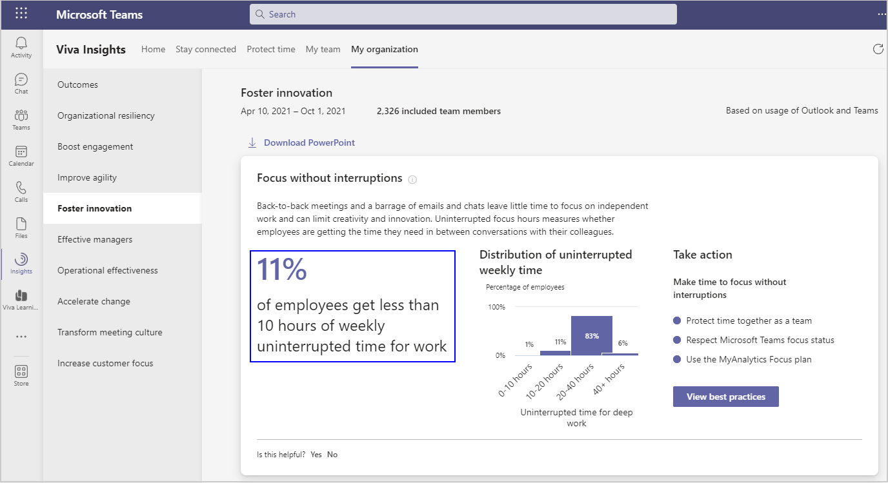
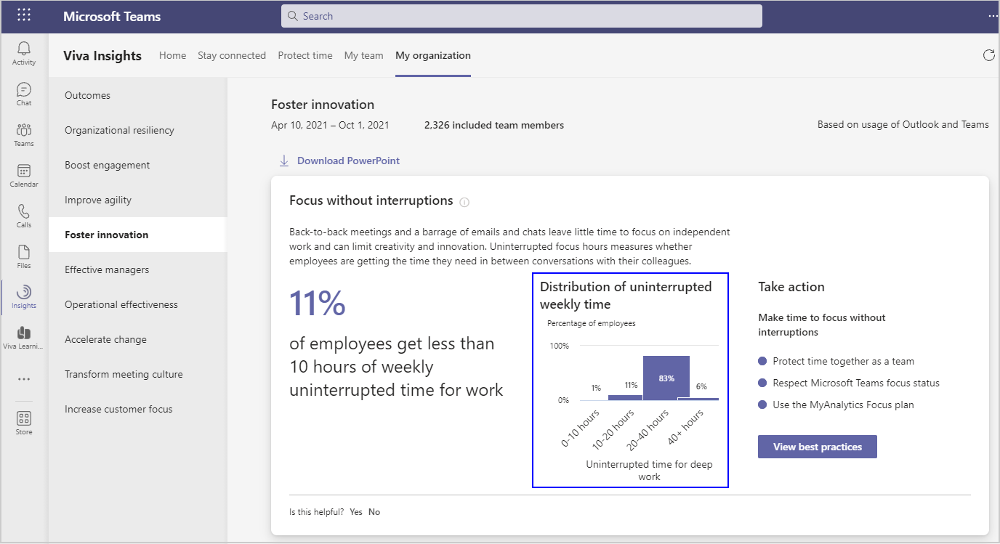

# Foster innovation

Employees who share information, prioritize learning, and protect time for deep thinking generate the new ideas needed for success in rapidly evolving markets. Each of the behaviors listed show how your organization compares with others based on industry research and your specific organizational data.

Microsoft Viva Insights has a **My organization** page that shows leader's collaboration data about their team. The outcomes include data about **Foster innovation**.

## Calculations

The **Focus without interruptions** insight shows a percentage of employees who get less than 10 hours of weekly uninterrupted time for work that uses the [Total focus hours](metric-definitions.md#focus-define) metric. The calculation is based on the percentage of employees who have less than 10 hours available to focus each week. It's calculated weekly and averaged over the time period.

<!--|Leverage influencers |Percentage of organizations who have few influencers |[Influence](metric-definitions.md#network-metrics) |Influencers are employees with the best connections to people across the company based on their collaboration patterns. This insight highlights the organizations that don't have sufficient representation of them, based on company and organization size.-->
The visual insight for **Focus without interruptions** is the **Distribution of uninterrupted weekly time** that shows the percentage of employees grouped by their uninterrupted [focus time](metric-definitions.md#focus-define). The groups are divided into those who spend between 0 and 10 hours, 10 and 20 hours, 20 and 40 hours, and more than 40 hours focusing. The percentages are calculated weekly and averaged over the entire time period.

<!--Leverage influencers |Organizations with limited influencers |Percentage of organizations that don't have sufficient representation of influencers, based on company size. This uses the [influence](metric-definitions.md#network-metrics) metric.|-->

## Best practices

To take action on an outcome, you can select **View best practices** to see the list of recommendations for the insight. This section describes why it's important for your employees to get time to **Focus without interruptions** and the top best practices to help them do so.
<!-- ### Foster cross-group collaboration

Collaboration across organizational boundaries enables the learning and idea formation required for innovation. [How to Make Sure Agile Teams Can Work Together](https://insights.office.com/collaboration/how-to-make-sure-agile-teams-can-work-together/) explains that work "occurs through collaboration in networks of relationships that often do not mirror formal reporting structures or standard work processes."

Ways to create opportunities for cross-group collaboration:

* Create cross-functional [Teams channels](/microsoftteams/teams-channels-overview) to build community and communicate, share information, and brainstorm about projects.
* Give teams an opportunity to join cross-functional teams to compete in an innovation challenge around a key business challenge.

For more best practices and how to create goals across teams or departments, see [Best practices for cross-group collaboration](../tutorials/gm-cgcollaboration.md).

## Focus without interruptions-->

Back-to-back meetings and a barrage of emails and chats leave little time to focus on independent work and can limit creativity and innovation. Are your employees getting the time they need in between conversations with their colleagues to complete challenging work, think creatively, and generate innovative ideas.

[How to establish a meeting-free day each week](https://insights.office.com/time-management/how-to-establish-a-meeting-free-day-each-week/) explains the "goal is uninterrupted focus" time to work "on projects that require focus and high-level thinking..." Ways to support focus time:

* Follow a team norm to not send chats to team members who have scheduled focus time or have the focusing status showing in Microsoft Teams.
* Use a [Focus plan](../personal/use/focus-plan.md) to automatically book focus time, protect this time by silencing chats, and track weekly progress.

For more best practices and ways to establish a 'no meeting' period, see [Best practices for focus time](../tutorials/gm-focus.md).
<!-- 
## Leverage influencers

Influencers are employees who are well connected to other influential employees. Your influencers can help extend the reach of innovative ideas by cascading new information through the organization.

The [Measuring your employees’ invisible forms of influence](https://insights.office.com/productivity/measuring-your-employees-invisible-forms-of-influence/) article says that "traditional organizational reporting structures limit managers’ visibility into how their employees are influencing and contributing to other teams. New workplace metrics are needed to help leaders get a more complete picture of this." Ways to leverage influencers:

* Use [Viva Insights](../personal/use/use-the-insights.md) and the [Network](../personal/use/network.md) page to see connections, top collaborators, and suggestions on how to improve connections and cultivate influence.
* Use [Microsoft Teams channels](/microsoftteams/teams-channels-overview) for cross-functional team collaboration and to drive conversations.

For more best practices and how to identify and utilize influencers, see [Best practices for influencers](../tutorials/gm-influencer.md).-->
