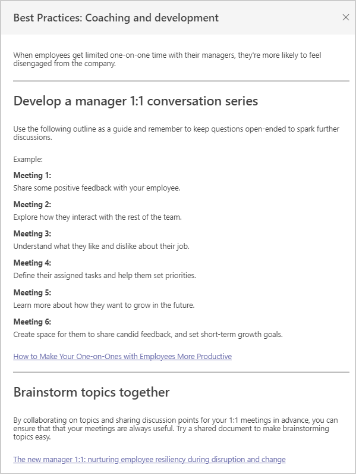

---

title: Explore group insights in Viva Insights
description: Explore more about group insights shown in Microsoft Viva Insights
author: madehmer
ms.author: helayne
ms.topic: article
ms.localizationpriority: medium 
ms.collection: viva-insights-manager 
ms.service: viva 
ms.subservice: viva-insights 
search.appverid: 
- MET150 
manager: scott.ruble
audience: Admin
---

# Explore group insights

Research shows that happy employees help boost productivity and reduce turnover. As a manager, Microsoft Viva Insights has a **My team** page that shows you insights and suggestions that can help you maintain positive employee experiences, such as evaluating how much time your group is working after hours on email or instant messages, and if your group is getting enough 1:1 time with you and other managers.

The **Group insights** section is available to managers who the Viva Insights admin specifies. Group insights are based all employees that report up to you as the manager, not just your immediate group members or direct reports. The admin uses the organizational data that is uploaded into the advanced insights app or that’s presented in Azure AD.

See [Admin tasks](../setup/ml-insights-setup.md) for details about the requirements and ask your admin for access.

You can see more group insights about your group by selecting **Explore more** in the **Group insights** section.

## Best practices

To see what actions are recommended for a specific group insight, select **View best practices**. For example, select **View best practices** to see what’s recommended for **Coaching and development**.

## About the group insights

You can see more details about an insight by selecting the **Information** (i) icon for it. The following describes how your group metrics are calculated to support these behavioral insights. With **Groups like yours**, you get comparable data from within your organization for context into broader organizational patterns. Today, "Group like yours" data is calculated as averages from peer manager groups. If you have only one peer group or no peer group, the company average is shown instead.

|Insight |Group metric description |Metric average for your group and "groups like yours" |
|--------------------------|-------------------|-----------------|
|Coaching and development |One-on-one time is the number of meeting hours with only an employee and their manager. To account for various meeting frequencies, the total time is calculated for each employee per month and averaged over a week. |The average number of hours that managers spend in one-on-one meetings with *all* of their direct reports. |
|Email overload |Employees that spend over 10 hours in email each week. Email workload is the number of hours employees spend sending and receiving email. |Average number of hours spent sending and receiving email. |
|After-hours work |After-hours work is the number of hours employees spend in meetings and on email outside of working hours. This uses the working hours set in the employee's Outlook calendar settings. |Average number of total hours a group spent in meetings and on email outside of working hours. |
|Long and large meetings |The number of employees that spend over 30 percent of their total meeting time in long or large meetings, divided by the total number of measured employees. Long meetings are those scheduled for more than an hour. Large meetings are those that involve more than eight people. |Average number of meeting hours spent by the group. |
|Focus time |The number of employees who have less than 20 hours each of available time for focused work, divided by the total number of measured employees. Focus time is when employees have two or more consecutive hours with no meetings. |Average number of total hours |
|Instant message use |One-on-one communication is the combination of email and instant messages (IMs) sent between two employees. This insight highlights the employees that spend less than 20 percent of their one-on-one communication over Teams IM. This is calculated as the percentage of one-on-one IMs sent, divided by the total number of one-on-one IMs and emails sent. |Average number of emails sent between only two employees. |
