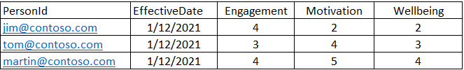

---

title: Viva Insights and Qualtrics integration
description: Learn how to integrate Microsoft Viva Insights and Qualtrics Prism Analytics data for more advanced analysis
author: madehmer
ms.author: helayne
ms.topic: article
ms.localizationpriority: medium 
ms.collection: viva-insights-advanced 
ms.service: viva 
ms.subservice: viva-insights 
search.appverid: 
- MET150 
manager: scott.ruble
audience: Admin
---

# Viva Insights and Qualtrics integration

The Microsoft Viva Insights and Qualtrics integration combines employee collaboration data from Viva Insights with employee engagement data in Qualtrics.

This integration enables you to combine Viva Insights query data and Qualtrics Employee Experience data. You can then identify behaviors and patterns behind key metrics, such as motivation, engagement, and wellbeing.

The following shows an example of how you can connect Qualtrics survey scores with Viva Insights query data.

|Qualtrics survey categories |Viva Insights metrics
|---------------------|-------------------|
|**Engagement**: I feel motivated and supported at work |Manager 1-1 hours, Skip level meeting hours, and Internal network size |
|**Motivation**: I know what to focus on at work |Manager 1-1 hours |
|**Wellbeing**: I am able to achieve a healthy work-life balance |After-hours collaboration and Focus hours |

## Example use cases

For example, the following shows how you can use Qualtrics survey scores for employees within the Viva Insights [Ways of working assessment](../tutorials/power-bi-collab-assess.md) dashboard in Power BI. You can use the report settings to filter the data to depict favorable (or unfavorable) responses and observe how collaboration patterns differ based on their wellbeing scores.

The following shows example data in **How is collaboration load impacting after-hours** for analyzing how your employees’ collaboration patterns are affected by after-hours work for those who had a score of **4** or **5** for **Wellbeing** in their Qualtrics survey.

The following example shows how you can include Viva Insights metrics in Qualtrics as filters at the top of the dashboard to filter the entire page. And then you can use these to configure the widgets on your Qualtrics dashboard to include Microsoft Viva metrics as breakouts.

## Integration options

* [Use Qualtrics data in Viva Insights](#use-qualtrics-data-in-viva-insights-analysis)
* [Use Viva Insights data in Qualtrics](#use-viva-insights-data-in-qualtrics)

## Use Qualtrics data in Viva Insights analysis

To use Qualtrics survey score data in Viva Insights:

1. [Export Qualtrics survey data](#export-qualtrics-survey-data)
2. [Upload Qualtrics data into Viva Insights](#upload-qualtrics-data-into-viva-insights)
3. [Data analysis in Viva Insights](#data-analysis-in-viva-insights)

### Export Qualtrics survey data

A Qualtrics data manager with the necessary credentials must complete the following steps to export employee survey data.

1. After you have completed survey collection for your engagement project, select the project name, such as **Microsoft Viva Engagement** to open it in **Qualtrics Employee Experience**. For details, see [Creating a Project (Employee Experience)](https://www.qualtrics.com/support/employee-experience/projects/creating-a-project-ex/).
2. Select the **Data & Analysis** tab for the project.

   

3. Select **Export & Import** > **Export data**.
4. When prompted, select **Excel**, select the **Download all fields** checkbox, select **Use numeric values**, and then select **Download**.

   

5. Open the downloaded Excel file, remove any columns that aren’t relevant for uploading into Microsoft Viva Insights, including the following:

   * StartDate
   * EndDate
   * IPAddress
   * Progress
   * Duration

6. Retain **Email_ID** and any fields relating to Qualtrics questions that you’ll want to compare to behavioral data in Viva Insights.
7. To include any aggregate category scores, such as for **Employee Engagement**, **Manager Effectiveness**, or a **DEI index** (diversity, equity, and inclusion index), add a new column, and calculate the average of the questions that comprise that category score.
8. If categories are not predefined, replace the question text with an applicable category name in the downloaded Excel file. For example, if the question text in the file has “**My company takes a genuine interest in my wellbeing**,” replace this with the **Wellbeing** category name. If the file has multiple questions related to a category, calculate the average of the scores in a new column with an applicable category name.
9. For a reminder on category composition, you’ll find them in **Categories** within the dashboard settings where they are used. For details about categories, see [Categories (EX)](https://www.qualtrics.com/support/employee-experience/creating-ee-project/dashboards-tab/dashboard-management/dashboard-settings/categories-ee/).

### Upload Qualtrics data into Viva Insights

Before using the Viva Insights Query Designer, you must confirm or complete the following prerequisites:

* [The advanced insights app is set up](/viva/insights/setup/set-up-workplace-analytics?toc=/viva/insights/use/toc.json&bc=/viva/insights/breadcrumb/toc.json) and ready to use.
* Your analysis population is assigned Viva Insights licenses
* Have a Viva Insights admin assigned to upload organizational (HR) data (who’s synonymous with the _legacy_ Workplace Analytics admin in the following steps).
* Have a Advanced insights analyst assigned to create and run analysis with the Query designer.

As a Viva Insights admin, do the following to import organizational and survey data from Qualtrics into the advanced insights app.

1. As the admin, you need to update the Qualtrics .csv export file to include the following organizational and survey attributes. The following graphic shows what this file must include.

   * **PersonId** - This uses the employee's primary SMTP address. It must be in a simplified format that contains no spaces.
   * **EffectiveDate** - Beginning of the time period reflected in the survey. For example, if it’s a quarterly survey that closed on March 30, then the preceding quarter would be a survey time frame of January 1st as the effective date.
   * **Engagement** - Survey score about employee engagement.
   * **Motivation** - Survey score about employee motivation.
   * **Wellbeing** - Survey score about employee wellbeing.

   

2. Save the organizational file as a UTF-8 encoded .csv file.
3. To upload this organizational file into Viva Insights, follow the steps in [Subsequent uploads](/viva/insights/setup/upload-organizational-data2?toc=/viva/insights/use/toc.json&bc=/viva/insights/breadcrumb/toc.json) and in **Step 6** of [File Upload](/viva/insights/setup/upload-organizational-data2?toc=/viva/insights/use/toc.json&bc=/viva/insights/breadcrumb/toc.json#file-upload), select **Add new data for existing employees**.
4. When prompted to map the custom fields in the app, for **Engagement**, **Motivation**, **Wellbeing**, or any other survey attribute, enter the same field names in the the app's attribute column, and select **Show in report** in the **Report options** column.

### Data analysis in Viva Insights

After the upload is successfully processed in Viva Insights within the app, a Viva Insights analyst can use the survey score data in [Query designer](../tutorials/query-designer.md) with any of the available queries and Power BI templates. For example, you can include the **Engagement** attribute in [Ways of Working assessment](../tutorials/power-bi-collab-assess.md).

1. In [the advanced insights app](https://workplaceanalytics.office.com/)(if that link doesn't work, try [this link instead](https://workplaceanalytics-eu.office.com/)), select **Analyze** > **Query designer**, and then select a query or template you want to create analysis with.
2. When creating the query, be sure to select what Qualtrics survey score data you want to include, such as **Engagement**, **Motivation**, and **Wellbeing**.
3. You can then use these survey attributes as group-by or filter attributes. As an example, you can include Wellbeing scores in the Ways of working assessment template for Power BI, and then filter the report for **Wellbeing** scores that depict favorable responses to observe how collaboration patterns differ based on their wellbeing scores.

You can also build your own analysis by selecting new attributes as organizational data fields. Be sure to select the time period for the analysis that maps to the survey time period.

>[!Note]
>After uploading the survey attributes, the attributes will remain in Viva Insights until the values are updated or deleted. For a new survey that requires updated values, you can upload a new organizational file by following the steps in the [previous section](#upload-qualtrics-data-into-viva-insights) and include the applicable **EffectiveDate** values for the new upload.

## Use Viva Insights data in Qualtrics

To use Viva Insights data in Qualtrics:

1. [Import Qualtrics employee data into Viva Insights](#import-qualtrics-employee-data-into-viva-insights)
2. [Run and download query data in Viva Insights](#run-and-download-query-data-in-viva-insights)
3. [Import query data to Qualtrics](#import-query-data-to-qualtrics)

### Import Qualtrics employee data into Viva Insights

The Qualtrics data manager and Viva Insights admin need to do the following to connect employee data between the two applications.

If the organizational data in Viva Insights includes an employee identifier, such as employee ID that is already used in Qualtrics data, then you can use that employee ID to connect the two data sources for combining organizational data from Viva Insights with Qualtrics survey data. Go to the next section to run a query.

If the organizational data in Viva Insights does not share a unique employee identifier with Qualtrics data, your manager needs to do the following to append organizational data in Viva Insights.

1. As the Qualtrics data manager, follow the steps in [Employee Directory Tools](https://www.qualtrics.com/support/employee-experience/directories/employee-directory-tools-ex/#DownloadParticipants) to export a .csv file with employee email and ID data that is required by Viva Insights.
2. Prepare an organizational data upload (.csv file in UTF-8 format) that maps Viva Insights data to Qualtrics data. See [Prepare organizational data](/viva/insights/setup/prepare-organizational-data?toc=/viva/insights/use/toc.json&bc=/viva/insights/breadcrumb/toc.json) for more details about what's required in the upload. For example, the following shows how a unique identifier, such as employee ID from Qualtrics can be mapped to the Viva Insights **PersonID** in the .csv upload file:

   

   >[!Note]
   >**EffectiveDate** in this example is the start of the survey period.

3. You then need to upload this organizational file into the advanced insights app by following the steps in [Subsequent uploads](/viva/insights/setup/upload-organizational-data2?toc=/viva/insights/use/toc.json&bc=/viva/insights/breadcrumb/toc.json) and select **Add new data for existing employees**.
4. When prompted to map the custom fields in the app, for UniqueIdentifier (Employee ID), enter the same field name in the app's attribute column, and select **Show in report** in the **Report options** column.
5. After the upload is successful, notify the analyst that the Qualtrics data is available.

### Run and download query data in Viva Insights

As the analyst, you can run the prebuilt query survey templates. You can then share this exported query data with Qualtrics for their reporting within Qualtrics Employee Experience.

1. In [the advanced insights app](https://workplaceanalytics.office.com/)(if that link doesn't work, try [this link instead](https://workplaceanalytics-eu.office.com/)), select **Analyze** > **Query designer**, and then select **Get started** under **Query**.
2. Select **Person** > **Next** > **Person query for surveys** > **Set up query**.
3. In the **Select metrics** section of the query, keep all the predefined metrics.
4. In **Select filters**, select **Active only** for **Which measured employees do you want to include** and then, optionally, you can further filter for the population of interest. For more details about filter and metric options, see [Create a Person Query](../tutorials/person-queries.md).
5. In **Organizational data**, confirm the UniqueIdentifier (Employee ID) attribute is selected.
6. Select **Run** to run the query, which can take a few minutes up to a few hours to complete.
7. When prompted, select to go to **Results**. After the results successfully run, select the **Download** icon for the query results, and then select **OK** to download it.

### Import query data to Qualtrics

As the Qualtrics data manager, do the following to import the Viva Insights query data into Qualtrics Employee Experience.

1. Open the query results (.csv) file in Excel and confirm it conforms to Qualtrics requirements for the import, which is imported as person metadata. See [Preparing Your Participant File for Import (EX)](https://www.qualtrics.com/support/employee-experience/creating-ee-project/participants-tab/participants-ee/preparing-your-participant-file-for-import-ee/) (Qualtrics documentation) for what’s required in the import file.
2. Instead of providing the raw query data, use a formula in Excel to calculate the average metrics for each person in the time period. Then delete the **PersonId** and **EffectiveDate** columns in the file and keep the **UniqueIdentifier** column, which is the join key for combining with Qualtrics data.

   

3. In the Excel file, change the averaged Viva Insights metrics into categorical values (such as any deciles, percentiles, quartiles, or quantiles) or survey form ranges (such as **Very Low** to **Very High**). The file is then ready to upload to Qualtrics, similar to the following example:

   

4. In Qualtrics, select the .csv query file to import.
5. You can include the metrics as filters at the top of the dashboard and filter the entire page, as shown in the previous graphic in [Example use cases](#example-use-cases). Or configure the widgets on your dashboard to include Viva Insights metrics as breakouts. For more details about using the dashboard and widgets, see [Dashboard Basic Overview (EX)](https://www.qualtrics.com/support/employee-experience/creating-ee-project/dashboards-tab/dashboard-management/dashboard-overview-ee/?parent=p001339) and [Widgets Basic Overview (EX)](https://www.qualtrics.com/support/employee-experience/creating-ee-project/dashboards-tab/widgets-ee/widgets-overview-ee/?parent=p001355).

