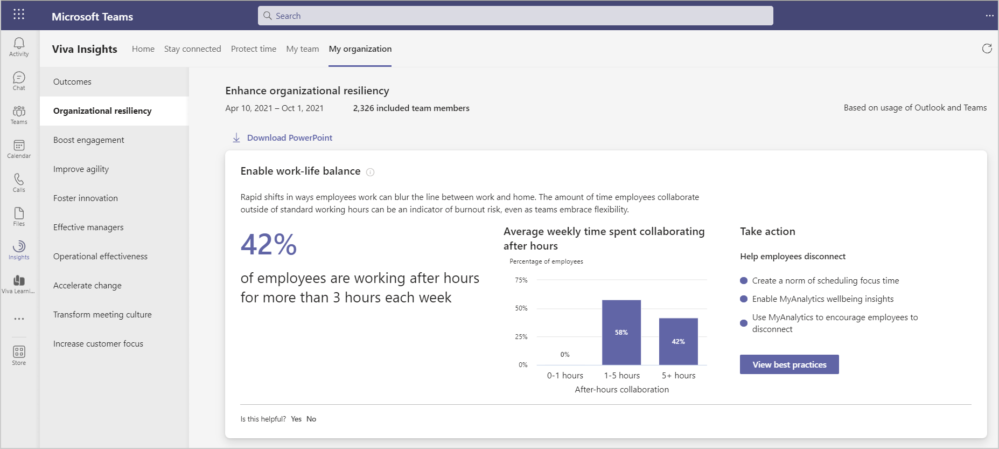

# Organizational resiliency

Resilience depends on having the right insights, systems, and tools to respond to sudden changes, recover from disruption, and reimagine the future for your organization. Each of the behaviors listed show how your organization compares with others based on industry research and your specific organizational data.

Microsoft Viva Insights has a **My organization** page that shows leader's collaboration data about their team. The outcomes include data about **Organizational resiliency**.

## Calculations

The following are the percentage insights, their underlying metrics, and some details about the calculations used for them.

|Behavior |Percentage insight | Metrics |Calculations |
|---------|--------|--------------------|----------------------|
|Enable work-life balance |Percentage of employees who are working after hours for more than three hours each week |[After-hours collaboration](/viva/insights/use/metric-definitions?toc=/viva/insights/use/toc.json&bc=/viva/insights/breadcrumb/toc.json#after-hours-collaboration-define) |Percentage of employees who spend more than 1 hour collaborating through emails, calls, instant messages, and meetings outside of working hours. This percentage is calculated weekly and averaged over the entire time period. |
|Provide support |Percentage of employees who have less than 15 minutes of 1:1 time with their managers each week |[Meeting hours with manager 1:1](/viva/insights/use/metric-definitions?toc=/viva/insights/use/toc.json&bc=/viva/insights/breadcrumb/toc.json#meeting-hours-with-manager-1-1-define) |Percentage of employees who spend less than 15 minutes of weekly 1:1 time with their managers. To account for various meeting frequencies, the total time is calculated for each employee per month and averaged over a week. |
|Connect across boundaries | Percentage of managers who spend a majority of their meeting time in double-booked meetings |[Conflicting meeting hours](/viva/insights/use/metric-definitions?toc=/viva/insights/use/toc.json&bc=/viva/insights/breadcrumb/toc.json#conflicting-meeting-hours-define) |Percentage of employees who more than 50 percent of their meeting hours in conflicting meetings. This insight is calculated weekly and averaged over all the weeks. |
|Cohesion within teams |Percentage of employees who are members of teams with strong cohesion |[Strong ties](/viva/insights/use/metric-definitions?toc=/viva/insights/use/toc.json&bc=/viva/insights/breadcrumb/toc.json#network-metrics) |Strong cohesion is calculated by the number of strong ties of all team members divided by the maximum possible number of strong ties in the team. This percentage is calculated weekly and averaged over the last six months.* |
<!--removing 12/16/21 per nick d.|Free up capacity |Percentage of employees who spend 25+ hours in collaboration each week |[Collaboration hours](/viva/insights/use/metric-definitions?toc=/viva/insights/use/toc.json&bc=/viva/insights/breadcrumb/toc.json#collaboration-hours-define) |Percentage of employees who spend more than 25 hours collaborating each week over email, calls, instant messages, and meetings. This insight is calculated weekly and averaged over the time period. |-->
The following defines the organizational data shown in the visual behavioral insights.

|Behavior |Visual insight | Definition |
|---------|--------|----------------------|
|Enable work-life balance | Average weekly time spent collaborating after hours  |Percentage of employees based on their weekly [after-hours collaboration](/viva/insights/use/metric-definitions?toc=/viva/insights/use/toc.json&bc=/viva/insights/breadcrumb/toc.json#person-metrics). They are divided into employees who spend less than one hour collaborating after-hours, employees who spend between 1 to 5 hours collaborating after-hours, and employees who spend more than 5 hours collaborating after-hours. These percentages are calculated weekly and averaged over the entire time period. |
|Provide support | Distribution of monthly 1:1 time with managers |Percentage of employees based on their monthly [meeting hours with managers 1:1](/viva/insights/use/metric-definitions?toc=/viva/insights/use/toc.json&bc=/viva/insights/breadcrumb/toc.json#meeting-hours-with-manager-1-1-define). They are divided into employees who have no 1:1s, between zero and one hour, and more than one hour of 1:1s with their manager in a month. These percentages are calculated monthly and averaged over the entire time period. |
|Connect across boundaries | Distribution of conflicting meeting hours |Percentage of employees based on their [conflicting meeting hours](/viva/insights/use/metric-definitions?toc=/viva/insights/use/toc.json&bc=/viva/insights/breadcrumb/toc.json#conflicting-meeting-hours-define). They are divided into those who spend less than 5 hours, between 5 and 10 hours, and more than 10 hours in conflicting meetings. These percentages are calculated weekly and averaged over the entire time period. |
|Cohesion within teams |Team cohesion levels across the company |An [organizational network graph](/viva/insights/use/insight-ona-measures?toc=/viva/insights/use/toc.json&bc=/viva/insights/breadcrumb/toc.json) that shows the number of teams with strong cohesion and those who are not very cohesive based on the average monthly collaboration activity within the team’s network. This uses [Strong ties](/viva/insights/use/metric-definitions?toc=/viva/insights/use/toc.json&bc=/viva/insights/breadcrumb/toc.json#network-metrics).*|

>[!Important]
>*At least 25 percent of your teams must have five or more members. If not, this insight will be unavailable due to incomplete information. To ensure teams are accurately identified, confirm that your [Organizational upload](/viva/insights/setup/upload-organizational-data2?toc=/viva/insights/use/toc.json&bc=/viva/insights/breadcrumb/toc.json) includes all employees with the correct **ManagerId** information.

## Best practices

To take action on an outcome, you can select **View best practices** to see a list of recommendations for it. This section describes why each of the following behaviors matter and the top best practices that can help enhance organizational resiliency.

* [Enable work-life balance](#enable-work-life-balance)
* [Provide support](#provide-support)
* [Connect across boundaries](#connect-across-boundaries)
* [Cohesion within teams](#cohesion-within-teams)

### Enable work-life balance

Rapid shifts in ways employees work can blur the line between work and home. The amount of time employees collaborate outside of standard working hours can be an indicator of burnout risk, even as teams embrace flexibility.

Based on research presented in the [Why unplugging from work is more work than we think](https://insights.office.com/productivity/unplugging/): "New research and our growing understanding about human behavior tell us two things for certain: that unplugging is more necessary than ever, and that true unplugging is not a single action but a social agreement — a culture shift that employees and companies must create together." Ways to support employee wellbeing:

* Use [personal wellbeing insights](../personal/use/wellbeing.md) to learn about your after-hours work habits and to encourage you to disconnect and recharge.
* Utilize [Inline suggestions in Outlook](../personal/Use/mya-notifications.md#delay-delivery) to automatically delay email delivery to align with configured working hours of coworkers.
* Use [Teams Together mode](https://www.microsoft.com/microsoft-365/blog/2020/07/08/reimagining-virtual-collaboration-future-work-learning/) for a shared background on video meetings. It cuts down on video meeting fatigue by making them feel more like in-person.

For more best practices and ways to protect employees' after hours, see [Best practices for wellbeing](../tutorials/gm-wellbeing.md).

### Provide support

During periods of disruption, managers play a critical role in helping employees navigate change and preserve a sense of belonging. Manager one-on-one (1:1) time can improve engagement and job performance, while lack of manager coaching can cause employee disengagement and attrition.

According to the research referenced in [What great managers do daily](https://insights.office.com/productivity/what-great-managers-do-daily/): "A Gallup study found that at least 70 percent of the variance in employee engagement scores is driven by who the boss is." Ways to keep employees engaged:

* Use [Viva Insights](../personal/introduction.md) to automatically schedule 1:1 time, receive reminders to do so, and follow up on tasks related to direct reports.
* Require managers to meet with direct reports for 30 minutes at least twice a month and hold them accountable for achieving that goal.

For more best practices and ways to establish better manager-team connections, see [Best practices for manager coaching](../tutorials/gm-coaching.md).
<!--
### Free up capacity

Resilient organizations respond to changing demands and new opportunities by nimbly adapting and refocusing employees' time to align with new priorities.

As explained in [How to finally kill the useless, recurring meeting](https://workplaceinsights.microsoft.com/digital-transformation/how-to-finally-kill-the-useless-recurring-meeting/), it's not only that the meeting provides little value or that people are multitasking; it's that "the sheer amount of time invested in these low-value interactions is a high-cost impediment to getting things done." Ways to reduce meeting time:

* Cancel any recurring meetings that might no longer be needed. Every quarter reassess the need for recurring meetings that consume the most time. Try cancelling some, and then add them back if they’re missed.
* Use [personal wellbeing insights](../personal/use/wellbeing.md) to learn about your after-hours work habits and use [Inline suggestions in Outlook](../personal/use/mya-notifications.md#delay-delivery) to automatically delay email delivery to align with configured working hours for coworkers.
* Reduce meeting hours by scheduling shorter meetings (such as only 15 minutes) with focused agendas. Short stand-up meetings are common in high-stakes workplaces to debrief or reflect on an event.

For more best practices and ways to establish 'meeting-free' periods, see [Best practices for meetings](../tutorials/gm-meetings.md).-->

### Connect across boundaries

Rapidly changing conditions require swift decision making. Managers with poor calendar management habits become obstacles to team goal attainment and create bottlenecks in decision making.

According to [Five ways to empower your team to make decisions](https://insights.office.com/management-strategy/five-ways-to-empower-your-team-to-make-decisions/): “Employee empowerment is directly tied to results. A study by Zenger Folkman found 4 percent of employees are willing to put in more effort when empowerment is low, while 67 percent are willing to go above and beyond when empowerment is high.” Other ways to empower decision making:

* Provide wide access to [Teams meeting recordings](https://support.microsoft.com/office/record-a-meeting-in-teams-34dfbe7f-b07d-4a27-b4c6-de62f1348c24) and [meeting notes](https://support.microsoft.com/office/add-a-onenote-notebook-to-teams-0ec78cc3-ba3b-4279-a88e-aa40af9865c2) in public channels whenever possible to increase the rate of information sharing.
* Use [Teams channels](/microsoftteams/teams-channels-overview) to share information as it emerges both formally through notes and files and informally through chats.
* Use [Insights](../personal/use/use-the-insights.md) to manage your calendar and increase your awareness of conflicting meetings and meetings that inform you of decisions. Managers who decline meetings as soon as possible with a brief explanation for why they did so reinforce decision rights and model healthy habits.

For more best practices and ways to remove obstacles, see [Best practices for meetings](../tutorials/gm-meetings.md).

### Cohesion within teams

Employees who maintain strong connections within their team often feel a greater sense of organizational belonging.

According to the [Rebuilding companies as communities](https://insights.office.com/culture/rebuilding-companies-as-communities/) article, "organizations function best when committed people work in cooperative relationships based on respect." Ways to improve team cohesion:

* Add colleagues to your [important people list](../personal/use/use-the-insights.md#add-important-people); also, receive suggestions to meet and reminders to respond to emails and complete tasks from these contacts.
* Provide teams with virtual opportunities to bond over non-work activities and form new connections. Create agendas with fun conversation prompts and activities such as online games.

For more best practices, see [Best practices for community connectivity](../tutorials/gm-connectivity.md).
