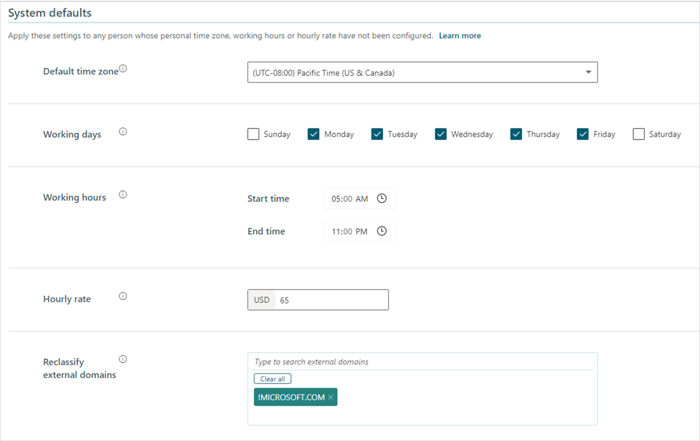

---

title: System defaults for Advanced insights
description: Describes the system default settings in the advanced insights app for Viva Insights that admins configure and edit for your organization
author: madehmer
ms.author: helayne
ms.topic: article
ms.localizationpriority: medium 
ms.collection: viva-insights-advanced 
ms.service: viva 
ms.subservice: viva-insights 
search.appverid: 
- MET150 
manager: helayne
audience: Admin
---

# System defaults

In **System defaults** for the advanced insights app in Microsoft Viva Insights, you can configure the following:

* [Default time zone](#default-time-zone)
* [Working days](#to-set-default-working-days)
* [Working hours](#to-set-default-working-hours)
* [Hourly rate](#hourly-rate)
* [Reclassify external domains](#reclassify-external-domains)

If you are setting up the advanced insights app for the first time, follow these steps:

1. Examine the default values of these **System defaults** settings. Either accept these default values or change one or more of them.
1. Expand the **Exclusions** section and look at its settings. (For more information about these settings, see [Privacy settings](privacy-settings.md).)
1. Optionally, specify data to exclude in one or the **Exclusion** options and, optionally, select to hash subject lines.
1. Select **Next** to process your organization's collaboration (Microsoft 365) data in the app.

If you are _not_ setting up the app, feel free to change these settings whenever it's necessary. Note that after the initial setup is complete, you can updated the exclusions settings on the **Privacy settings** page.

>[!Important]
>Changes made to these system defaults are applied soon after the next data refresh of your organizational (HR) data or Microsoft 365 collaboration data. These changes apply to data retroactively and can affect calculations of historical metrics.

**Owner** – Viva Insights admins have full access to this page. For details, see [Assign roles to admins and analysts](../setup/assign-roles-to-wpa-admins.md).

## Default time zone

Use this setting to configure the default time zone for your organization. Typically, this is the time zone of the corporate headquarters or the time zone in which most employees reside.

Viva Insights first attempts to read time zones from each user's mailbox. If time zone has not been set up for the mailbox, Viva Insights tries to determine it from the [organizational data](organizational-data.md). If time zones have not been uploaded in the organizational data, Viva Insights reads the time zone from the setting on this page. If the default time zone was not set on this page, Viva Insights uses Pacific Time (US).

Viva Insights uses the time zone setting in calculations of collaboration activities, such as emails and meetings. It uses this setting only for Microsoft 365 data that it has yet to process. Changing the time zone setting does not affect data that has already been processed.

### To set the default time zone

1. For **Default time zone** on the **System defaults** page, select the applicable time zone to use by default for analysis.
2. Select **Save**.

## Working days and working hours

Users can set their own working days in [Outlook settings](https://outlook.office.com/calendar/options/calendar/view/appearance). Viva Insights attempts to read these custom settings from each user’s mailbox first. Failing that, it uses the default settings for employees' working days and hours that you set in **System Defaults**.

Viva Insights uses the working days and hours settings in calculations of collaboration activities, such as emails and meetings. It uses these settings only for Microsoft 365 data that it has yet to process. Changing the working days and hours settings does not affect data that has already been processed.

### To set default working days

* For **Working days**, select the appropriate days of the week.  

### To set default working hours

* For **Working hours**, select the start and end times to use by default for analysis.

## Hourly rate

Viva Insights uses hourly rate to calculate the cost of low-quality meetings, where a person's hourly rate for the organization is multiplied by number of low-quality meeting hours. Viva Insights first tries to get the Hourly rate value from organizational (HR) data. Failing that, it uses the value of Hourly rate that is set on this page. For more information, see [Meetings overview](../use/explore-metrics-meetings-overview.md#hourly-rate).

### To set the default hourly rate

1. For **Hourly rate**, enter an average employee hourly rate to use by default for analysis.
2. Select **Save**.

## Reclassify external domains

You can use this setting to reclassify one or more external domains as internal, which includes them in your organizational data analysis.

After you add a domain and save the change for this setting, it'll change all of the data related to the specified domain as internal to your organization, as follows:

* Explore the stats charts and metrics will show the domain as internal *retroactively* for the specified date range. For example, employees in this domain will change from external to internal collaborators for all collaboration data shown in **Explore the stats**.
* Organizational and Microsoft 365 data from this domain will update to be internal after the *next data refresh*.
* Data sources will then include the domain (previously external) in internal-collaborator metrics and applicable coverage data will change based on this new domain classification.
* The changes can be reverted by removing the domain that was reclassified.
* [Excluding domains in the privacy settings](privacy-settings.md#exclude-domains-or-email-addresses) overrides the changes made with this reclassification setting. That is, an excluded domain remains excluded, whether or not it's reclassified as internal.

### To reclassify an external domain

1. For **Reclassify external domain**, enter an external domain in the search field, and then select it to reclassify it as internal to your organization.
2. Select **Save** (top right of page).

## Related topics

* [Set up Advanced insights](../setup/set-up-workplace-analytics.md)
* [Privacy settings](privacy-settings.md)
