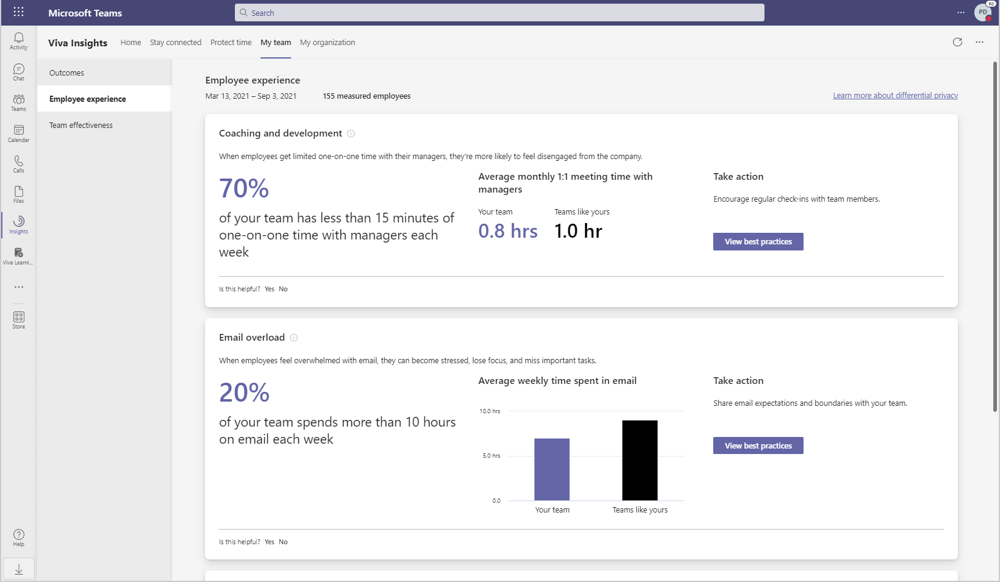
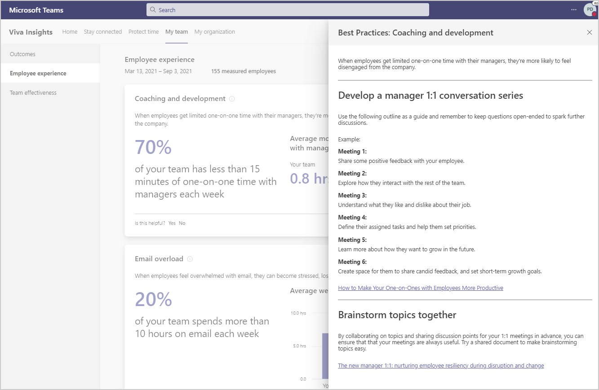

---

title: Team experience in Viva Insights
description: Learn about a team's experience in the Microsoft Viva Insights
author: madehmer
ms.author: helayne
ms.topic: article
ms.localizationpriority: medium 
ms.collection: viva-insights-manager 
ms.service: viva 
ms.subservice: viva-insights 
search.appverid: 
- MET150 
manager: scott.ruble
audience: Admin
---

# Employee experience

Microsoft Viva Insights has a **My team** page that shows manager's collaboration data about their team. The outcomes include data about **Employee experience**, which you can select in **My team** to see more details.

Research shows that happy employees help boost productivity and reduce turnover. These insights and suggestions can help you maintain positive employee experiences, such as evaluating how much time your team is working after hours on email or instant messages, and if your team is getting enough 1:1 time with you and other managers.

## Best practices

To see what actions are recommended, select **View best practices**. For example, in **Employee experience**, select **View best practices** to see what’s recommended for **Coaching and development**.

## About the insights

You can see more details about the insights by selecting the **Information** (i) icon next to the insight. The following describes how your team metrics are calculated to support these behavioral insights. With **Teams like yours**, you get comparable data from within your organization for context into broader organizational patterns. Today, "Team like yours" data is calculated as averages from peer manager teams. If you have only one peer team or no peer team, the company average is shown instead.

|Insight |Team metric description |Metric average for your team and "teams like yours" |
|--------------------------|-------------------|-----------------|
|Coaching and development |One-on-one time is the number of meeting hours with only an employee and their manager. To account for various meeting frequencies, the total time is calculated for each employee per month and averaged over a week. |The average number of hours that managers spend in one-on-one meetings with *all* of their direct reports. |
|Email overload |Employees that spend over 10 hours in email each week. Email workload is the number of hours employees spend sending and receiving email. |Average number of hours spent sending and receiving email. |
|After-hours work |After-hours work is the number of hours employees spend in meetings and on email outside of working hours. This uses the working hours set in the employee's Outlook calendar settings. |Average number of total hours a team spent in meetings and on email outside of working hours. |
