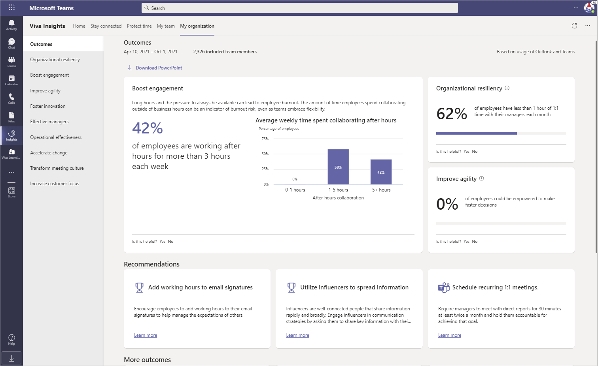

---

title: Leader insights in the My organization page
description: My organization in Microsoft Viva Insights gives leaders key indicators into how their company is getting work done
author: madehmer
ms.author: helayne
ms.topic: article
ms.localizationpriority: medium 
ms.collection: 
- m365initiative-viva-insights 
- viva-insights-leader
ms.service: viva 
ms.subservice: viva-insights 
search.appverid: 
- MET150 
manager: scott.ruble
audience: Admin

---

# My organization

You can view leader insights in **My organization** within the Microsoft Viva Insights app in Microsoft Teams. As a business leader, these insights give you a snapshot of how your company is doing. The insights include company-wide outcomes and leading indicators for each outcome, which help you see why it's important to pay attention to that outcome:  

While you can also see these outcomes and their related best practices in the advanced insights app, it's advantageous to find them in Teams. That's because you're already using Teams for communicating during remote work, namely for meeting, for sharing files, and for sending IMs to employees and other leaders.

## Data privacy

For information about data privacy and GDPR compliance in the Viva Insights app, see [Privacy and data protection](/viva/insights/privacy/data-protection-intro?toc=/viva/insights/use/toc.json&bc=/viva/insights/breadcrumb/toc.json).

## Admin tasks

For access to **My organization**, your admin must assign you the role of _Analyst (Limited)_ for the advanced insights app. Refer your admin to [Assign roles](/viva/insights/setup/assign-roles-to-wpa-admins?toc=/viva/insights/use/toc.json&bc=/viva/insights/breadcrumb/toc.json) for details.

Ask your admin also needs to install and set up the Viva Insights app in Teams for the organization. See [Admin tasks](../personal/teams/viva-teams-app-admin-tasks.md) for details.

## Install, pin, and configure the app

After your admin completes the [Admin tasks](#admin-tasks), your setup for **My organization** is the same as for [Personal insights](../personal/teams/viva-teams-app.md) in the Viva Insights app. See the following to install, pin, and configure the app in Teams:

* [Install and pin the app](../personal/teams/viva-teams-app-install.md)
* [Configure the app](../personal/teams/viva-teams-app-settings.md)

>[!Note]
>You can also locate the Viva Insights app at [https://aka.ms/InsightsTeamsApp](https://aka.ms/InsightsTeamsApp).

## View My organization

1. On the Teams app bar (left navigation), select **Insights**.
2. On the **Viva Insights Home** page, the card in the upper right shows a random insight from one of the **My organization** outcomes.
3. To learn more about the insight, select the **Explore more**.

   

   You can also use any of the other features on this page, such as **Reflect**, **Praise**, **Stay connected**, and **Protect time**. For more information about these features, see [Viva Insights Home](/insights/viva-insights-home).

4. In the Viva Insights menu, select **My organization** to see the top recommendations and some of the top insights.
5. You can inspect the outcomes and the statistics that they show to see if any red flags might need your attention.

## Outcomes

To investigate more about an outcome, select it to see more details.

* [Organizational resiliency](resiliency.md)
* [Boost engagement](engagement.md)
* [Improve agility](agility.md)
* [Foster innovation](innovation.md)
* [Effective managers](effective-managers.md)
* [Operational effectiveness](operational.md)
* [Accelerate change](/viva/insights/use/change?toc=/viva/insights/use/toc.json&bc=/viva/insights/breadcrumb/toc.json)
* [Transform meeting culture](meeting-culture.md)
* [Increase customer focus](icustomer-focus.md)

>[!Note]
>To provide feedback as you use Viva Insights, select **Yes** or **No** for the "Is this helpful" question near the end of every insight and every page.

## Related topics

* [Personal Viva Insights](/insights/teams-app)
* [Viva Insights introduction](viva-insights-intro.md)
