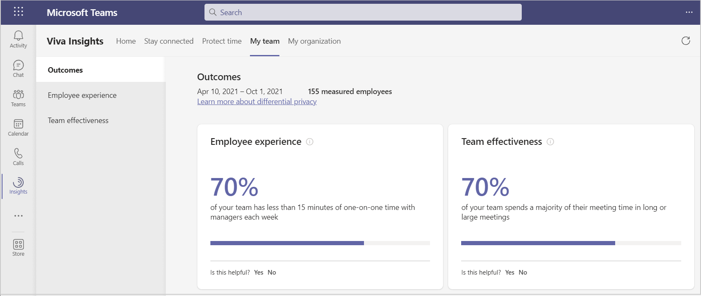

---

title: Viva Insights for managers
description: My team in Microsoft Viva Insights in Teams shows managers their team collaboration patterns
author: madehmer
ms.author: helayne
ms.topic: article
ms.localizationpriority: medium 
ms.collection: viva-insights-manager
ms.service: viva 
ms.subservice: viva-insights 
search.appverid: 
- MET150 
manager: scott.ruble
audience: Admin
---

# My team insights

Microsoft Viva Insights shows managers insights about how their teams’ work patterns might lead to burnout and stress. These can be caused by regular after-hours work, meeting overload, or too little focus time.

As a manager, you can see these insights in **My team** within the Viva Insights app in Microsoft Teams. My team provides visibility into team collaboration patterns that are leading indicators of overall employee experience and wellbeing. You can then use these insights to understand current team norms and take action to create positive change.

## Data privacy

When data is processed for My team insights, Microsoft protects employee privacy and fully complies with local regulations, such as the General Data Protection Regulation (GDPR) the same as for Personal insights. For information about data privacy and GDPR compliance in Viva Insights, see [Privacy guide](../personal/teams/viva-teams-app-privacy.md).  

## Admin tasks

**My team** is available to teams who have a [Microsoft Viva Insights license](../personal/overview/plans-environments.md). Ask your admin about licensing and to install and set up the Viva Insights app in Teams for your organization. See [Admin tasks](../personal/teams/viva-teams-app-admin-tasks.md) for details.

## Install, pin, and configure the app

After your admin has completed the [Admin tasks](../personal/teams/viva-teams-app-admin-tasks.md), the setup for **My team** is the same as for [Personal insights](../personal/teams/viva-teams-app.md) in the Viva Insights app. See the following to install, pin, and configure the app in Teams:

* [Install and pin the app](../personal/teams/viva-teams-app-install.md)
* [Configure the app](../personal/teams/viva-teams-app-settings.md)

## View My team

1. In the left navigation bar in Teams, select **Insights**.
2. In **Viva Insights Home**, you’ll see an insight about your team. To learn more about this insight, select **Explore more**.

   

   You can also use any of the other features on this page, such as **Reflect**, **Praise**, **Stay connected**, and **Protect time**. For more information, see [Viva Insights Home](/insights/viva-insights-home).

3. At the top of Viva Insights, select **My team** to see business outcomes related to your team, such as **Employee experience** and **Team effectiveness**.
4. You can then use these outcomes and statistics to spot any red flags that might need your attention.  

## Outcomes

See the following for more details about an outcome.

* [Employee experience](team-experience.md)
* [Team effectiveness](/viva/insights/use/team-effectiveness?toc=/viva/insights/use/toc.json&bc=/viva/insights/breadcrumb/toc.json)

>[!Note]
>As you use the Viva Insights app, you can provide feedback about the app to Microsoft. To learn how, see **Q2** in [Manager and leader insights FAQ](my-team-faq.md).

## Related topics

* [Personal insights in Viva Insights](/insights/teams-app)
* [Viva Insights introduction](viva-insights-intro.md)
