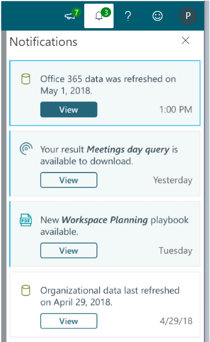

# Notifications and What's new

The ribbon at the top of every page in the advanced insights app with Microsoft Viva Insights offers several choices, including options to provide feedback; view information about your tenant, role, and session; and to view documentation.

It also lets you view notifications and learn What's new in Viva Insights, as described in the following sections. 

## Notifications in the app

In the advanced insights app, you can see notifications about important and timely information. These notifications cover data updates, product and feature updates, and updates related to your recent activity within the app. They also describe what has changed since you last used the app, plus timely updates and reminders of steps that you can take next.

### Notification display is role based

The notifications that you see are based on the role that you've been assigned. If you have more than one role assigned, you can see notifications for all of your roles. 

### Notification types

* **Warning** - Notification of scheduled service or downtime that will affect your ability to use the app.  
* **User** - You can take several actions in the app that generate notifications.  
* **System** - Notices that Microsoft 365 or organizational data has been updated.
* **Knowledge** - Updates and links to playbooks and product updates.

### Reading and controlling notifications

The notifications panel is open by default on the Home page:

You can open this panel by selecting the **Bell** icon in the ribbon. You can close the notifications panel by selecting the **Bell** icon again or simply by clicking outside the panel.

When a new notification arrives, a green circle with a number appears. This number displays the number of unread notifications. Notifications appear in the panel ten at a time. At the bottom of the panel, you have the option to load more notifications. Notifications are listed chronologically with the most recent at the top.

After you hover over a notification, it is considered "dismissed" and the displayed number of unread notifications updates (if the panel is open). If you click a notification and trigger a new page to load or if you close the panel, the notifications are considered seen and dismissed, and the notification circle goes away. Selecting an external link open it in a new tab.

You cannot delete notifications, but notifications expire after 60 days.

## What's new in Viva Insights

To open the _What's new_ panel, select the bullhorn icon in the ribbon: 

_What's new_ describes recently added features of Viva Insights, such as new dashboards, metrics, data sources, and navigation possibilities. 

It also describes upcoming features when the changes they bring will affect your current work. For example, if a new data source will change the way metrics are calculated, this section might encourage you to save current query results so that you can compare data from before the change with data after the change.  

### Use What's new 

Each _What's new_ item provides a short description of the feature. It also offers a **Read more** link. This link lets you drill deeper, either by opening the documentation for that feature or by presenting informative examples and a **Show me** link that takes you to the feature's page in Viva Insights.

The “new notification” icon (the number) on the bullhorn shows how many unread notifications you have. Select the **Read more** link on a card to lower this number by one. After you have selected **Read more** on all the _What’s new_ cards, the number disappears.  
