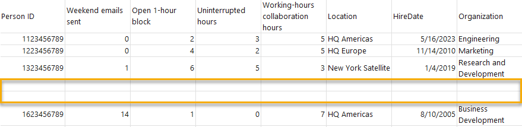
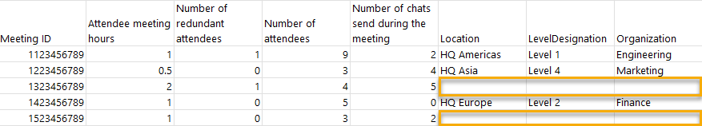

# Domain suppression

When you suppress a domain in Microsoft Viva Insights, you prevent data associated with people in that domain from showing in analyst experiences. You can specify which domains you want to suppress on the Privacy settings page in the advanced insights app.

## When to use domain suppression

Your company might choose to use domain suppression if it collaborates with domains it considers sensitive. Here’s an example: your company, Contoso, is in talks to acquire another company, Adventure Works. While the deal is still considered confidential, you might want to prevent @adventureworks.com—and details about people belonging to adventureworks.com—from appearing in analyst experiences that analysts, or other employees, could access. 

By suppressing sensitive domains through the **Privacy settings** page, analysts won’t view these domains while they’re using Viva Insights or deduce their presence from other information. However, Viva Insights will still use data of people from suppressed domains when it calculates metrics. 

## How to change domain suppression settings

1.	Go to the **Privacy settings** page in the advanced insights app.
2.	Under **Suppress domains**, type in the first domain you want to suppress. Select the plus (**+**) icon to add more.
3.	Select **Save changes**. 

>[!Important]
>Changes to these settings take effect after the next data refresh, which might take up to one week. 

## How it works

After you suppress a domain in **Privacy settings**, Viva Insights filters  out information that an analyst could use to find out whether a person belongs to that suppressed domain. Here are a few examples:

In a person query, people from suppressed domains don’t show up in query results. In the following graphic, rows four and five contained data from someone in a suppressed domain.

In a meeting query, Viva Insights filters out information for organizers from suppressed domains. In the graphic below, the meeting in row three and row six was organized by someone from a suppressed domain. So, Viva Insights filtered out their data in query results.

In cross-collaboration queries, primary collaborators from suppressed domains are never included as part of query results.

Domain suppression doesn’t affect metric calculations. 
