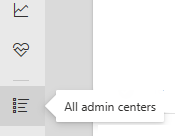
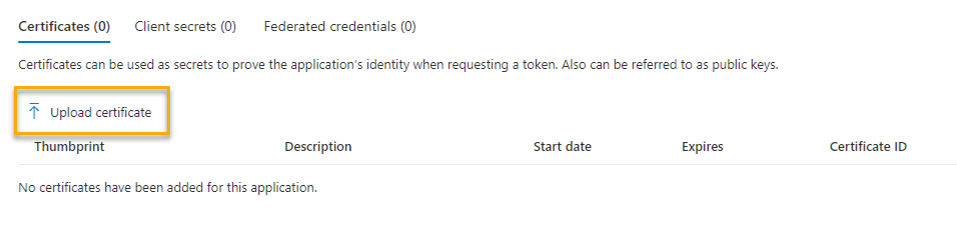

# Import organizational data

Your organizational data can appear in the Microsoft Viva Insights’ advanced insights app in one of three ways: through Azure Active Directory, which is the default source; through a .csv file that you as an Insights admin upload; or through an automated data import that you, your source system admin, and your Microsoft 365 IT admin set up.

This article talks about the third option: importing data.

## Workflow

1. You and the Microsoft 365 IT admin create and set up the import application. 
1. The data source admin pushes data to Viva Insights.
1. The app validates your data. (If validation isn’t successful, you can choose from a few options described in [Validation fails](#validation-fails).)
1. The app processes your data. (If processing isn’t successful, you can choose from a few options described in [Processing fails](#processing-fails).)

After the data successfully validates and processes, the overall data-import task is complete.

## App setup

### Register the app in Azure Active Directory

*Applies to: Microsoft 365 admin*

1. From the Microsoft admin center's left rail, select **All admin centers**. This option appears as the last one on the list.

    

1. Select **Azure Active Directory**.

1. Create a new app registration:
    1. In the top toolbar, select **Add > App registration**.

        

    2. Give your app a name. 
    1. Under **Supported account types**, leave the first radio button, **Accounts in this organizational directory only ([Your organization] only - Single tenant)**, selected. Select **Register**.

        

1. On the resulting screen, copy down the **Application (client) ID**. You'll need to give this to the Insights admin later. 

1. Upload a certificate:
    1. To the right of **Client credentials**, select **Add a certificate or secret**.

    

    2. Select **Upload certificate**.

    

    3. Upload the certificate from your files and add a **Description**. Select the **Add** button.

    

1. Remove Microsoft Graph permissions:
    1. Select **API permissions** from the left rail.
    2. Select the ellipses (***...***) to the right of **Microsoft Graph**. 
    3. Select **Remove permission**.

        

    1. Confirm removal.
    
1. Give the Insights admin the app ID you generated in step 4.

## Validation

After  

In most cases, file validation should complete quickly. If your organizational data file is large, validation could take up to one or two minutes.

After this phase completes, validation has either succeeded or failed. Depending on the outcome, you’ll either receive a success notification or a failure notification in the top-right corner of the **Data connections** screen.

For information about what happens next, go to the appropriate section:

[Validation succeeds](#validation-succeeds)

[Validation fails](#validation-fails)

### Validation succeeds

After successful validation, Viva Insights starts processing your new data. Processing can take between a few hours and a day or so. During processing, you’ll see a “Processing” status on the **Data connections > Upload or delete in progress** table.

After processing completes, it's either succeeded or failed. Depending on the outcome, you’ll either receive a success notification or a failure notification in the top-right corner of the **Data connections** screen. 

#### Processing succeeds

When processing succeeds, you’ll see a “Success” status in the **Upload or delete history** table. At this point, the upload process is complete.

After you receive the “Success” status, you can:

* Select the view (eye) icon to see a summary of the validation results.

* Select the mapping icon to see the mapping settings for the workflow.

>[!Note]
>Each tenant can have only one upload in progress at a time. You need to complete the workflow of one data file, which means you either guide it to a successful validation and processing or abandon it, before you begin the workflow of the next data file. The status or stage of the upload workflow is shown on the **Data connections** tab.

#### Processing fails

If processing fails, you’ll see a failed status in the **Upload or delete in progress** table. Selecting the link in the status brings you to an explanation of the failure.

Select **Edit or start new upload**. This button lets you begin the upload process again.

>[!Note]
>Processing failures are generally due to backend errors. If you’re seeing persistent processing failures and you’ve corrected the data in your uploaded file, log a support ticket with us.

### Validation fails

If data validation fails, you’ll see a new screen with a “Validation failed” error and some information about the failure. You can select the **Cancel upload** button if you don’t want to proceed with the upload process.

<!--screenshot - confirm with RB-->

Before you make changes in the source file and try the upload again, you can select **Download issues**. This log file describes the problems in your data that might have caused the validation errors. Use this information to decide what to do next—fix the source data or change your mapping settings.

#### Guidelines for correcting errors in data

This section contains help for correcting data in an uploaded source file that is causing validation errors.

When any data row or column has an invalid value for any attribute, the entire upload will fail until you fix the source file (or you fix the attribute mapping).

##### Rules for field headers

All field header or column names need to:

* Begin with a letter (not a number).
* Only contain alphanumeric characters (letters and numbers, for example, **Date1**).
* Have no leading or trailing blank spaces or special characters (those that are non-alphanumeric, like *@*, *#*, *%*, *&*).

##### Rules for field values

The field values in data rows need to comply with the following formatting rules:

* The  **EffectiveDate** and **HireDate** field values need to be in the MM/DD/YYYY format.
* The required **PersonId** and **ManagerId** field values need to be a valid email address (for example, `gc@contoso.com`).
* The  **Layer** field values need to contain numbers only.
* The  **HourlyRate** field values need to contain numbers only, which the app assumes is in US dollars for calculations and data analysis.

>[!Note]
>The app doesn't currently perform currency conversions for **HourlyRate** data. All calculations and data analysis assumes the data to be in US dollars.

##### Rules for characters in field values

The following field rules apply to characters in field values:

* Double-byte characters, such as Japanese characters, are permitted in the field values.
* The maximum character length of field values in rows is 128 KB, which is about 1024 x 128 characters.
* “New line” (\n) characters are not permitted in field values. 

## Related topic

[Prepare organizational data](prepare-org-data.md)
