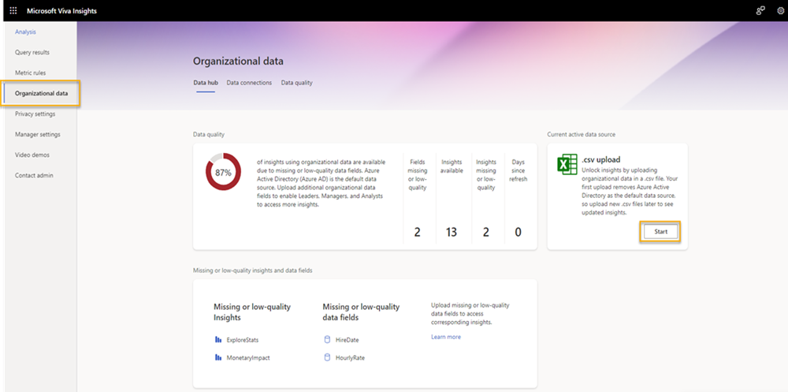

# Upload organizational data (first upload)

Your organizational data can appear in the Microsoft Viva Insights’ advanced insights app in one of two ways: either through Azure Active Directory—which is the default source—or through a .csv file that you as an admin upload.

This article talks about the second option, uploading data through a .csv file. After you’ve prepared data as described in [Prepare organizational data](./prepare-org-data.md), you’ll need to complete the following steps.

>[!Important]
>Only use the following steps if this is the first time you’re uploading organizational data. If this isn’t your first upload, see [Upload organizational data (subsequent uploads)](upload-org-data-subsequent.md) to update previously uploaded data.

## Workflow

After you prepare the source data, the uploading process follows these steps, which are described in the following sections:

1. You upload the .csv file.
1. You map fields.
1. The app validates your data. (If validation isn’t successful, you can choose from a few options described in [Validation fails](#validation-fails).)
1. The app processes your data. (If processing isn’t successful, you can choose from a few options described in [Processing fails](#processing-fails).)

After the data successfully validates and processes, the overall data-upload task is complete.

## File upload

To upload your .csv file, follow these steps:

1. In the **Organizational data** page, select **.csv upload**.
    
1. Enter an **Upload name**.
1. Under **Upload file**, select the .csv file you want to upload. 
    
    Make sure that the .csv file is:

    * UTF-8 encoded
    * Not open in a different program when you begin the upload process
    * Not larger than 1 GB

>[!Note]
> To see the structure and guidelines for .csv files, and to avoid common issues during upload, you can download a template through the **Download .csv template** link.

4. To upload, select **Next**. To cancel the upload, select **Cancel**. 

## Field mapping

After you upload your file, you’ll see the field mapping page. To view insights from your data, you need to map fields (columns) from your .csv file to field names that the app recognizes.

There are two types of fields: *System default* and *Custom*.

### System default (required or optional)

System default fields can be either *required*—which are **PersonId**, **ManagerId**, and **Organization**—or *optional*. They represent attributes that Viva Insights knows and uses in specific calculations beyond grouping and filtering.

>[!Important]
> Every required field needs to have a valid, non-null value in every row. You need to map all required Viva Insights values, even if the column headers in your .csv files don’t exactly match the Viva Insights value name.

Optional fields are commonly encountered system fields that the app suggests for use. You don’t need to map optional fields if your organization doesn’t have data for them.

To find out whether a field is required or optional, refer to the **Viva attributes** section to the right of the mapping list. Required attributes have a “Required” label and optional attributes have an “Optional” label.

### Custom

Custom fields are optional attributes you can create. Custom fields are optional attributes you can create. The following section, step 2a, explains mapping and naming a custom attribute.

#### To map fields

Follow the steps below to map your .csv data to Viva Insights attributes. 

>[!Important]
>All .csv header fields, which appear under **Source column name**, need to be mapped before you can advance to the next part of the upload process.

1. For each required Viva Insights field:
    1. Find the corresponding column header under **Source column name**.
    >[!Important]
    >To prevent a validation error later, make sure this column is the right data type.

    2. Under the **Map to Viva Insights field** column, open the dropdown list and select the Viva Insights attribute that corresponds with the column header you identified in step a. 
     

    >[!Tip]
    > Hover over an attribute name to read its description.
    > 

2. Repeat steps 1a and 1b for custom and optional fields.
    * To add a custom field, just include it as a column in your data file. The app will automatically assign it a name and map it.

    >[!Note]
    >For this release of Viva Insights, all custom attributes are assigned a default name and can only be classified as **String** data types.

1. After you’ve completed mapping your attributes, select the **Next** button in the bottom left of the screen.

After you map fields, the app validates and processes your data as described in the following sections. If validation and processing are successful, your input to the upload process is complete.

## Validation

After you’ve mapped attributes, the app starts validating your data.  

In most cases, file validation should complete quickly. If your organizational data file is large, validation could take up to one or two minutes.

After this phase completes, validation has either succeeded or failed. Depending on the outcome, you’ll either receive a success notification or a failure notification in the top-right corner of the **Data connections** screen.

For information about what happens next, go to the appropriate section:

[Validation succeeds](#validation-succeeds)

[Validation fails](#validation-fails)

### Validation succeeds

After successful validation, Viva Insights starts processing your new data. Processing can take between a few hours and a day or so. During processing, you’ll see a “Processing” status on the **Data connections > Upload or delete in progress** table.

After processing completes, it has either succeeded or failed. Depending on the outcome, you’ll either receive a success notification or a failure notification in the top-right corner of the **Data connections** screen. 

#### Processing succeeds

When processing succeeds, you’ll see a “Success” status in the **Upload or delete history** table. At this point, the upload process is complete.

After you receive the “Success” status, you can:

* Select the view (eye) icon to see a summary of the validation results.

* Select the mapping icon to see the mapping settings for the workflow.

>[!Note]
>Each tenant can have only one upload in progress at a time. You need to complete the workflow of one data file, which means you either guide it to a successful validation and processing or abandon it, before you begin the workflow of the next data file. The status or stage of the upload workflow is shown on the **Data connections** tab.

#### Processing fails

If processing fails, you’ll see a failed status in the **Upload or delete in progress** table. Selecting the link in the status brings you to an explanation of the failure.

Select **Edit or start new upload**. This button lets you begin the upload process again.

>[!Note]
>Processing failures are generally due to backend errors. If you’re seeing persistent processing failures and you’ve corrected the data in your uploaded file, log a support ticket with us.

### Validation fails

If data validation fails, you’ll see a new screen with a “Validation failed” error and some information about the failure. You can select the **Cancel upload** button if you don’t want to proceed with the upload process.

<!--screenshot - confirm with RB-->

Before you make changes in the source file and try the upload again, you can select **Download issues**. This log file describes the problems in your data that might have caused the validation errors. Use this information to decide what to do next — fix the source data or change your mapping settings.

#### Guidelines for correcting errors in data

This section contains help for correcting data in an uploaded source file that is causing validation errors.

When any data row or column has an invalid value for any attribute, the entire upload will fail until you fix the source file (or you fix the attribute mapping).

##### Rules for field headers

All field header or column names need to:

* Begin with a letter (not a number).
* Only contain alphanumeric characters (letters and numbers, for example, **Date1**).
* Have no leading or trailing blank spaces or special characters (non-alphanumeric, such as @, #, %, &).

##### Rules for field values

The field values in data rows need to comply with the following formatting rules:

* The  **EffectiveDate** and **HireDate** field values need to be in the MM/DD/YYYY format.
* The required **PersonId** and **ManagerId** field values need to be a valid email address (for example, `gc@contoso.com`).
* The  **Layer** field values need to contain numbers only.
* The  **HourlyRate** field values need to numbers only, which the app assumes is in US dollars for calculations and data analysis.

>[!Note]
>The app doesn't currently perform currency conversions for **HourlyRate** data. All calculations and data analysis assumes the data to be in US dollars.

##### Rules for characters in field values

The following field rules apply to characters in field values:

* Double-byte characters, such as Japanese characters, are permitted in the field values.
* The maximum character length of field values in rows is 128 KB, which is about 1024 x 128 characters.
* “New line” (\n) characters are not permitted in field values. 

## Related topic

[Prepare organizational data](prepare-org-data.md)