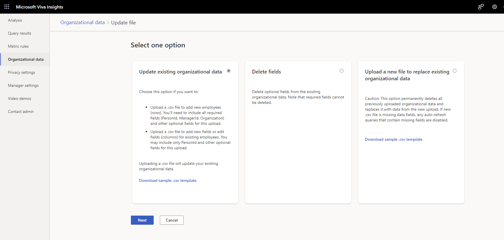
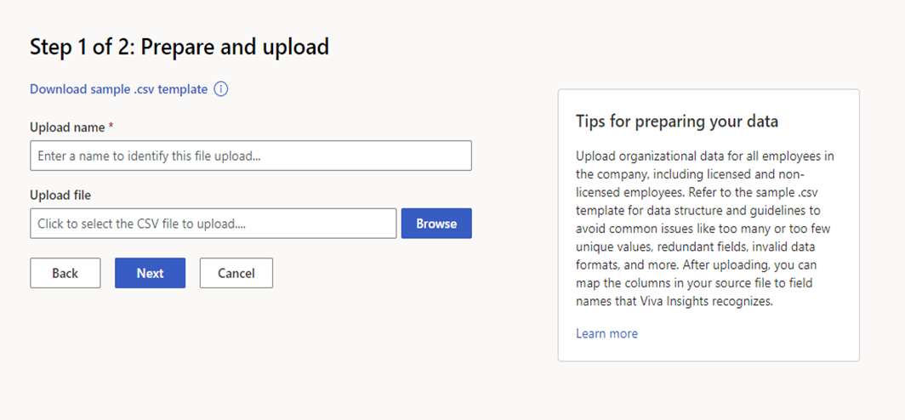
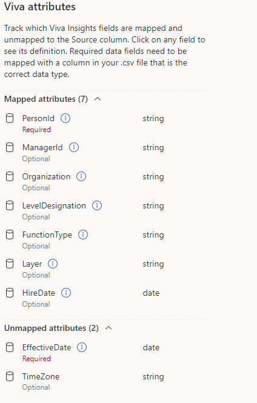
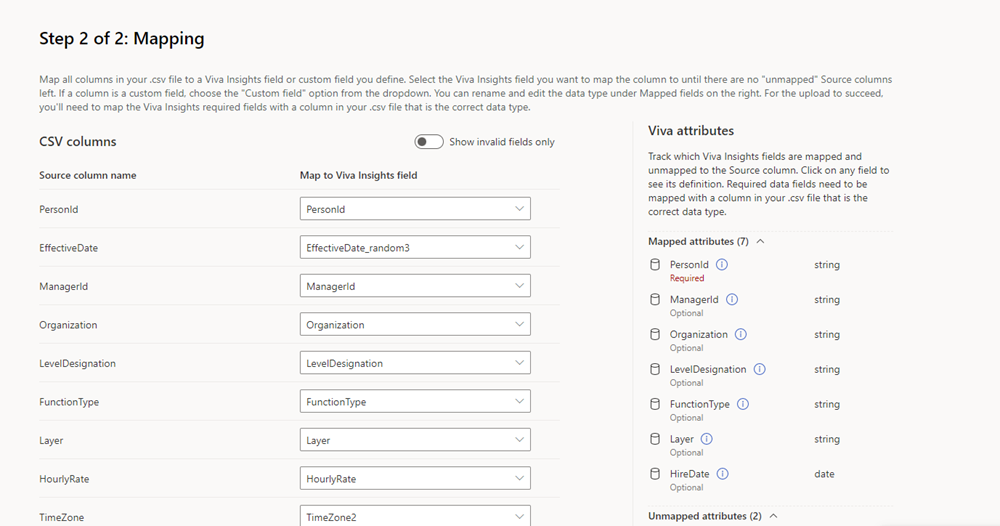
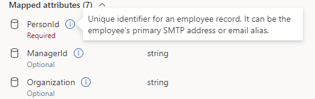
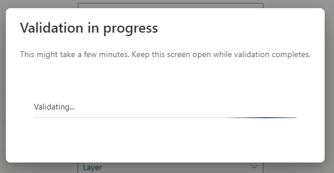
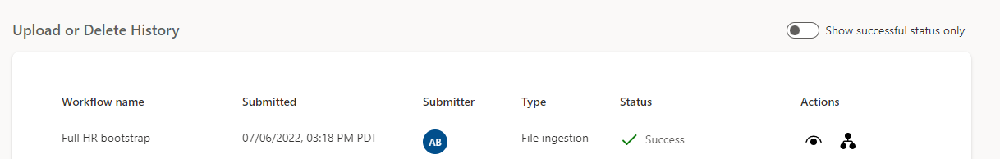
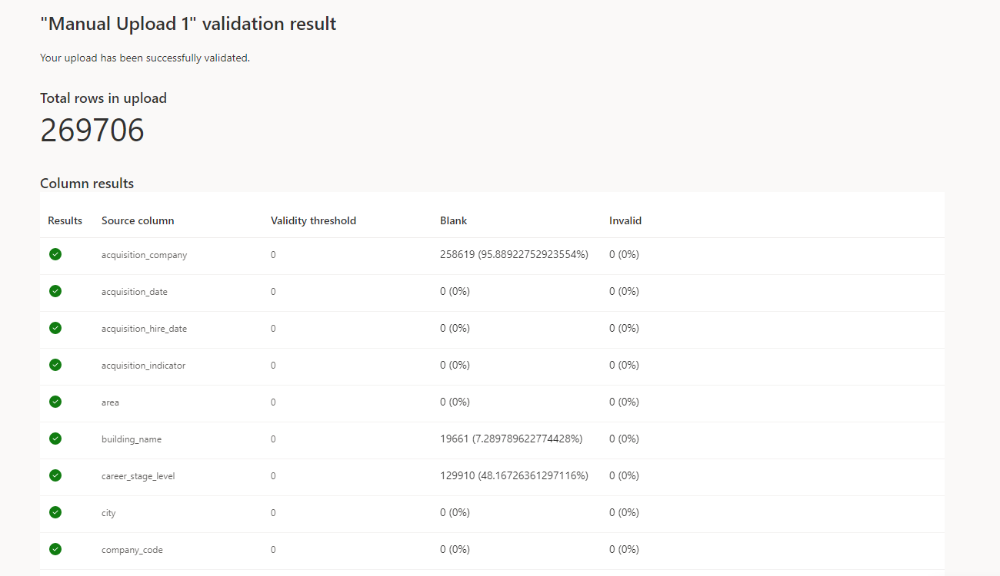
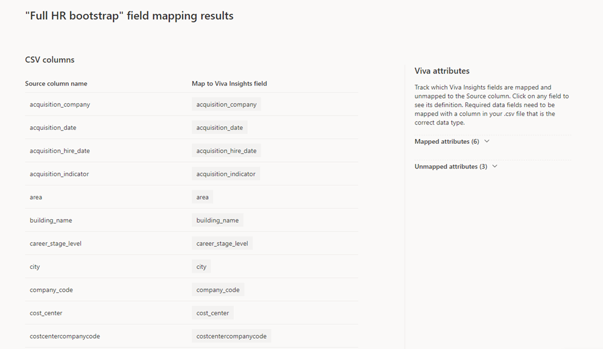
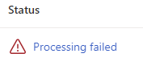

# Upload organizational data (subsequent upload)

If organizational data has already been uploaded into the advanced insights app, you as an admin can use the information in this article to:

* Edit existing data.
* Replace existing data.
* Delete organizational attributes from existing data.

Complete these steps after preparing the data as described in [Prepare organizational data](./prepare-org-data.md).

>[!Important]
>Only follow these steps if this is not the first time you’ve uploaded organizational data. If this is the first time, follow the steps in [Upload organizational data (first upload)](upload-org-data-first.md).

## Workflow

After you prepare the source data, the uploading process follows these steps, which are described in the following sections:

1. You upload the .csv file.
1. You map fields.
1. The app validates your data. (If validation isn’t successful, you can choose from a few options described in [Validation fails](#validation-fails).)
1. The app processes your data. (If processing isn’t successful, you can choose from a few options described in [Processing fails](#processing-fails).)

After the data successfully validates and processes, the overall data-upload task is complete.

## To update, replace, or delete data

All three actions share the same two first steps:

1.	Select either the **Start** button on the **Data hub** tab or the **Edit or start new upload** button on the **Data connections** tab.

2.	The resulting page lists three options:
    * **Update existing organizational data**
    * **Delete fields**
    * **Upload a new file to replace existing organizational data** 

    Make your selection based on what you want to do, then navigate to the corresponding section below for step 3.

    |Action   |Section |Comments |
    |---------|--------|---------|
    |Add new employees (rows) |[Update existing organizational data](#update-and-replace-existing-data) |Your file includes needs to include all required fields (**PersonId**, **ManagerId**, and **Organization**) and other optional fields. |
    |Add new fields (columns)|[Update existing organizational data](#update-and-replace-existing-data)| Your file needs to include **PersonId** and other optional fields.|
    |Edit fields (columns)|[Update existing organizational data](#update-and-replace-existing-data)|Your file needs to include **PersonId** and other optional fields.|
    |Delete attributes| [Delete optional fields from existing organizational data](#delete-optional-fields-from-existing-organizational-data)|You can only delete optional attributes. If you delete fields used in auto-refreshing queries, those queries will be disabled.|
    |Replace all existing organizational data|[Replace existing data](#replace-existing-data)|This option *permanently deletes* all organizational data you’ve uploaded in the past. If your file is missing any fields, auto-refreshing queries that use those fields will be disabled.|

## Update and replace existing data

### Update existing data

#### File upload

3. Under **Upload file**, select the file you want to upload, then select **Next**.

Now you’re ready to map fields. For your next steps, go to [Field mapping](#field-mapping).

##### Example: adding a new data column

Let’s say you want to upload a new engagement score value for each employee. You’ve  already uploaded the recommended 13 months or more of snapshot data, which included the required columns for all employees; now you want to apply the engagement score value to all of that historical data. You’d choose the **Update existing organizational data** option. To  upload your new **EngagementScore** data column, you’d need to upload the file that contains it. 

### Replace existing data

#### File upload

3. Replace existing data:
    1. Enter an **Upload name**.
    1. Under **Upload file**, select the .csv file you want to upload. 

    Make sure that the .csv file is:

    * UTF-8 encoded
    * Not open in a different program when you begin the upload process
    * Not larger than 1 GB

    

    >[!Note]
    >To see the structure and guidelines for .csv files, and to avoid common issues during upload, you can download a template through the **Download .csv** template link.

    3. Upload your file by selecting **Next**. If you need to cancel the upload, select **Cancel**.

Now you’re ready to map fields. For your next steps, go to [Field mapping](#field-mapping).

### Delete optional fields from existing organizational data

3. Delete fields:
    1. Name your delete action so you can refer to it later.
    1. Identify the attribute you want to delete, then check the corresponding box.
    1. The resulting screen lists which attributes have been deleted. Select **Back** to return to the Data hub.

The delete process is now complete.

>[!Important]
> The following sections apply to *upload* and *replace* actions only. <!--need screenshot-->

## Field mapping

After you upload your file, you’ll see the field mapping page. To view insights from your data, you need to map fields (columns) from your .csv file to field names that the app recognizes.

There are two types of fields: *System default* and *Custom*.

### System default (required or optional)

System default fields can be either *required*—which are **PersonId**, **ManagerId**, and **Organization**—or *optional*. These required and optional fields represent attributes that Viva Insights knows and uses in specific calculations beyond grouping and filtering.

>[!Important]
> Every required field needs to have a valid, non-null value in every row. You need to map all required Viva Insights values, even if the column headers in your .csv files don’t exactly match the Viva Insights value name.

Optional fields are commonly encountered system fields that the app suggests for use. You don’t need to map optional fields if your organization doesn’t have data for them.

To find out whether a field is required or optional, refer to the **Viva attributes** section to the right of the mapping list. Required attributes have a “Required” label and optional attributes have an “Optional” label.

### Custom

Custom fields are optional attributes you can create. The following section, step 5a, explains how to map and name a custom attribute.

#### To map fields

Follow the steps below to map your .csv data to Viva Insights attributes. 

>[!Important]
>All .csv header fields, which appear under **Source column name**, need to be mapped before you can advance to the next part of the upload process.
<!--screenshot-->
4. For each required Viva Insights field:
    1. Find the corresponding column header under **Source column name**. 
    >[!Important]
    >To prevent a validation error later, make sure this column is the right data type.

    2. Under the **Map to Viva Insights field** column, open the dropdown list and select the Viva Insights attribute that corresponds with the column header you identified in step a.
     
    >[!Tip]
    > Hover over an attribute name to read its description. 
    > 
    >
    >If you’re *updating* data, you can choose to only see the new columns you’ve added or column headers you’ve changed. To do so, select the **Show invalid fields only** toggle.
2. Repeat steps 4a and 4b for custom and optional fields.
    * To add a custom field, just include it as a column in your data file. The app will automatically assign it a name and map it.

    >[!Note]
    >For this release of Viva Insights, all custom attributes are assigned a default name and can only be classified as **String** data types.in the bottom left of the screen.

After you map fields, the app validates and processes your data as described in the following sections. If validation and processing are successful, your input to the upload process is complete.

### If expected columns are missing or excluded

For a query to run successfully, particular attributes (columns) need to be present in the organizational data. This requirement is also true for queries with the auto-refresh option turned on. If attributes (columns) that a query uses are missing from a data upload, the app will alert you. You’ll see a table that lists attribute fields and the queries those fields are used in, along with a warning message: “Proceeding will disable these queries. If an auto-refresh query that contains these fields is created while the function is in progress, it will also be disabled.”

After you review missing attributes:

* If you decide not to continue with the data upload or replacement, select **Cancel**. This button returns you to the field mapping page.
* If you decide to continue with data upload even though there are missing attributes, select **Next**. Note that this choice turns off auto-refresh for queries listed above. You can still access the results of the last runs of these queries.

## Validation

After you’ve mapped attributes, the app starts validating your data.  

In most cases, file validation should complete quickly. If your organizational data file is large, validation could take up to one or two minutes.

After this phase completes, validation has either succeeded or failed. <!--Depending on the outcome, you’ll either receive a success notification or a failure notification in the top-right corner of the **Data connections** screen.-->

For information about what happens next, go to the appropriate section:

[Validation succeeds](#validation-succeeds)

[Validation fails](#validation-fails)

### Validation succeeds

After successful validation, Viva Insights starts processing your new data. Processing can take between a few hours and a day or so. During processing, you’ll see a “Processing” status on the **Data connections > Upload or delete in progress** table.

After processing completes, it has either succeeded or failed. Depending on the outcome, you’ll either receive a success notification or a failure notification in the top-right corner of the **Data connections** screen.

#### Processing succeeds

When processing succeeds, you’ll see a “Success” status in the **Upload or delete history** table. At this point, the upload process is complete.

After you receive the “Success” status, you can:

* Select the view (eye) icon to see a summary of the validation results.

* Select the mapping icon to see the mapping settings for the workflow.

>[!Note]
>Each tenant can have only one upload in progress at a time. You need to complete the workflow of one data file, which means you either guide it to a successful validation and processing or abandon it, before you begin the workflow of the next data file. The status or stage of the upload workflow is shown on the **Data connections** tab.

#### Processing fails

If processing fails, you’ll see a failed status in the **Upload or delete in progress** table. Selecting the link in the status brings you to an explanation of the failure.

Select **Edit or start new upload**. This button lets you do the following things for the data file you uploaded earlier:

* Edit to add new rows or columns.
* Delete attributes.
* Replace existing file with a new file.

>[!Note]
>Processing failures are generally due to backend errors. If you’re seeing persistent processing failures and you’ve corrected the data in your uploaded file, log a support ticket with us.

### Validation fails

If data validation fails, you’ll see a new screen with a “Validation failed” error and some information about the failure. You can select the **Cancel upload** button if you don’t want to proceed with the upload process.

<!--screenshot - pending from RB-->

Before you make changes in the source file and try the upload again, you can select **Download issues**. This log file describes the problems in your data that might have caused the validation errors. Use this information to decide what to do next — fix the source data or change your mapping settings.

#### Guidelines for correcting errors in data

This section contains help for correcting data in an uploaded source file that's causing validation errors.

When any data row or column has an invalid value for any attribute, the entire upload will fail until you fix the source file (or you fix the attribute mapping).

##### Rules for field headers

All field header or column names must:

* Begin with a letter (not a number).
* Only contain alphanumeric characters (letters and numbers, for example, **Date1**).
* Have no leading or trailing blank spaces or special characters (non-alphanumeric, such as *@*, *#*, *%*, *&*).

##### Rules for field values

The field values in data rows must comply with the following formatting rules:

* The  **EffectiveDate** and **HireDate** field values need to be in the MM/DD/YYYY format.
* The required **PersonId** and **ManagerId** field values need to be a valid email address (for example, `gc@contoso.com`).
* The  **Layer** field values need to contain numbers only.
* The  **HourlyRate** field values need to numbers only, which the app assumes is in US dollars for calculations and data analysis.

>[!Note]
>The app doesn't currently perform currency conversions for **HourlyRate** data. All calculations and data analysis assumes the data to be in US dollars.

##### Rules for characters in field values

The following field rules apply to characters in field values:

* Double-byte characters, such as Japanese characters, are permitted in the field values.
* The maximum character length of field values in rows is 128 KB, which is about 1024 x 128 characters.
* “New line” (\n) characters are not permitted in field values. 

## Related topic

[Prepare organizational data](./prepare-org-data.md)
