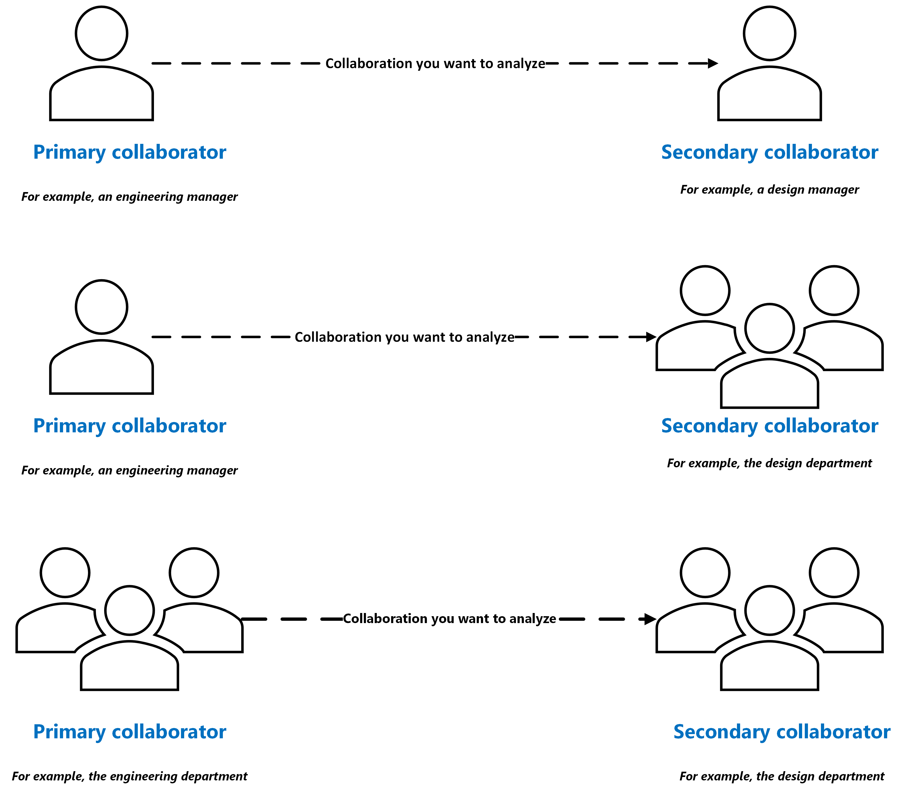

# Primary and secondary collaborators in cross-collaboration queries

When you're building a cross-collaboration query in Microsoft Viva Insights, you might wonder who you should set as a primary collaborator and who you should set as a secondary collaborator.

## About collaborators 

Before we dive into how you might set your collaborators, let's discuss who primary and secondary collaborators *are*:

* **Primary collaborators** are the people whose collaboration habits you're most interested in analyzing. You might think of them as the main character of your query, because you want to run an analysis from their perspective. 

* **Secondary collaborators** are the people who work with the primary collaborators and engage in collaboration activities with them. In other words, you don't want to run an analysis from their perspective, but including them as a supporting character provides valuable information about the primary collaborators' collaboration habits and to your query as a whole.

### Setting collaborator filters

To set primary and secondary collaborators, Viva Insights asks you to use filters. You'll need to add one or more filters for each collaborator type, based on your organizational data. If you wanted to make your primary collaborator a business analyst, for example, you'd pick an attribute like **Job level** and set it to "Business analyst." Again, the available filters and values depend on what your organizational data contains.

## Example primary and secondary collaborators

Before you started your cross-collaboration query, you probably had a research question in mind. Here's a sample research question for each query type, and who, based on that question, you'd want to set as primary and secondary collaborator.

|Research question| Query type| Primary collaborator| Secondary collaborator
|----|----|----|----|
|How often are engineering managers collaborating with design managers?| Person-to-person|Engineering manager|Design manager|
|How often are engineering managers collaborating with the design department?|Person-to-group|Engineering manager|Design department|
|How often is the engineering department collaborating with the design department?|Group-to-group| Engineering department|Design department

The most important question to keep in mind while setting collaborator types is *whose perspective are you interested in analyzing?* These are the people you want to make your primary collaborators.