# Advanced insights metric rules

To reveal external and internal collaboration trends, Microsoft Viva Insights uses email, calendar, and Teams activities, like chats and calls. While people use these tools to collaborate on work, they might also use them to keep track of personal meetings, team social activities, and all-day trainings. If queries included these non-work collaboration activities, they’d produce skewed results.

So, how can you exclude non-work collaboration activities from your queries and get more accurate results? Add a metric rule. When you use rules in your queries, Viva Insights leaves out meetings, emails, chats, and calls you don’t want to analyze. 

Let’s use an example. People in your company might book focus time on their calendars, but focus time isn’t something you’d want to analyze like a meeting. To prevent focus time from sneaking into queries, you might consider setting up a rule to exclude these calendar events. 

Similarly, you could create a rule that excludes emails where the sender and recipient are the same person. This way, you avoid including non-collaborative activities, like notes to self, in your email queries.
Metric rules only apply and filter data in the Analysis page and for the data shown within the Viva Insights app for managers and leader insights. 
When you set a rule as default, it applies to all future queries and the Viva Insights app in Teams and web. Refer to About default rules for more information.

## About the metric rules page

Before we get into discussing how to use rules in your queries, let’s discuss where you can find, create, and edit them: the **Metric rules** page. To get to the **Metric rules** page from the advanced insights app analyst experience, select **Metric rules** from the left pane.

### Views

The **Metric rules** page contains five views, which you can access through tabs near the top of the page. Let’s talk about each of them, and also explain how to use some related features.

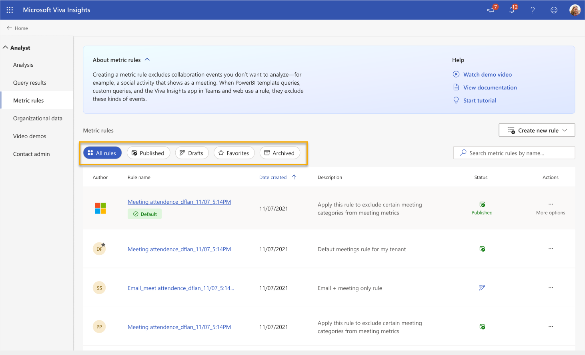

#### All rules

The **All rules** view shows all the rules that people in your organization have published and drafted. 

Here’s what you can do in this view:

* **Set as default**, if you originally created the rule
* **Clone**
* **Archive**, if you originally created the rule
* **Delete**, if you originally created the rule
* **Favorite** 

>[!Note]
>Want to make a rule similar to someone else’s? Use the **Clone** function and create your own based on their settings. Cloning works on drafts and published rules.

#### Published

The **Published** view shows all rules that people in your organization have published—that is, it doesn’t show any drafts.

Here’s what you can do in this view:

* **Set as default**, if you originally created the rule
* **Clone**
* **Archive**, if you originally created the rule
* **Delete**, if you originally created the rule
* **Favorite** 

#### Drafts

In the **Drafts** view, you’ll find rules that people in your organization are working on and haven’t published yet. You can only publish your own drafts, but you can use the **Clone** option on anybody’s draft.

>[!Note]
>We describe how to save a rule as a draft in [How to create new rules](#how-to-create-new-rules).

Here’s what you can do in this view:

* **Clone**
* **Publish**, if you originally created the rule
* **Delete**, if you originally created the rule

#### Favorites

Use the **Favorites** view as a place to find frequently accessed rules you’ve marked as favorites in the **All rules** or **Published views**. 

Here’s what you can do in this view:

* **Clone**
* **Archive**, if you originally created the rule
* **Delete**, if you originally created the rule
* **Remove as favorite**

##### How to mark a rule as Favorite

To mark a rule as a favorite while you’re in **All rules** or **Published**, select the ellipses (**...**) under the **Actions** column, and then select the **Favorite** option. 

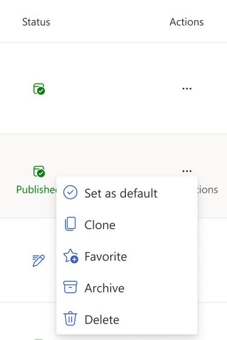

When you go to add a rule to a query, you’ll find your favorites beneath the default rule.

#### Archived

The **Archived** view stores previously published rules that shouldn’t be deleted. Generally, if you think you might want to restore a rule later, or want to have a record of it, archiving is a better option than deleting. Only the person who originally created a rule can archive or restore it.

##### How to archive and restore a rule

To archive a rule, select the ellipses (**...**) under **Actions**, and then select **Archive**. The rule moves to your **Archived** view.
 
To restore—that is, republish—a rule, select the ellipses under the **Actions** column, and then select **Undo archive**.

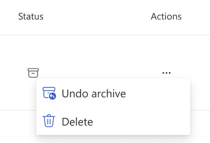
 
## How to create new rules

>[!Note]
>We’re in the process of rolling these changes out to customers.
You can create a new rule in two ways: either by starting with one of our templates or creating one from scratch. In either case, you’ll need to get started by selecting the **Create new rule** button on the **Metric rules** page.
 
### From a template

#### About templates

Before we jump in, let’s discuss how we’ve set up our rule templates.

##### Categories

We’ve compiled some categories for each collaboration type you might want your rule to apply to: **Vacation / OOF** (or “out of office”), **Focus time**, **Attended meetings**, **Likely attended meetings**, **Invited meetings**, **No meeting day**, **Appointments**, and **Emails sent to self**. Collaboration types are meetings, emails, chats, and calls.
 
To find out how we define these categories, expand each category container. If you want to include a category in your rule, select the checkmark next to its title.

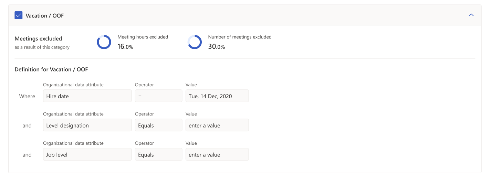

 To select all categories or deselect all categories, use the **Select all** or **Clear all** options above all categories.
 
##### Attributes

In each category, you’ll notice a few preselected attributes and values, for example, Level designation. These attributes and values determine what kind of information the metric pulls from your data.

>[!Note]
These values in templates are prefilled. If you want more granular control over attributes and values, consider creating a rule from scratch.

#### To add a rule from a template

1. After you select **Create new rule**, pick the first option from the dropdown menu: **Create using a template**.

    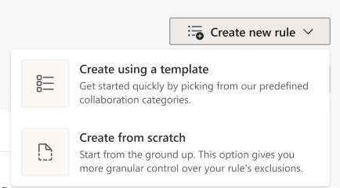
 
1.	Select the categories you want your rule to apply to. 

    Repeat this step for each category you want to include.

1. If you want to go on to naming and publishing your rule, select the **Next** button in the top right of your screen.
 
    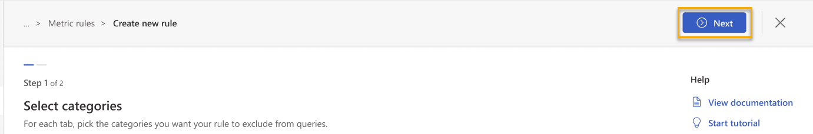

    If you’re done for now and want to save your rule as a draft, select the close icon to the right of **Next**, instead.  Select **Save**. If you don’t want to save your draft, select **Cancel**.
 
1.	Fill out your rule’s publication details:
    1.	Give your rule a name (required).
    1.	Give your rule a description so other analysts know what it does (optional).
    1.	Select whether you want to put this rule in your **Favorites** view (optional).
    1.	Select whether you want to make this rule a default rule (optional).

    >[!Important]
    > When you set a rule as default, that rule applies to all queries that any analyst in your organization runs. Default rules also affect calculations for the Viva Insights app in Teams and web. Use the default option carefully.
 
1. If you’re done editing your rule and you’re ready to publish it, select the **Publish** button. Select **Previous** to go back.
 
    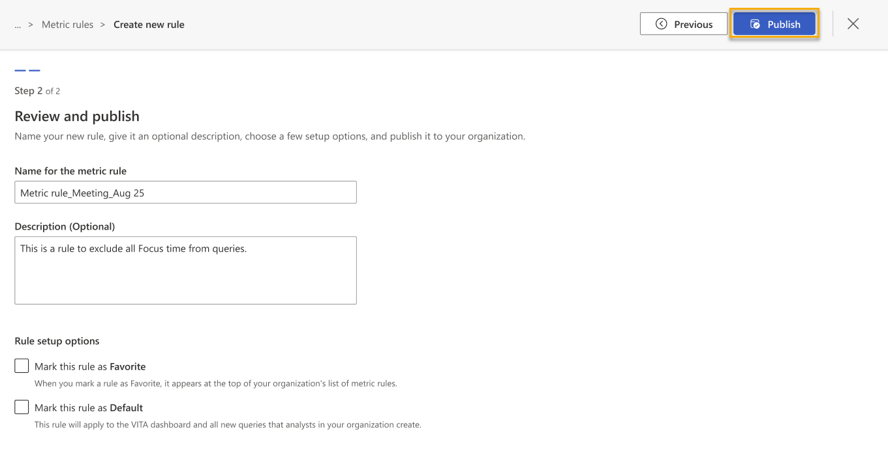

1.	Your new rule appears in the **Published** and **All rules** views on the **Metric rules** page, and in your **Favorites** view if you marked it as a favorite in step 4c. When you go to add a new metric rule to a query, you’ll also find it among the rule options. If you marked a rule as a default in step 4d, that rule will apply to any query that any analyst in your organization runs from this point on.

If you’re ready to add your rule to a query, go to [How to add a rule to your query](#how-to-add-a-rule-to-your-query).

### From scratch

To create a new metric rule from scratch and publish it to your organization, follow these steps:

1. After you select **Create new rule**, pick the second option from the dropdown menu: **Create from scratch**.

    

1. From the tabs at the top of the **Define exclusions** page, select the first collaboration type you want your rule to apply to. Collaboration types are meetings, emails, chats, and calls. 

1. Define what you want to analyze by adding conditions and condition groups. 

    The collective term we use for conditions and condition groups is *filters*. 

    When you create a filter, you’re telling Viva Insights to skip certain types of collaboration events when it runs queries. To learn more about filters, go to our custom person query documentation: [Person query](person-query.md).

    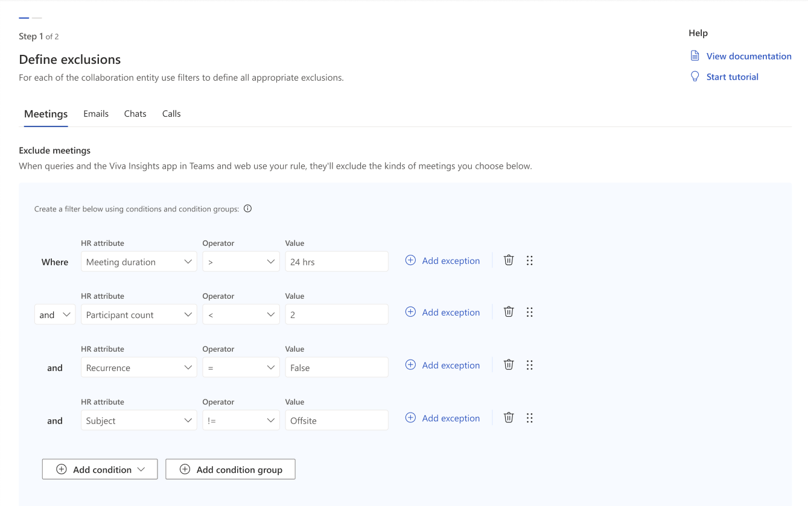

1. If you have other collaboration types you want your rule to apply to, select them from the tabs at the top of the **Define exclusions** page. Add filters for each collaboration type.

    >[!Note]
    >If your rule applies to chats and emails, you can set filters for items read and items sent.

1. For meeting and email filters, add exceptions to your rule, if there are any.

    Exceptions are set as keywords, and they only apply to email or meeting rules. When you give your rule an exception, you’re telling Viva Insights to use the rule like normal, except when it finds one of your set keywords in the email’s subject line or the meeting’s title. In that case, instead of skipping over that email or meeting like your rule dictates, Viva Insights will include that meeting or email in queries. 

    Here’s how to add exceptions to your rule:

    1. Select **Add exception** to the right of your condition or condition group.
    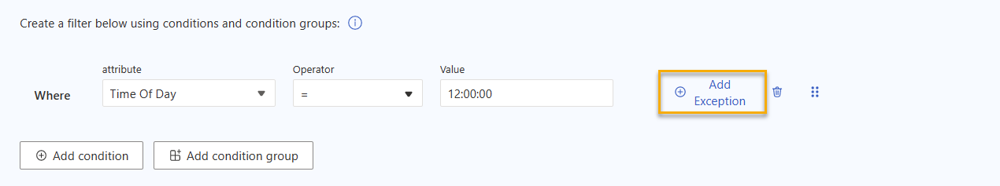
    1. A pane opens to the right. Type a keyword in the text-input field and press **Enter** on your keyboard. Enter each term separately.
    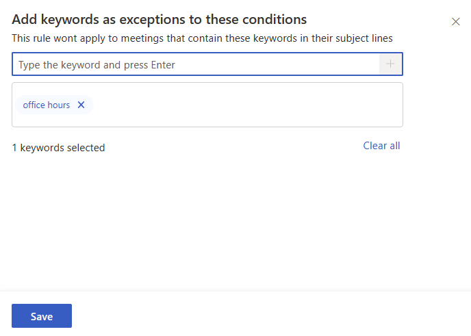
    1. After you’ve entered all your keywords, select the **Save** button at the bottom left of the pane.
    1. You’ll see your exceptions noted in the condition group. If you need to remove a keyword or add more, select the **exceptions** link again.
    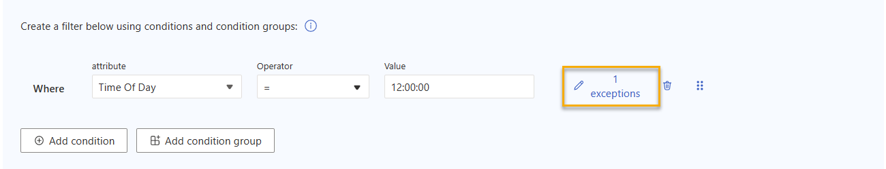

1. If you want to go on to naming and publishing your rule, select the **Next** button in the top right of your screen.

    

    If you’re done for now and want to save your rule as a draft, select the close icon to the right of **Next**, instead.  Select **Save**. If you don’t want to save your draft, select **Cancel**.

1. Fill out your rule’s publication details:
    1. Give your rule a name (required).
    1. Give your rule a description so other analysts know what it does (optional).
    1. Select whether you want to put this rule in your **Favorites** view (optional).
    1. Select whether you want to make this rule a default rule (optional). 

    >[!Important]
    >When you set a rule as default, that rule applies to all queries that any analyst in your organization runs. Default rules also affect calculations for the Viva Insights app in Teams and web. Use the default option carefully.
 
1. If you’re done editing your rule and you’re ready to publish it, select the **Publish** button. Select **Previous** to go back.

    

1. Your new rule appears in the **Published** and **All rules** views on the Metric rules page, and in your **Favorites** view if you marked it as a favorite in step 7c. When you go to add a new metric rule to a query, you’ll also find it among the rule options. If you marked a rule as a default in step 7d, that rule will apply to any query that any analyst in your organization runs from this point on.

If you’re ready to add your rule to a query, go to How to add a rule to your query.

## How to add a rule to your query

1. While you’re building your query, select More Settings in the Query setup section.
 
1. A **Metric rules** pane appears. Select the rule you want to apply.

    >[!Note]
    > You can only apply one rule at a time. If there’s a default rule active in your organization, you’ll notice that the rules pane shows it as selected. When you set a different rule, you’re removing the default rule from your query and replacing it with the one you pick.
    > 
    >If your organization is just starting to use the advanced insights app, the default rule here might be **Meeting exclusions**. We talk about this rule in [The meeting exclusions rule](#the-meeting-exclusions-rule).

1. Select the **Save settings** button.
 
## View rule

To get more information about a rule, select the View rule link to the right of the rule title. When you select View rule, you go to a view-only version of the rule builder (unless you were the person who built the rule). Here, you can find out which attributes this rule uses and the organizational data it will exclude.

## About default rules

Default rules help analysts run queries consistently, and they also determine how the Viva Insights app in Teams and web calculates data.
While default rules create consistency, marking a rule as default has some wide-reaching effects. When you mark a rule as default, you’ll:

* Apply that rule to any query that any analyst in your organization runs from this point on.
* Change how Viva Insights calculates the metric(s) involved in the rule, which affects how the Viva Insights app in Teams and web shows data.
If your organization has a default rule, but you don’t want to use it, you’ll need to go into **More Settings** and de-select it. You can add another rule if you want.

To quickly identify default rules, look for the green **Default** tag.
 
### The meeting exclusions rule

When your organization first uses the analyst experience, you’ll notice we’ve already set a default rule: meeting exclusions.  

The meeting exclusions rule works by excluding time and count metrics for meetings that match this criteria:

* The duration of the meeting is 24 hours or more.
* The meeting is canceled.
* The user is not the meeting organizer, and if their response to a meeting invite is anything other than "Accept."
* There are fewer than two participants.
* The event is set to show as anything other than "Busy" on participant's calendars.

#### View rule details

When you view the meeting exclusion rule’s details, you’ll find a different layout than other rules created by analysts in your organization.

To view the rule’s criteria, expand **Which meetings are excluded from collaboration metrics?**. To find out which metrics this rule doesn’t apply to, expand A**re there exceptions to this rule?**. 

To get an example .xlsx file that shows what's included and excluded from existing collaboration data, select **Download sample results**.

#### Replace meeting exclusions as default

You or another analyst can replace meeting exclusions as the default rule whenever you want. Just keep in mind that you’re applying that default rule to all future queries, and also changing calculations for the Viva Insights app in Teams and web.
