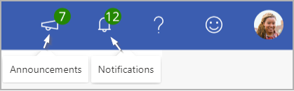

---

title:  Advanced insights notifications and announcements
description: The advanced insights app with Microsoft Viva Insights shows notifications and announcements about system changes, user actions, and product updates
author: madehmer
ms.author: v-lilyolason
ms.topic: article
ms.localizationpriority: medium 
ms.collection: viva-insights-advanced
ms.service: viva 
ms.subservice: viva-insights 
search.appverid: 
- MET150 
manager: helayne
audience: Analyst

---

# Notifications and announcements

The top ribbon in the advanced insights app with Microsoft Viva Insights includes a number of options, including a way to provide feedback; view information about your tenant, role, and session; and view additional documentation resources.

It also lets you view notifications and see announcement about what's new in Viva Insights, as described in the following sections.

## Notifications in the app

In the advanced insights app, you can see notifications about important and timely information. These notifications cover data updates, product and feature updates, and information about your recent activity within the app. They also describe what has changed since you last used the app, plus timely updates and reminders of steps that you can take next.

### Role-based notifications

The notifications that you see are based on the role that you've been assigned. If you have more than one role assigned, you can see notifications for all of your roles.

### Notification types

* **Warning** - Notification of scheduled service or downtime that will affect your ability to use the app.  
* **User** - You can take several actions in the app that generate notifications.  
* **System** - Notices that Microsoft 365 or organizational data has been updated.
* **Knowledge** - Updates and links to product updates.

### Reading and controlling notifications

The notifications pane is open by default on the Home page:

<!-- add new image when the app is available>

You can open this pane by selecting the **Bell** icon in the ribbon. You can close the notifications pane by selecting the **Bell** icon again or simply by clicking outside the pane.

When a new notification is added, the green circle with a number reflects any unread notifications. Up to ten notifications are shown in the pane at a time. At the bottom of the pane, you can load more notifications when applicable. Notifications are listed chronologically with the most recent at the top.

After you hover over a notification, it is considered "dismissed" and the number of unread notifications changes (if the pane is open). If you select a notification and trigger a new page to load or if you close the pane, the notifications are considered seen and dismissed, and the number goes away. Selecting an external link, opens it in a new tab.

You cannot delete notifications, but notifications expire after 60 days.

## Announcements

To open **Announcements**, select the megaphone icon in the ribbon:

Announcements describe recently added features or feature updates, such as new Power BI templates, metrics, or data sources.

It also describes upcoming features or updates that will affect your current work. For example, if a new data source will change the way metrics are calculated, this section might encourage you to save current query results so that you can compare data from before the change with data after the change.  

Each announcement includes a short description of the feature or feature update with a link to open documentation or view an informative example about it.

The “new notification” number on the megaphone shows how many unread notifications you have. Select the **Read more** or other available link for the feature or update to reduce the number. After you have selected the **Read more** or other type of link on all of the announcements, the number will go away.
