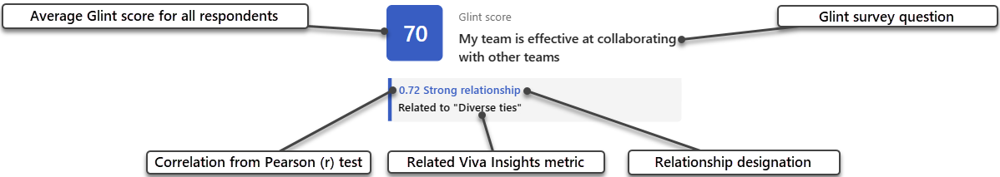

# Glint with Viva Insights report

The **Viva Insights with Glint** shows how Glint survey questions and Viva Insights metrics are related. 

With this report, you can:

* Investigate how employee sentiment and behavioral collaboration patterns might be correlated.
* Visualize trends for behavioral data.
* Average behavioral metrics, which are broken down by sentiment favorability.

Before we get started, here are a few things you should know:

* Your survey data will import from Glint to Viva Insights through an API. Your admin needs to set up this connection. 
* For this private preview, the report is only available in English.

To populate the report in Power BI, you’ll need to set up and successfully run the predefined **Viva Insights with Glint** query in Viva Insights.

[!INCLUDE [Demonstration](includes/demonstration.md)]

<iframe title="Wellbeing - Summary" width="600" height="373.5" src="https://msit.powerbi.com/view?r=eyJrIjoiNTcwNGQwMTctYWUwYy00MjAwLThlM2YtYTIwMWI4ZGEwZTg0IiwidCI6IjcyZjk4OGJmLTg2ZjEtNDFhZi05MWFiLTJkN2NkMDExZGI0NyIsImMiOjV9" frameborder="0" allowFullScreen="true"></iframe>

[!INCLUDE [Prerequisites](includes/prerequisites.md)]

## Report setup

### Run query

1.	In the Viva Insights analyst experience, select **Analysis**.
2.	Under Power BI templates, navigate to **Viva Insights with Glint** and select **Start analysis**. 
[!INCLUDE [Setup steps](includes/setup-steps.md)]

## Report settings

|Setting|Description|
|-------|-----------|
|View report by| Set the primary group-by attribute for all report pages. You can change this attribute at any time and all report pages will group values by the new attribute. <!--what are the cases you'd ever want to group by something other than Organization, like a question or the client_uuid?-->
|Filter by| Select a category you want to filter your report by: <ul><li> client_uuid <li>Organization<li>One of the survey's questions <li>survey_cycle_id<li> survey_cycle_title <!--same as above. Also, what is the uuid, cycle id, and cycle title? Will these be the category name for everyone-->
|Filter value|Filter by a value in the category you selected above. For example, if you selected "Organization" above, you could set "Engineering" here. You'll only see data from the Engineering organization, so setting filters lowers the **People included in this report** count. <!--what are the numerals for the Q values? Are the Q values actually categories, and each number is the question number?-->
|Include| Choose whether you want this report to include: <ul><li>Weeks that people are probably out of office, like holiday weeks. These weeks have lower levels of collaboration than others. <li>Employees who collaborate fewer than hours per week. These employees are unlikely to be knowledge workers, or they don’t use Outlook or Teams.
|Preferred report language|In later releases, you'll be able to pick your report’s language. For this private preview, the report is only available in English. <!--verify when this will change. After private preview?-->

### People included in this report 

This figure show how many people your report is analyzing. When you adjust your filters, you'll notice different numbers here.

To protect privacy, this report doesn't show groups with fewer than ten people. Learn more about minimum group size in our [setup documentation](../../setup-maint/setup.md#minimum-group-size).

## About the report

This report shows two main pieces of information:

* The Glint score, which is how your organization responded, on average, to a particular question on the Glint survey.
* The correlation, which is the relationship between the Glint score and a Viva Insights metric. Metrics provide productivity information about your organization's employees--for example, **Collaboration hours** or **Manager coaching hours 1:1**.

### About correlations and relationships

Throughout this report, correlations indicate whether change in a survey response average is associated with change in a Viva Insights metric, and vice-versa. 

In other words, if data for certain metrics change, would Glint scores reflect that change? For example, if employees received fewer manager coaching 1:1 hours, would they rate their relationship with their managers differently when they took a Glint survey? The answer might be "yes" if a metric and a survey question have a high correlation. 

Understanding these relationships can help you better contextualize your Viva Insights metric data, and also understand how these numbers are affecting your organization's employees. 

#### How we calculate correlations and determine relationships

We've selected a list of Glint survey questions and Viva Insights metrics that could potentially be related. We curated this list from our entire set of Viva Insights metrics. To help create this list, we drew from academic literature and validated correlations between Glint and Viva Insights data pairs.

To arrive at the correlations you see in your report, we use the Pearson correlation coefficient (r) between each pair: survey question responses and data from a Viva Insights metric. Correlations fit within a scale from -1 to 1:

* **-1** indicates a perfect negative linear relationship. For example, the data in Viva Insights might show high manager 1:1 time, but all respondents report they don't feel coached by their manager. If you're looking at a -1 correlation on a graph, the data points would form a diagonal line from the top of the y axis to the bottom of the x axis.
* **0** indicates no relationship. For example, the data in Viva Insights might show varied manager 1:1 time, and respondents give varying answers when asked whether they feel coached by their manager. If you're looking at a 0 correlation on a graph, there wouldn't be a discernable pattern between the data points. 
* **1** indicates a perfect positive linear relationship. For example, the data in Viva Insights might show high manager 1:1 time, and all respondents report that they feel coached by their manager. If you're looking at a 1 correlation on a graph, the data points would form a diagonal line from the bottom of the x axis to the top of the y axis.

Using these correlations, we determine whether a relationship between a Glint survey question and a Viva Insights metric is strong, moderate, weak, or if there's no relationship.

|                  |For positive correlations |For negative correlations |
|------------------|---------|--------|
|**Strong relationship**|  0.5 to 1|-1 to -0.5 |
|**Moderate relationship**|0.3 to 0.5 |-0.5 to -0.3 |
|**Weak relationship**|0.1 to 0.3 |-0.3 to -0.1 |

If a survey question and metric have **no relationship**, the correlation is between -.1 and .1, including 0.

### Overview

The Overview page has two main sections: **Summary** and **Questions with strong relationship**.

#### Summary

Get an overview about the survey you're analyzing:

* Name
* When it was opened and closed
* How many questions it has
* When correlation with Viva Insights data took place (for example, 01/04/2023 - 04/02/2023). <!--would like more information about this-->

#### Questions with strong relationship

View the four survey questions with the strongest relationships to Viva Insights metrics. These questions and metrics are presented on cards that contain this information:

* Glint survey score for the question, averaged from all respondents 
* Question text
* Correlation coefficient from the Pearson (r) test and kind of relationship (strong, moderate, weak, or no relationship)
* Name of the related Viva Insights metric

### Explore survey and metric relationships

Select a survey question, pair it with a Viva Insights metric, and explore the relationship between the pairing. To 
dive deeper, add the **View report by**, **Filter by**, and/or **Filter value** to see how this relationship changes for 
different populations. Refer to [Report settings](#report-settings) to learn more about these controls.

#### Question and metric relationship

View the average score for the **Survey question** you selected. The graph below the score card shows how strongly the survey question is connected to the **Behavior metric** you selected. In addition to showing the correlation coefficient and the kind of relationship, the graph represents the distribution of survey scores for your selected question.

#### Behavior metric averages

View Viva Insights data for the **Behavior metric** you selected, before and after the survey period. For example, if you selected "Meeting and call hours with manager 1:1" as your metric, the area chart would show you how many hours employees were spending on average with their managers before the survey took place, at the time of the survey, and after the survey closed.

#### Question response sentiments

Compare data for your selected metric with how favorably respondents answered your selected survey question. For example, if you picked "Uninterrupted hours" as your metric and "I feel supported to work in the way that is best for me in terms of when and where I work" as your survey question,
the graph would show you the average uninterrupted hours by those who responded favorably, unfavorably, and neutrally. Select **Open chart breakdown** to view the total number of responses, and three separate graphs: metric data for those who responded favorably, unfavorably, and neutrally. <!--do we have a breakpoint between these three?-->

### Glossary

Get definitions for all the metrics used in this report. To view definitions for all metrics in Viva Insights, refer to our [metric definition article](../../reference/metrics.md).

[!INCLUDE [Power BI tips and troubleshooting and Related topics](includes/powerbi-tips-related-topic.md)]