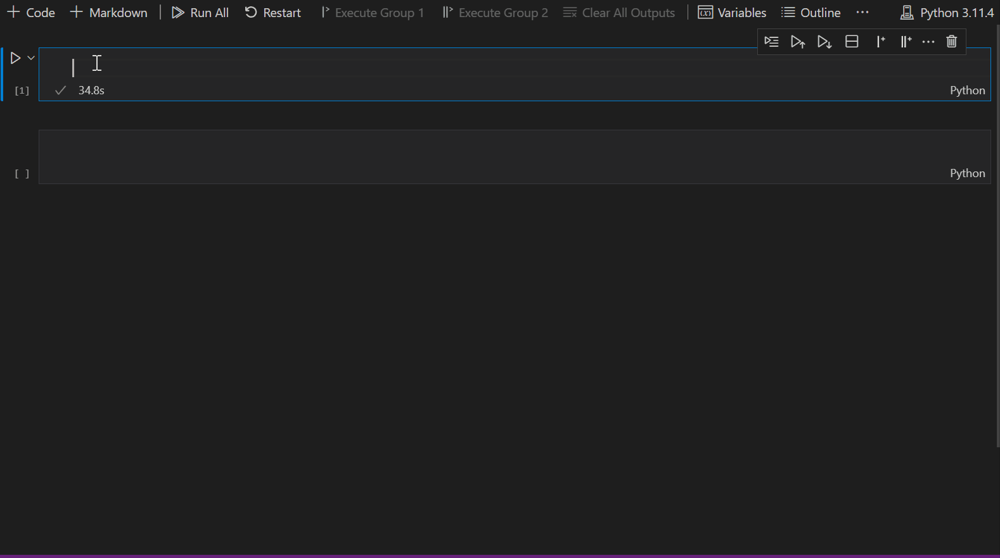

# vivainsights Python package

The **vivainsights** Python package is an open-source repository of Python functions that enable analysts to execute custom analyses that go beyond the insights that Viva Insights templates and Viva Insights custom queries make available. These analyses can help leaders go deeper into the data that Viva Insights provides to solve more specific problems.

For the detailed package documentation, please visit the [package website](https://microsoft.github.io/vivainsights-py/).

The **vivainsights** library is published on the [Python Package Index (PyPi)](https://pypi.org/project/vivainsights/).

>[!Note]
>Python is an open-source programming language widely used for data analysis and data science. It has a large and active community of developers who contribute to its development and maintenance. Python provides a range of libraries and tools for data analysis, machine learning, and scientific computing. For users who prefer R for data analysis, we also have a [package with similar features written in R](vivainsights-r-package.md). 

## Capabilities for analysts

With the Python library, you can:

* Validate quality and shape of data prior to analysis.
* Build summary tables and visualizations for exploratory data analysis.
* Automatically identify groups with significant patterns.
* Perform advanced organizational network analysis (ONA), text analytics, and inference analysis.
* Export key visualizations and analysis tables in different formats.

The following gif shows the experience of creating a visualization of collaboration hours with the **vivainsights** Python package:

## Example visualizations

Here are a few more examples of the visualizations you can make with this Python package: 

:::image type="content" source="../images/analyst-python-create-boxplot.png" alt-text="Screenshot of a boxplot for distribution of emails sent.":::

:::image type="content" source="../images/analyst-python-create-trend.png" alt-text="Screenshot of a trend graph that shows enauks sent - hotspots by organization.":::

:::image type="content" source="../images/analyst-python-create-bar.png" alt-text="Screenshot that shows a bar graph of emails sent - weekly average by organization.":::

## More about Python and the vivainsights Python package

### Why should I use Python to analyze data from Viva Insights?

* Reproducibility – Code-based workflows help facilitate reproducible analysis, which is the notion that analysis should be built in a way that is replicable by others. Python as a tool promotes this good practice.  
* Scalability – Python scales relatively well in the context of large datasets. The application of functions and automated processes also help cut down routine analysis time.
* Integration – If you already use Python as part of your analysis toolkit, adopting the package as part of the workflow will be seamless and easy.

### How will using the vivainsights Python package benefit me and my organization? 

By using the **vivainsights** Python package, you can:

* Improve the speed, scalability, and reproducibility on current analysis workflow for Viva Insights. 
* Maintain a streamlined data-science workflow by integrating Viva Insights with existing Python and data science workflows (for example, analyzing engagement surveys, ERP, or CRM data).
* Deliver advanced analytics proof-of-value artifacts quickly without switching to a different stack or putting in additional coding effort. 

### Is the vivainsights Python package right for me?

The library is designed for analysts or data scientists who have at least a basic knowledge of Python or statistical programming. Python has a code-based analysis workflow, so you should be comfortable analyzing data without a graphical user interface. 

### Is the vivainsights Python package free to use?

Both Python and the **vivainsights** Python package are open source. This means they’re free to use with no commercial licenses required. 

### What’s the difference between the vivainsights Python package and Power BI templates from Viva Insights?

The **vivainsights** Python package and Power BI templates Viva Insights from Viva Insights are complementary tools. In short, the **vivainsights** Python package requires more technical expertise from the user, but it also has more analytical power and potential. 

Power BI dashboards are easy to set up for users with no coding background. The Python package enables versatile and in-depth analysis to your Viva Insights data, providing the interface for more complex analysis like clustering and churn modeling. 

## Analyst resources

The **vivainsights** Python package, its documentation, and other related resources are available on GitHub in the following locations:

* [vivainsights Python package source code](https://github.com/microsoft/vivainsights-py/)
* **vivainsights** Python package [documentation](https://microsoft.github.io/vivainsights-py), which includes a quick-start guide, code examples, and other information like the structure of the package.
* [Submit an issue or a feature request](https://github.com/microsoft/vivainsights-py/issues)
* [Full list of functions](https://microsoft.github.io/vivainsights-py/vivainsights.html)

