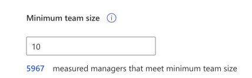

# Manager settings

>[!Important]
> Manager settings only control **Group insights** within **My team** in the Viva Insights app in Teams. To set up or disable the **My team** page, refer to [Admin tasks](/viva/insights/personal/teams/viva-teams-app-admin-tasks).

As an admin for Microsoft Viva Insights, you can set up and edit **Manager settings** to allow all measured people managers or a specified group of managers access to aggregated collaboration insights about their team. 

Only managers whose team meets or exceeds the **Minimum team size** setting can access **Group insights** within **My team** in Viva Insights in Teams. The other admin tasks required for Group insights access are the same as for access to **My team**. See [Admin tasks](/viva/insights/personal/teams/viva-teams-app-admin-tasks.md) for details.

The size of the team counts the manager and all the employees who directly or indirectly report to that manager within the organization's reporting hierarchy. The following are based on Azure Active Directory data by default, or the latest organizational (HR) data that's been successfully uploaded and processed for Viva Insights in the advanced insights app:

* **Measured managers** – Managers who are assigned licenses can see their team's insights through Group insights within My team in Viva Insights in Teams.
* **Managers enabled** – Only managers who meet the minimum team size can view their team's insights.
* **Minimum team size** – You can set the minimum size of a team that a manager is allowed to view insights about and start plans for. The minimum size allowed is 10 (including the manager). This section also shows you how many measured managers currently have teams that are equal to or more than the minimum setting.

## To configure manager settings

Insights admins can access **Manager settings**. Before managers can access Viva Insights in Teams or in the advanced insights app, they need to be assigned a license and have a team that meets or exceeds the **Minimum team size** setting.

1. In **Manager settings**, check the box to allow managers with the minimum team size access to their team data in Viva Insights.

1. Select either **All managers**, which allows all measured managers access, or **Select managers (upload .csv)**, which enables you to give specific managers access.

    
    * If you chose **Select managers (upload .csv)**, you need to create a .csv file that lists the email addresses for the select managers, then select **Upload .csv** to upload this list. 

    If you're allowing all managers access, continue to step 3. If setting up access for select managers, select **Download currently enabled manual upload manager list .csv** to confirm which managers now have access. If an error occurs, such as an invalid email or an unlicensed manager, the .csv file will show the error for that manager.

3. In **Minimum team size**, you can change the minimum to a number more than 10 (the lowest allowed setting). This setting limits access to only those managers who have teams equal to or more than that number, which includes the manager in the team count.

4. Select **Save**.

>[!Note] 
> Changes to these settings will apply after one hour. 