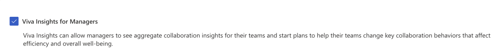
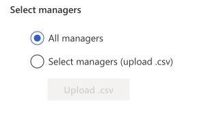
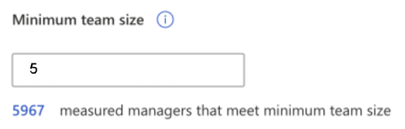

# Configure manager settings

*Applies to: Insights Administrator*

>[!Important]
> Manager settings affect [organization insights](../../org-team-insights/org-insights.md) in the Viva Insights app in Teams and on the web.

As an Insights Administrator, you can set up and edit **Manager settings** to allow all measured people managers or a specified group of managers access to aggregated collaboration insights about their team.

## About manager settings

### Prerequisites for managers

In addition to the settings you configure below, managers need to have two things before they can access organization insights in Viva Insights:

* A license assigned to them by the Microsoft 365 Global Administrator
* A team that meets or exceeds the **Minimum team size** setting

### Team size

Only managers whose team meets or exceeds the **Minimum team size** setting can access [organization insights](../../org-team-insights/org-insights.md) in Viva Insights in Teams and on the web. This number must be at least five.

The size of the team includes the manager and all the employees who directly or indirectly report to that manager within the organization's reporting hierarchy. 

>[!Note]
>To learn how team size differs from group size, go to [What’s the difference between minimum team size and minimum group size?](#whats-the-difference-between-minimum-team-size-and-minimum-group-size).

### Current managers

You'll notice the following numbers on the **Manager settings** page. These numbers are based on Microsoft Entra data by default, or the latest organizational (HR) data that's been successfully uploaded and processed for Viva Insights in the advanced insights app:

* **Current managers**
    * **Measured managers** – The number of managers who are assigned licenses and who can see their team's insights throughout the Viva Insights in Teams
    * **Managers enabled for aggregate group insights in Viva Insights** – The number of managers who meet the minimum team size you set. These managers can view aggregated group insights about their team.

## Configure manager settings

:::image type="content" source="../images/manager-settings-5-minimum.png" alt-text="Screenshot of Manager settings page." lightbox="../images/manager-settings-5-minimum.png":::

To configure manager settings, follow these steps:

1. Select **Viva Insights for Managers**. When you select this box, you'll allow managers with the minimum team size to access their team data in Viva Insights.

1. Select one of the following:

    
    1.  **All managers**, which allows all measured managers access to team insights (granted that their team size meets the minimum). If you're selecting this option, move on to step 3.
    1. **Select managers (upload .csv)**, which allows you to give specific managers access to team insights. After you select this option:
        1. Create a .csv file that lists the email addresses for the select managers.
        1. Select **Upload .csv** to upload your list.
        1. Select **Download currently enabled manual upload manager list .csv** to confirm which managers now have access. If an error occurs, like an invalid email or an unlicensed manager, the .csv file will show the error for that manager.
3. Confirm or change the **Minimum team size**. You can change this minimum to a number more than five, which is the lowest allowed setting. This setting limits access to only those managers who have teams equal to or more than that number, which includes the manager in the team count.

    

4. Select **Save**.

>[!Note] 
> Changes to these settings will apply after one hour.

### Leader role assignment

As an Insights Admin, you can manage access to the group manager experience for  business leaders in your organization. The group manager experience provides insights and recommendations to help leaders foster a healthy and productive work culture for their teams.  

To enable the group manager experience, you need to assign the Group Manager role to the eligible leaders in your organization. You can do this by either selecting a .csv file or AAD groups. You can create and manage AAD groups that contain the leaders you want to enable for the group manager experience. You can use dynamic or static groups, and you can add or remove members as needed.  

#### How to assign the Group Manager role using AAD groups 

To assign the Group Manager role using AAD groups, follow these steps:

1. Sign in to the Viva Insights Admin portal with your Insights Admin credentials.  

2. On the left, select **Settings**, then **Manager Settings**.  

3. Select **Use AAD groups**.  

4. Select **Add group**.  

6. Search for the AAD group you want to use and select it. You can add multiple groups if needed.  

7. Select **Apply**. You will see the number of people leaders who are members of the selected groups and are eligible for the group manager experience.  

## What’s the difference between minimum team size and minimum group size?
 
### Minimum team size

Minimum team size determines which managers are eligible to view organization insights in the Viva Insights app. The size of the team includes the manager and all the employees who directly or indirectly report to that manager within the organization's reporting hierarchy. This number can’t be lower than five.

As we described earlier, managers also need to be [assigned a license](assign-licenses.md) to view these insights.

### Minimum group size

Minimum group size helps protect individual privacy. Because it’s easier to guess information about an individual based on results about a smaller group, we hide organization insights for weeks when fewer people are active in Outlook and Teams than the minimum group size. The Insights Administrator can choose to increase this threshold, but it also has to be at least five. The minimum group size applies to data visualizations in advanced insights Power BI templates as well as group comparisons in organization insights for leaders and managers in Outlook and Teams.

## Next steps

> [!div class="nextstepaction"]
> [Configure personal insights defaults
](configure-personal-insights.md)

*Applies to: Exchange admin, Insights Administrator*
