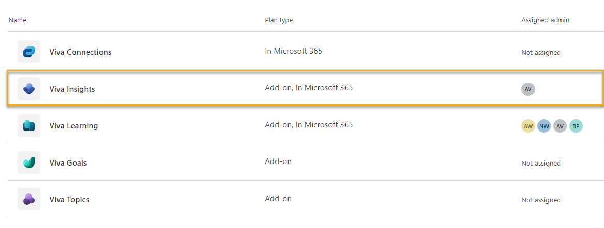
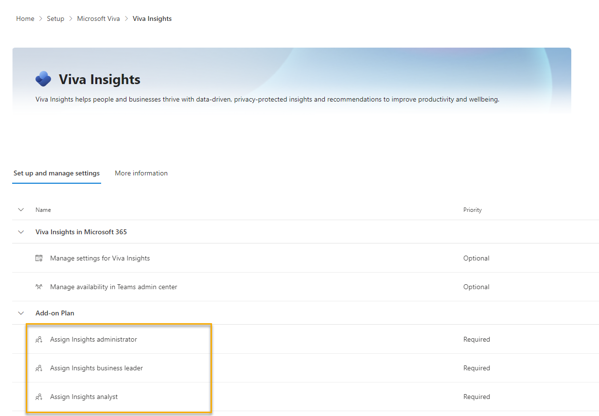
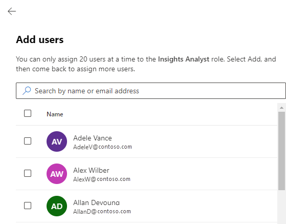
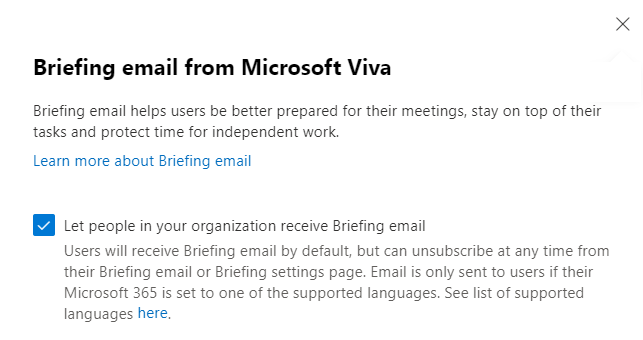

# Using the new admin center

>[!Note]
> This article is intended for targeted release customers. Some functionality is introduced gradually to organizations that have set up the targeted release options in Microsoft 365. If you're not part of the Targeted Release program:
>
>* You might not yet see this feature or it might look different than what is described in this article. Features are subject to change. 
> * You should follow our regular applicable setup directions (for example, for assigning user roles, read [Assign user roles](assign-user-roles.md)).

With the new admin center, you as an admin can initiate setup, deployment, and manage licenses for all generally available Viva apps from a central location in the Microsoft 365 Admin Center. This article talks about how to perform tasks specific to Viva Insights. To learn more about the new experience in general, refer to [The new Microsoft Viva admin experience](/viva/new-microsoft-viva-admin-experience).

## To access Viva Insights settings

Go to the Viva [admin page](https://admin.microsoft.com/Adminportal/Home?source=applauncher#/featureexplorer/collections/VivaExperiences). To access the Viva Insights admin page, select the Viva Insights option within the list of Viva offerings.

>[!Note]
>Some of the directions below—[Assign licenses](#assign-licenses) and [Manage the Briefing email](#manage-the-briefing-email)—take place on the main **Microsoft Viva** admin page, not the **Viva Insights** admin page.

## Manager, leader, and advanced insights

### Assign licenses

Before you can assign roles, you’ll need to assign licenses. If you don’t have licenses assigned, you’ll be directed to the **Licenses** page. You can also get to this page later by selecting the **Manage licenses** button on the Viva admin page, then selecting **Microsoft Viva**.

Make sure the right individuals or groups are assigned a Viva license. Select a group or user on this page to make changes.

### Assign roles

To assign Viva Insights roles in the updated admin experience:

1. On the Viva admin page, select **Viva Insights**.
1. Under **Add-on Plan**, select the role you want to assign: **Insights admin, Insights business leader, or Insights analyst**.

1. Select **Add users** or **Add groups**.
1. Select users(s) or groups(s), then select **Add**.

### Manage settings in the advanced insights app

Under **Add-on Plan**, select **Manage privacy, data, and manager settings in Advanced Insights**. This option brings you to the advanced insights app’s admin portal. Complete your privacy setup, upload or connect HR data, and determine manager access here. For more information about setting up advanced insights, refer to our [advanced insights setup documentation](setup.md).

## Personal insights

### Manage default settings

To manage default personal insights settings for your organization, select **Manage settings for Viva Insights**. On the next page, you’ll see a checklist containing the following features:

* Insights dashboard
* Digest email
* Insights Outlook add-in and inline suggestions
* Meeting effectiveness surveys
* Schedule send suggestions

Using this list, choose which features are turned on by default for all users. If you want all features on by default, leave them selected. If you prefer a mixed deployment—where some features are on by default and others aren’t—deselect the ones you want to turn off.

>[!Note]
>Users can individually opt in and out of these features through their personal settings.

When you’re done making changes, select **Save**.

### Manage Teams app settings

To manage settings for the Viva Insights app in Teams, select **Manage availability in Teams admin center**. This option takes you to the Teams admin center, where you can make changes to the app's settings. To read more about installing the Viva Insights app, refer to [Admin tasks for Viva Insights](/viva/insights/personal/teams/viva-teams-app-admin-tasks#install-the-app).

### Manage the Briefing email

Use the Viva admin page to change your organization’s default Briefing email settings. Select **Manage briefing email in Viva** near the top of the page.

This option opens a pane on the right side of your screen. If you want everyone in your organization to get the email by default, select the checkbox. If you don’t, deselect the checkbox. Individuals can opt in or out of Briefing emails in their personal settings.

### To confirm installation of the Outlook add-in

To confirm that the Viva Insights Outlook add-in is installed for your organization, select **Settings > Integrated apps**. Then, look or search for the Viva Insights Outlook add-in in the list of apps. To turn the add-in on or off by default, refer to [Manage default settings](#manage-default-settings).
