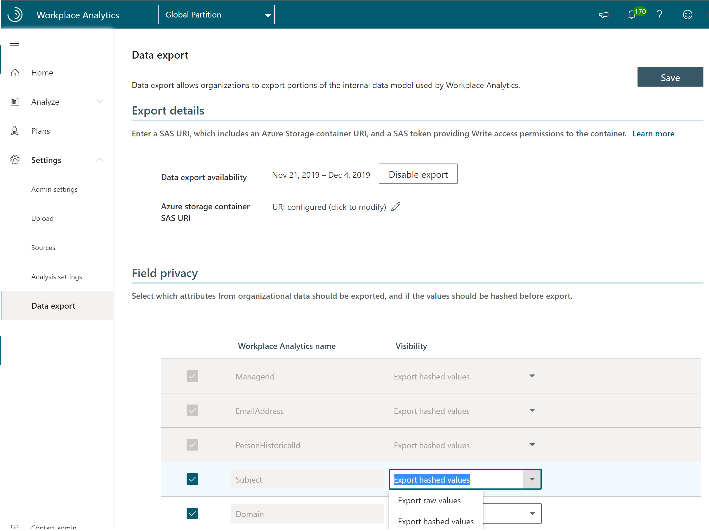

# Workplace Analytics Data export

_Data export is available only as part of a Microsoft service engagement._

>[!Important]
>As of February 2022, this product is no longer being supported.

Your company might have unique data-analysis needs requiring custom exploration of Workplace Analytics insights and data that goes beyond what's available in Workplace Analytics. For example, you might have custom data exploration that requires you to combine Workplace Analytics data with data outside of Workplace Analytics.

As part of the service agreement, you can ask your Microsoft representative to enable Data export in the Workplace Analytics app. If you have two or more partitions set up in Workplace Analytics, you can also specify for which partitions to enable Data export in the app. The ability to specify what data can be exported by whom helps you maintain data protection.

After data export is enabled, your Viva Insights or Workplace Analytics can view and use the **Data export** page in Workplace Analytics to save the SAS URI, which points to an Azure storage container with write-only permission.

Saving the SAS URI enables a workflow that exports the Workplace Analytics data to the storage container. The data will be exported each time it is refreshed in Workplace Analytics, for the agreed duration of the CS agreement.

## Data included in the export

You can export pre-processed Workplace Analytics data to a designated Azure storage container as .csv files. The export uses the latest available organizational data that was uploaded and processed in Workplace Analytics.

If you add new organizational data attributes to your Workplace Analytics upload, you must also add them as additional fields in the export in **Data export** > **Field privacy**. The new fields are added to the next data export after the data upload is next refreshed and processed in Workplace Analytics. For details, see [Subsequent organizational data uploads](/viva/insights/setup/upload-organizational-data2?toc=/viva/insights/use/toc.json&bc=/viva/insights/breadcrumb/toc.json).

The following .csv files are included in data exports. Select a file to view what's included in that file, such as the data column names, data types, and definitions:

* [Meetings](#meetings)
* [MeetingParticipants](#meetingparticipants)
* [PersonHistorical](#personhistorical)
* [MailParticipants](#mailparticipants)
* [Mails](#mails)
* [Calls](#calls)
* [CallParticipants](#callparticipants)
* [InstantMessages](#instantmessages)
* [InstantMessageParticipants](#instantmessageparticipants)

## Azure environment requirements

Before exporting Workplace Analytics data, confirm the following:

* Your company has a current Azure subscription and an Azure storage account with an Azure storage container for storing the exported Workplace Analytics data.

* Have a write-only SAS URI for the storage container. To learn more about SAS, see [Delegating Access with a Shared Access Signature](/rest/api/storageservices/delegate-access-with-shared-access-signature).

## To export data

1. If you have already installed Azure Templates, use the SAS URI created after deployment which grants write-only access to the raw data folder that was set up during deployment and use that URI in **Step 3**.
2. If you have partitions set up in Workplace Analytics, select which partition you want to export data from. If not, skip to the next step.
3. In Workplace Analytics, go to **Controls** > **Analyst settings** > **Data export**.
4. In **Azure storage container SAS URI**, enter the URI for the Azure storage container.
5. In the **Field privacy** section, select which fields to export as raw values and as hashed values. Note the options for the required fields at the top of the list are locked and unchangeable, as shown in the following graphic.

   >[!Note]
   >When you add new attributes to your organizational data and you want to include them in a data export, you must repeat this step to add the new attributes as additional fields to include in the export.

6. Select **Save** (top right) to save your selections and enable a workflow that exports the Workplace Analytics data to the storage container. The applicable data is then exported to Azure during each subsequent data refresh in Workplace Analytics.

   

## Exported .csv files

The .csv files that are listed in this section are included in data exports.

### Meetings

This file includes one row for each meeting or appointment with the following metrics. Recurring meetings result in a row for each occurrence.
  
|Column name|Data type|Description|
|-----------------|---------------|-----------------|
|MeetingId|string|Unique identifier for each meeting (including recurring meetings); primary key|
|ICalUid|string|Meeting calendar ID|  
|Subject|string|Meeting subject (respects tenant privacy settings; see [Workplace Analytics Privacy settings](../use/privacy-settings.md) for details)  |
|IsRecurring|Boolean|True if this is a recurring meeting|
|IsCanceled|Boolean|True if the meeting was canceled|
|StartTime|datetime|Meeting start time|
|DurationMinutes|integer|Meeting length in minutes|
|TotalAccept|integer|Total number of meeting acceptances|
|TotalDecline|integer|Total number of meeting declines|
|TotalNoResponse|integer|Total number of invitees who did not respond to the meeting invite|
|TotalTentativelyAccepted|integer|Total number of invitees who tentatively accepted|
|TotalAttendees|integer|Sum of total accept, total no-response, plus organizer|
|TotalDoubleBooked|integer|Number of attendees who had conflicting meetings or appointments on their calendar|
|TotalEmailsDuringMeeting|integer|Number of emails sent during the meeting by all attendees who did not decline the meeting invitation|

### MeetingParticipants

This file has one row for each participant in a calendar meeting with the following metrics.
  
|Column name |Data type |Description |
|-----------------|---------------|-----------------|
|MeetingId |string |Unique identifier for each meeting (including recurring meetings); foreign key matching [Meetings](#meetings) table|
|PersonHistoricalId |string |Unique value for a participant any time an HR attribute changes; foreign key matching [PersonHistorical](#personhistorical) table|
|LocalStartTime |datetime |Start time of the meeting in the participant's local time|
|IsOrganizer |Boolean |True if this participant organized the meeting|
|IsDoubleBooked |Boolean |True if this person has more than one meeting at this time in their calendar|
|Response |enumerated |Invitee's response to the meeting: declined, tentative, accepted, or no response|
|DurationMinutesAdjusted |double |Time spent in meeting, adjusted if double booked|
|NumberOfEmailsDuringMeeting |integer| The number of emails sent by this participant in this meeting|

### PersonHistorical

This file includes one row for each person that has HR attribute changes and for each HR change with the following metrics. A new row is created when a person's HR attributes change.
  
|Column name|Data type|Description|
|-----------------|---------------|-----------------|
|PersonHistoricalId|string|Unique value for every person for each HR change; primary key|
|EmailAddress|string|Masked value, unique for every email address|  
|StartDate|datetime|Effective start date of last HR change (does not apply for original hire date, or leave date)|
|EndDate|datetime|Effective end date of last HR change (does not apply for original hire date, or leave date)|
|PopulationType|string|Type of employee. See [PopulationType](#populationtype).|
|ManagerId|string|Unique value for each person's manager|
|HR Attribute 1|varies |HR values that have been added to the dataset; see [HR attributes](#hr-attributes).|
|   ...   |||
|HR Attribute n|varies |HR values that have been added to the dataset; see [HR attributes](#hr-attributes).|
|LevelDesignation|string|HR values for employee levels that represent an employee's experience, management level, or seniority within the organization.|
|Organization|string|HR values for the internal organization for which employees belong that's specific and identifiable by the organization's leaders.|
|IsInternal|Boolean|True if PopulationType is either MeasuredEmployee or InternalCollaborator|
|ExternalCollaboratorId|string|Email address if PopulationType is ExternalCollaborator and the tenant is configured to include external email IDs in the report|

#### PopulationType

The following describes possible values for the **PopulationType** column.

|Value|Description|
|------|------|
|MeasuredEmployee|An employee who has a Workplace Analytics license assigned|
|InternalCollaborator |A person within the company who does not have a Workplace Analytics license assigned|
|ExternalCollaborator |A person with a domain that does not match the default company domain|
|DistributionList |An Active Directory distribution list|
|MeetingRoom |A meeting room|

#### HR attributes

The HR attributes represent organizational data your company has uploaded for use in Workplace Analytics. The attributes include a required set of attributes, optional attributes, and custom attributes. For more information about these attributes, see [Prepare organizational data](/viva/insights/setup/prepare-organizational-data?toc=/viva/insights/use/toc.json&bc=/viva/insights/breadcrumb/toc.json#attribute-reference).

### MailParticipants

This file includes one row for every email sent and received with the following metrics.
  
|Column name|Data type|Description|
|-----------------|---------------|-----------------|
|MailId|string|Unique identifier for every email sent; foreign key matching primary key of the [Mails table](#mails)|
|PersonHistoricalId:|string|Unique identifer for every person; foreign key matching [PersonHistorical](#personhistorical) table primary key|  
|IsSender|Boolean|True if this person sent the email|
|LocalSentTime|datetime|Local time when the email was sent|
|PersonTimeSpentInHours|double|Time spent reading or writing email in hours (heuristic estimated value)|
|PersonTimeSpentInMinutes|double|Time spent reading or writing email in minutes (heuristic estimated value)|

### Mails

This file includes one row for every email sent with the following metrics.

|Column name|Data type|Description|
|-----------------|---------------|-----------------|
|MailId|string|Unique identifier for each email; primary key|
|ConversationId|string|Unique thread identifier|
|Subject|string|Meeting subject (respects tenant privacy settings; see [Workplace Analytics Privacy settings](../use/privacy-settings.md) for details)|
|SentTime|datetime|When the email was sent, in the sender's local time|
|SenderTimeSpentinMinutes|double|How many minutes spent writing the email (heuristic estimated value)|
|NumberOfRecipients|integer|Number of email recipients, not including the sender|

### Calls

This file includes one row for each call with the following metrics. Recurring, scheduled calls (also referred to as _meetings_) result in a row for each occurrence.

|Column name |Data type |Description |
|-----------------|---------------|-----------------|
|CallRecordId |string |Unique identifier for each call (including scheduled calls); primary key  |
|MeetingId |string |Meeting calendar ID (iCalUID + StartDate) associated metadata found on the mapped MeetingId (if a scheduled call/meeting) |
|AppName | string |Name of the source app (for example: Teams, Skype) |
|IsScheduledCall |Boolean |True if this is a scheduled call |
|TotalParticipants |integer |Sum of total participants for the call |
|InteractionType |enumerated |Invitee's response to the call: joined or attended, tentative, accepted, or no response |

### CallParticipants

This file includes one row for each participant in a call with the following metrics.
  
|Column name|Data type|Description|
|-----------------|---------------|-----------------|
| CallRecordId | string | Unique identifier for each call (including scheduled calls); primary key  |
| PersonHistoricalId | string | Unique value for a participant any time an HR attribute changes; foreign key matching [PersonHistorical](#personhistorical) table |
| IsOrganizer | Boolean | True if this participant organized the call |
| LocalStartTime | datetime | Start time of the call in the participant's local time |
| LocalEndTime | datetime | End time of the call in the participant's local time |

### InstantMessages

This file includes one row for each instant message with the following metrics.

|Column name|Data type|Description|
|-----------|---------|------------|
| InstantMessageId |string |Unique identifier for each instant message; foreign key matching InstantMessage table |
| AppName |string |Name of the source app (for example: Teams, Skype) |
| SentTime |datetime |Sent time of the instant message in the participant's local time |
| InteractionType |enumerated |The type of instant message received by a person: GroupChat, OneOnOneChat |
| TotalParticipants |double |Sum of total IM participants (includes sender) |

### InstantMessageParticipants

This file includes one row for each participant in an instant message with the following metrics.

|Column name |Data type |Description |
|-----------|----------|-----------|
|InstantMessageId |string |Unique identifier for each instant message; foreign key matching [InstantMessage](#instantmessages) table |
|PersonHistoricalId |string |Unique value for a participant any time an HR attribute changes; foreign key matching [PersonHistorical](#personhistorical) table |
|isAfterHours |Boolean |True if this instant message was sent after hours |
|IsSender |Boolean |True if this person was the instant message sender |
|LocalSentTime |datetime |Sent time of the instant message in the participant's local time |
|SenderTimeSpentInMinutes |double |Time spent in instant message, approximation |

## Related topics

* [Deploy and configure Workplace Analytics Azure Templates](./deploy-configure.md)
