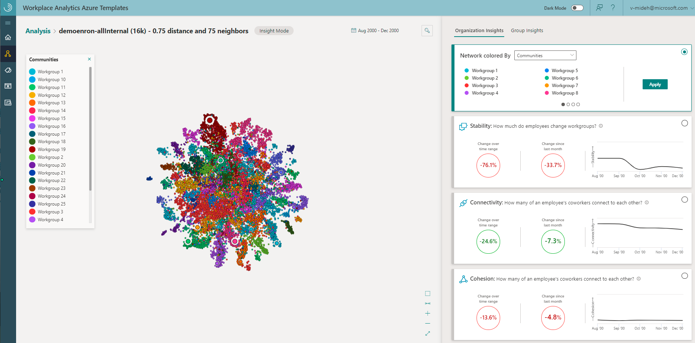
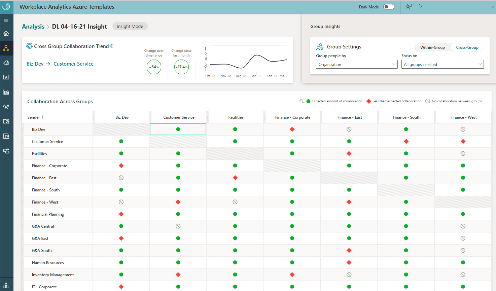
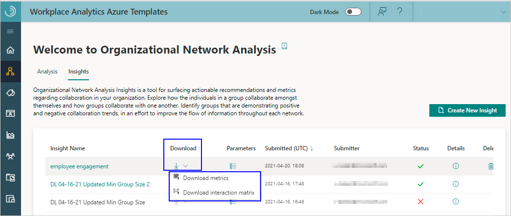
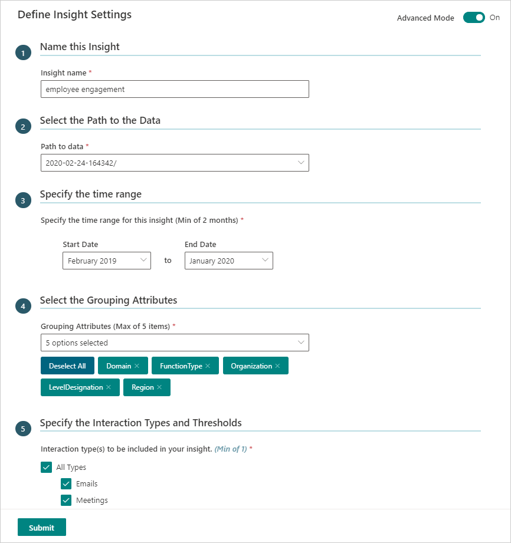

---

ROBOTS: NOINDEX,NOFOLLOW
title: Insights in the Organizational Network Analysis Azure Template
description: Learn how to create and use insights in the Organizational Network Analysis Azure Template for Workplace Analytics
author: madehmer
ms.author: helayne
ms.topic: article
ms.localizationpriority: medium 
ms.collection: m365initiative-viva-insights 
ms.service: viva 
ms.subservice: viva-insights 
search.appverid: 
- MET150 
manager: scott.ruble
audience: Admin
---

# ONA Insights

The Organizational Network Analysis (ONA) Template includes Organization and Group Insights you can use to quickly validate hypotheses regarding overall collaboration patterns within a group, across different groups, or the organization as a whole.

This following analysis helps you identify groups who are showing either positive or negative collaboration behaviors and how those behaviors trend over time.

* [**Organization Insights**](#organization-insights) - Insights about overall company-wide collaboration, including stability, connectivity, and cohesion scores.
* [**Group insights**](#group-insights) - The group-based insights can guide your work on creating a workplace with healthy and sustainable collaboration behaviors.

## Organization Insights

The graphs to the right about organizational insights show data about the organization as a whole month to month.

* **Workgroup Stability** - Measures the change of informal workgroup memberships from month to month. Informal employee workgroups are based on Community Detection. A high score indicates a group who is consistently coming together to collaborate month over month. This is also available through the downloaded data. For more details about this measure, see the [measure calculations](ona-metric-calculations.md#workgroup-stability).
* **Network Silo Behavior** - Helps quantify how connected or siloed a network is. A low score suggests that employees communicate freely across workgroups and throughout the organization. A high score indicates employees who primarily communicate within their informal workgroup, which is based on Community Detection. A high score reflects a network who is siloed or modular in structure, while a low score represents a network who is more connected and not modular. This is also available through the downloaded data. For more details about this measure, see the [measure calculations](ona-metric-calculations.md#network-silo-behavior).
* **Employee Cohesion** - Employee Cohesion measures the extent to which employees’ connections (friends of friends) will also connect with each other, forming a triangle of connections. High scores indicate that there are many connections among colleagues. These connections tend to increase trust and understanding within teams and can also indicate those employees who are more willing to help others because their team members know each other. This is also available through the downloaded data. For more details about this measure, see [measure calculations](ona-metric-calculations.md#employee-cohesion).
* **Community Detection** - Identifies natural clusters of employees who collaborate more with each other than with the rest of the organization. These informal communities or workgroups might not align with the formal organizational structure because they represent how individuals naturally work together. By default, the network visual is colored by these workgroups. The community assignments are also available through the downloaded data. For more details about this measure, see the [measure calculations](ona-metric-calculations.md#community-detection).

For example, the following graphic shows a Stability of -33.7 percent change in workgroup membership as compared to last month, which shows an improvement as compared to the overall time range.

The following metrics are used for the graph and are currently only available in the downloaded data.

* **Freedom** - Measures how much of the collaboration within informal workgroups crosses the boundaries of the formal organizational hierarchy. High freedom indicates that people within a workgroup tend to collaborate outside of their reporting lines. Low freedom means that people within a workgroup tend to collaborate within their reporting lines. See [measure calculations](ona-metric-calculations.md#freedom) for more details.
* **Fluidity** - Measures how much employees’ positions in the network shift over time. These individual scores are averaged at the workgroup and network levels, where workgroups are defined by Community Detection. Low fluidity scores indicate that people have more stable communication patterns month over month. High fluidity scores indicate people who are frequently changing who they collaborate with and how much. For more details on fluidity, see [measure calculations](ona-metric-calculations.md#fluidity).

## Organization Insights graph

The organizational network graph help you analyze how the organization as a whole is doing month to month. The graph shows nodes that are sized by the number of connections people have to other colleagues within the organization. In **Network colored by**, you can change how the graph is colored based on the selected group metric or organizational (HR) attribute. You can also select a node in the graph to see more information about it.

To see a comparison between two graphs for about the organization's network, select the **Show Side By Side View** (Venn diagram) icon. You can use this to view before and after comparisons within the set time period for the different specified groups.

For the side-by-side graphs, select **Figure Options** in the center, bottom of the page to view and select any combination of the following:

* **Time period** - Select the start month and the end month for the time period that was specified in the analysis, so you can compare the first month's data to the last month's data.
* **Colored by** - Select what the graph nodes are colored by for each of the graphs, including the Organization Insights Metrics (Workgroup Stability, Network Silo Behavior, Employee Cohesion, and Communities) and organizational (HR) attributes.

For example, you can compare natural group communities with the formal structure within your organization to see who you might seat together for better group cohesion, to improve cross-group collaboration, and for more efficient group communications.

## Group Insights

Group Insights include the following trends about how people within the selected group are collaborating for the selected date range. All insights in the tabular views refer to the groups’ behavior in the _most recent month_ in the selected time range. For this within-group analysis, you select what metric to group people by in **Group Settings**.

* **Group Stability** - Shows which groups shift positions in the network on average by changing their collaboration habits. A higher score means the group have more stable networks because they tend to work with the same people in the same ways. A lower score means they have lower stability because they more frequently shift their collaboration patterns. Desirable changes in percentages are shown in green and undesirable changes are in red. This is based on the [fluidity](ona-metric-calculations.md#fluidity) measure.
* **Isolation Risk** - Shows which groups are disconnected from others or are at risk of being disconnected. Groups who spend five or more hours collaborating within the group as compared to one hour collaborating outside the group are at risk of being isolated. Insular group members might be less likely to access, understand, or implement ideas from outside their group. This is based on the [E-I Index](ona-metric-calculations.md#e-i-index) measure for a group where high risk is less than -0.67, medium risk is between -0.5 and -0.67, and low risk is greater than -0.5. Desirable changes in percentages are shown in green and undesirable changes are in red. The red band in the graph indicates the group is isolated.
* **Group Cohesion** - Shows which groups have enough connections among team members needed to build trust. Group members who trust one another are more inclusive and better positioned to deliver successful results. This is based on [employee cohesion](ona-metric-calculations.md#employee-cohesion) that's measured with the global clustering coefficient.
* **Overall risk** - A combination of Isolation Risk, Collaboration Balance, and Group Cohesion. The groups with multiple high-risk factors are ranked higher than groups with lower risk behaviors. This can identify groups where change initiatives might be the most helpful.

For example, the following graphic shows within-group trends for the **Sales - Central** group. These high-level trends highlight overall collaboration patterns for this group over time.

For Within-Group comparisons, you can select a column to sort the table by. By default, the highest risk groups are listed first. Also, it's important to note that if a group ever has fewer individuals than the minimum group threshold, it will not be shown in the Group Insights table.

No change in collaboration means the group members or groups collaborated about the same (or less than a 0.05% change) for the months being compared.

None or no data means there was not sufficient data, or the data didn’t meet the minimum-group size or thresholds set for this analysis.

No collaboration means the group members or groups didn’t collaborate at all that month or for the months being compared.

Select **Cross-Group** to see your organization’s cross-group collaboration trends between groups based on the selected group settings and which cell is selected in the table. This is based on the [Density](ona-metric-calculations.md#density) ratio measure where all values less than one standard deviation away from the median density for cross-groups is considered high risk.

For example, the following shows that the **Biz Dev** and **Customer Service** groups had a positive 64 percent change in expected collaboration over the selected time range and a positive 17.4 percent change as compared to the previous month's collaboration.

Use **Focus on** to select which groups you want to hide or show in the **Collaboration Across Group** table. You can also hide a group by selecting the **Clear Row** (**eye**) icon that's available when you hover on the group's column or row name within the table. To unhide a group, select the group name in **Focus on**.

To see more details about the collaboration metrics or the interaction matrix that this insight analysis uses, you can select them as **Download** options for an insight.

## To create a new insight

1. In Workplace Analytics Azure Templates, select **Organizational Network Analysis**.
2. In **Insights**, select **Create New Insight** at top right.
3. In **Define Insight Settings**, enter a name and select a path to the data.

   

4. In **Specify the time range**, select a date range (minimum of two months) to get collaboration trends over time.
5. In **Select the Grouping Attributes**, select up to a maximum of five internal attributes to analyze. The available attributes match up to the HR attributes included in the imported [organizational data](/viva/insights/setup/prepare-organizational-data?toc=/viva/insights/use/toc.json&bc=/viva/insights/breadcrumb/toc.json#attribute-reference) from Workplace Analytics.
6. If **Advanced Mode** is **Off** (at the top), skip to the next step. If **Advanced Mode** is **On**, you'll see the **Specify the Interaction Types and Thresholds** section, where you can specify the following:

   * **Choose the interaction type(s)** - Select what to analyze in the dataset, independently or in combination, including emails, meetings, Teams chats, and Teams calls. Note that if you include meetings and Teams calls in your analysis, only unscheduled Team calls are counted to avoid double counting meeting call activity.
   * **Max number of people involved in each interaction** - Select the maximum number of people involved in each interaction.
   * **Minimum number of unique interaction types** - Select the minimum number of interaction types that indicate a meaningful interaction.
   * **Maximum duration of a meeting or call** - Select the maximum number of interactions between the selected groups or people.
   * **Advanced Settings** - Select to turn it **On** if you want to specify individual interaction thresholds that define a meaningful connection, such as a minimum number of emails, meetings, chats, calls, and interactions across two or more types.

   >[!Important]
   >When analyzing calls or chats, you'll only see data from the time period where all signals exist. For example, if you select meetings and calls to analyze and 13 months of meeting data is available, but only three months of Microsoft Teams data is available, you'd only see data for the three months that include all of the selected types of interactions.

7. Select **Submit**. Based on the data size, it might take anywhere from a few minutes up to a few hours to successfully create the insight.

## To view an insight

1. In **Organizational Network Analysis** > **Insights**, select the name of the insight in the table that you want to view.

   

2. The following information and options are available in the table for existing insights:

   * When the **Status** is a green check mark, the insight was successfully saved and can be viewed.
   * During insight creation, select the **Job Details** (i) icon to view details about where the job is at in the process.
   * If the analysis fails with a **Status** of a **red X**, select the **Job Details** (i) icon to view details and see what might've caused the failure.
   * Select a table column heading, such as **Name** or **Submitter**, to sort by it.
   * Select the **Parameters** icon next to the name to view details about its parameters, such as the time range, network boundary condition filters, and node and group metrics.
   * Select the **Delete Insight** (trashcan) icon to delete analysis that you created from the list.
   * Select the **Download** icon to download one of the following as a .csv file.

     * **Download metrics** for the person and group metrics in the saved insight, which are based on the selected date range and other options.
     * **Download interaction matrix** for the PersonID interactions and related data, such as date range and other options.

     >[!Important]
     >When you calculate metrics in a **Download interaction matrix** file, know that your calculations might be different than the metrics calculated in a group-level download file. These differences occur because a person's HR attribute values can change over time and the calculations in the different downloads only use a snapshot of the latest available HR values.

## Related topics

* [Organizational Network Analysis Azure Template](./organization-network-analysis.md)
* [ONA metric calculations](./ona-metric-calculations.md)
* [Workplace Analytics Azure Templates overview](./overview.md)
