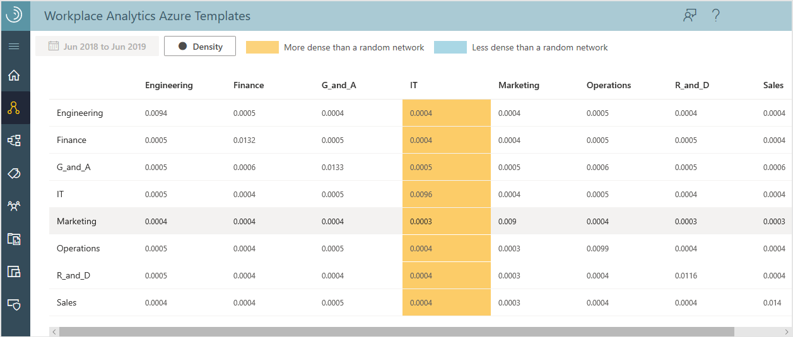
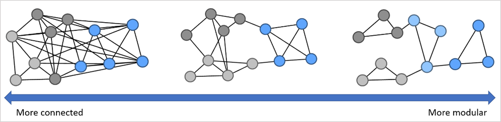

---

ROBOTS: NOINDEX,NOFOLLOW
ms.date: 10/16/2019
title: Measure calculations for Organizational Network Analysis Azure Template
description: Learn how the metrics are calculated for the Organizational Network Analysis Azure Template for Workplace Analytics
author: madehmer
ms.author: helayne
ms.topic: article
ms.localizationpriority: medium 
ms.collection: m365initiative-viva-insights 
ms.service: viva 
ms.subservice: viva-insights 
search.appverid: 
- MET150 
manager: scott.ruble
audience: Admin
---
# ONA measure calculations

_This template is only available as part of a Microsoft service engagement._

The Organizational Network Analysis (ONA) Azure Template for Workplace Analytics has a number of measures to help you visualize and analyze collaborative relationships within your organization.

In the network graphs, each dot or node represents an employee or a group. The lines between the nodes represent connections, which are collaborative relationships between them. The node measures for employees are de-identified to maintain their privacy. Group node measures represent the group's measures, such as for a department (Sales) or a functional group (program managers) within the organization.

## How are connections measured?

Each of the measures are based on the connections between the nodes. To ensure the calculations accurately represent the interactions between people or groups within the organization, the measures account for connection weight and direction:

* **Weight** - Connections are weighted based on the amount of collaboration time in meetings and email between two nodes (connection strength).
* **Direction** - Connections are also directed because they specifically account for who sent and who received email. For these calculations, meetings do not have direction.

## Highlight key employees or groups

You can highlight key employees or groups by sizing the nodes in the graph by using the **Scale Nodes** option. The default value of this option is **No Measure**.

You can size the nodes based on various network metrics. The following table lists the available node measures and their uses.

| Measure | What it indicates |
| ------- | --- |
| [Boundary Spanning](#boundary-spanning) | How well people in one group shares information with other groups. |
| [Bridging Index](#bridging-index)  | The relative importance of nodes to information flow, such as gatekeepers or liaisons of information. |
| [Community Detection](#community-detection)  | The informal community or workgroup to which an employee belongs based on their collaboration patterns. |
| [Degrees](#degrees)   | The overall network size of each node. |
| [Density](#density)   | The strength of connections between nodes (within groups and between groups). |
| [E-I Index](#e-i-index)  | The size of an imbalance between external and internal collaboration for an individual within a group or for a group.|
| [Employee Cohesion](#employee-cohesion)  | Scores represent the extent to which employees collaborate with colleagues who also collaborate, which forms a collaborative triangle. |
| [Fluidity](#fluidity)  | The change in an individual’s, group’s, or network’s structure from one month to the next by quantifying how much employees shift their position in the network. |
| [Freedom](#freedom)  | A group-level measure that quantifies how much a workgroup’s communication structure differs from the formal organizational structure. |
| [Group Size](#group-size)  | The group size based on the number of people that share the same attribute in the selected time period. |
| [Influence Index](#influence-index) | A node's potential influence on the opinions of the network or a measure of social status. |
| [Network Silo Behavior](#network-silo-behavior)| A network-level metric that indicates the extent to which the network is divisible into distinct communities. |
| [Qualitative Variation Index](#qualitative-variation-index) | The diversity among the contacts (egonet) of an individual or a group. |
| [Workgroup Stability](#workgroup-stability)| Uses Leiden’s community detection algorithm to assign individuals into workgroups to measure the change in workgroup membership from month to month. |
<!-- |[Reach Index](#reach-index)| Represents the ability to access or share information across the organization while going through minimal intermediaries. |-->

The following graphic shows the different Node Sizing options where the largest node in each graph represents the one with the highest measure for that option.

## Are the measures for employees and groups different?

No, the measure interpretations for employees and groups are the same. For example:

* If an employee has a high degree, this indicates that the person has more connections in the network than those with lower scores. For this reason, they have more exposure or access to information.
* If a group has a high degree, this indicates the group has more connections in the network than other groups with lower scores. For this reason, the group has more exposure or access to information.

The calculations of group measures are not simply an aggregate of the employees' scores within the group. (Aggregate measures are average, median, maximum, or minimum.) Instead, the measures are the cumulative scores of how people in the group interact with people in other groups. The two measures might sometimes be equal but that's generally not the case. The key difference is that the group measures do not account for connections that occur between members of the same group.

A simple analogy of this is a water molecule, which is made up of two hydrogen atoms and one oxygen atom. If you average together the properties of hydrogen and oxygen (both gases), it won't generate the properties of a water molecule because the bonds between atoms are important to its properties.

Just like atoms and molecules, how people are connected within an organizational group makes the properties of the group different than the average properties of the individual people within the group. You can generate summary statistics of employees within the group from the employee-level (de-identified) measures.

For more general information about these network measures, see [Centrality](https://wikipedia.org/wiki/Centrality).

## Boundary Spanning

Boundary Spanning measures the extent to which employees act as representatives of their group across the organization. It indicates the sharing of information with other groups.

For a defined group, Boundary Spanning measures an employee's collaboration with other groups' members. Its value gets a boost for the diversity of the employee's connections, the number of connected groups. This measure does not consider ties inside their own group.

This measure is calculated as follows for employees as compared to groups.

* **Employee level** &ndash; Boundary Spanning is the geometric mean between the total collaboration time that a person spent with people outside their group and the number of unique groups that this person collaborated with. (Total collaboration time is a measure of emails sent and meetings attended.)

* **Group level** &ndash; This is the same for groups as for employees, except that the totals represent a group instead of a person. It's the geometric mean between the total collaboration time a specified group gave to people outside its own group and the total number of unique, external groups that the group collaborated with.

* Both levels for this measure account for direction and weight.

## Bridging Index

The Bridging Index represents employees or groups that control the flow of information throughout the network. The nodes with high Bridging Index values can indicate gatekeepers or liaisons of information. Depending on the function of the group or individual, it can be advantageous or stressful playing this role in an organization.

This index measures the number of times a person or group is on the most probable path of information flow between two other people or groups. This measure isn't limited to the shortest paths between nodes but accounts for all possible ways that information flows between nodes in a network.

The most meaningful insight that you can derive from the Bridging Index is the rank of the nodes. The values are between 0 and 1.

For example, assume that node A has a Bridging Index of 0.7 and node B has a Bridging Index of 0.35. You can accurately assume that node A tends to control more information throughout the network than node B, because node A ranks higher than node B. However, you cannot assume node A controls twice as much information or is twice as likely to be a change agent in the network as node B, because the values indicate a *ranking* of information flow and not the *amount* of information.

While rank is the most important aspect of Bridging, a pure ranking (or ordinal) score of individuals would remove the distribution of scores. The distribution of the Bridging scores can give you insights into the existence of clusters of key bridgers, which is why it provides a score instead of just an ordinal ranking of individuals.

This measure is calculated as follows for employees as compared to groups.

* **Employee level**: An employee's Bridging Index is the sum of the importance scores for the connections that are tied to that employee. Importance scores represent a connection's likelihood that information will flow through the connection. These scores are estimated by using the strength of the connection and the number of network paths the connection is included in.

* **Group level**: Similarly, the group's Bridging Index is the sum of the importance scores of the connections between nodes in the group and nodes outside of their group. No connections between nodes of the same group are considered in the group measure.

* Both levels for this measure account for direction and weight.

## Community Detection

Community Detection is the unsupervised assignment of individuals to communities or workgroups based on their collaboration patterns. These informal workgroups might not align with the formal organizational structure and represent how individuals naturally work together. Additionally, these workgroups are the basis for workgroup stability, network connectivity, freedom, and fluidity. It is available in Insights mode or through the downloaded data.

The classical definition of a network community is a group of individuals that are densely connected to each other and sparsely connected to others outside of the community. Here, the density and sparsity of a potential community is estimated by maximizing the modularity by using the [Leiden method](https://arxiv.org/abs/1810.08473), which is recursively run to induce subgraphs on large communities until the maximal community size is achieved. This method uses an undirected, weighted graph.

Individuals are assigned to one root community and one leaf community.  The root community is the parent of a set of leaf communities. Both the root and the leaf community assignments are available in the download, but only the root community assignment is used to calculate the measures that depend on workgroups. The root and leaf community assignments are integers starting at 1 and there is no correlation between the number and the properties of the community. In **Organization Insights**, you can select to color the entire organization by the root community to see the overlap between workgroups and the official organizational structure.

For more information on community detection, see [Community structure](https://en.wikipedia.org/wiki/Community_structure).

## Degrees

Degrees denotes the network size and is based on the number of connections to a node. Simply, the overall degree is the number of edges (incoming and outgoing) connected to a node. Indegree is the number of incoming edges to a node and outdegree is the number of outgoing edges. Indegree and outdegree are available in  downloaded files only.

This measure is calculated as follows for employees as compared to groups.

* **Employee level**: These are all calculated by counting the number of connections to an individual employee. The value is between 0 and 1 because it is divided by two times the total number of employees in the graph. (It divides by two to account for directionality of sent and received emails.) This measure accounts for the direction but not the weight of the connections. Degrees equals 0 if an employee isn't connected to anyone. Degrees equals one if an employee is connected to everyone.

* **Group level**: The group degree centrality is the unique number of nodes outside the group that are connected to members of the group. The value is between 0 and 1 because it is divided by the number of people outside of the group. This measure does not consider the weight or directionality of the connections.

Both indegree and outdegree are normalized to be between 0 and 1, such as in the following equation:

  ("Indegree" + "Outdegree")/2 = "Degree"

## Density

Density measures the extent to which and how strongly employees within or between groups are connected. A higher density indicates higher levels of connectivity within or between communities. Dense groups indicate a cohesion among the members of that group.  

Density is the number of actual connections among employees divided by the total possible number of connections that could exist among the same employees. Density values are between 0 and 1, where 1 indicates that all individuals in that group are strongly connected to each other.

The measure accounts for the strength of the connections between individuals and normalizes them to help control the tendency of individuals to communicate more than other individuals.

This measure also uses directionality, which means the density between group A and group B will only count the interactions that went from A to B. It will not count the interactions that went from B to A. The densities between groups will vary depending on whether the density is from group A to B or from B to A. For this reason, the density matrix isn't symmetrical.

### Example

See the following density table.

* The direction of connections is the groups listed in the left-hand column (senders) are connected with and send information to the groups listed across the top row of the table (recipients).
* The density of communication going from group A to group B is the intersecting number for group A on the left-hand column and group B across the top of the table.

For more information, see [Density](https://wikipedia.org/wiki/Dense_graph).

When viewing Density graph data, the higher density (orange) and lower density (blue) cells are highlighted based on the modularity. The color indicates whether a group is more or less connected in the network, as compared to what's expected with a random network. If no cells are colored, the groups are as dense as expected with no outliers.

A group is *orange* when it's higher in density and *blue* when it's lower in density than what's expected. The cells are not colored by the value of the density in the table. Rather, they are colored based on the modularity. The colors are only shown in the metrics download (.csv) file and not in the table view in the template. For more details and a definition of what modularity is, see the [measure calculations](ona-metric-calculations.md#density).

**Modularity** is the fraction of edges within a group minus the fraction of edges that are expected from a random network with the same nodes and the same degrees, but not the same connections between nodes. In other words, it's the difference between what the network is and what a similarly constructed random network is expected to be.

If the modularity is as follows:

* **positive** - The group has more connections within it than expected.
* **zero or close to zero** - The connections are about the same as a random network.
* **negative** - The group has fewer and less strong connections than would be expected from pure chance. This metric interprets the density measure as to whether the amount of connections between groups and within groups is high or low. It also gives insight into the overall graph and its connectivity.

**Density Ratio** compares the density values of a group to the expected density of a group's size within the context of the tenant. The density ratios for two groups who are collaborating with each other are compared to the median density of cross-group densities.

This measure helps identify groups who are cohesive and groups that might lack the connectivity to be cohesive. A density ratio that’s greater than 1 represents a group who is denser than expected or is higher than average. Density ratio is used in Group Insights for the within group cohesion and cross-group collaboration patterns.

## E-I Index

The E-I index is available only in downloaded data. It indicates the size of an imbalance between external and internal collaboration for an individual within a group or for a group. This is helpful in identifying individuals or groups who are at risk of being siloed.

The E-I index is between -1 (all collaboration is internal) and 1 (all communication is external facing). A value of 0 represents a balanced amount of internal and external collaboration. This measure accounts for weighted edges but does not account for direction.

An E-I index of -0.67 corresponds to a 5:1 internal to external collaboration. Consequently, values at or below -0.67 indicate a group or individual might be at risk of being siloed. In this measure, an individual can only belong to one group.

This measure is calculated differently for employees as compared to groups:

* **Employee level** - The external ties are those outside of the employee's own group and internal ties are the connections the employee has with others in the same group.
* **Group level** - The external ties are those outside of the group and internal ties are those within the same group.

## Employee Cohesion

Employee cohesion is measured by the global clustering coefficient. It indicates the likelihood that individuals’ connections will also connect with each other in the network. The scores are between 0 and 1, where 0 represents no completed triads in the network and 1 means that the network is completely connected. High cohesion scores indicate a greater sense of trust and understanding among employees and a willingness for employees to help each other.

This measure accounts for edge weight but not the direction. It is available in Insights mode or through the downloaded data. For more details on this measure, see [Clustering coefficient](https://en.wikipedia.org/wiki/Clustering_coefficient).

## Fluidity

Fluidity measures the change in an individual’s, group’s, or network’s structure from one month to the next by quantifying how much employees shift their position in the network. An individual’s position in the network is determined by capturing their collaboration behavior (contacts and time spent with contacts) and projecting that into high dimensional space by using the [OMNI](https://arxiv.org/pdf/1705.09355.pdf) embedding technique. This technique preserves the high-dimensional space for different periods of time which makes it possible to compare fluctuations throughout time. Then, the distance between the individual’s current position and their position from the previous month is calculated. These individual shifts are averaged and reported for each workgroup or other organizational grouping. Again, workgroups in this case are defined by community detection and not the formal hierarchy.

A few examples may help to interpret this measure. If an employee joins a new team or begins a new project with different collaborators, then they will experience high fluidity for that month. If they maintain their existing group of collaborators from the previous month, then they would have low fluidity that month. Different roles have different baseline fluidities, for example IT support has a high baseline fluidity since they communicate with a changing group of employees across the organization. Higher level managers also have a higher average baseline fluidity.

Fluidity scores are equal to or greater than 0. A score of 0 would indicate that the position of an individual in a network did not change since the previous month. Higher fluidity scores indicate that the position of the individual has shifted significantly since the previous month. Often fluidity scores are very small, especially for large networks, but there are usually clear delineations between the most stable individuals and the least stable. Fluidity scores can be compared from month to month for a single network, but cross-network fluidity scores should not be compared. This is because the embedding is specific to the network and time periods.

Two types of fluidity are available in the download: the ego-centric fluidity and the global fluidity. These reflect changes that an individual perceives to their network and changes that occurred at the global network structure level, respectively. This measure uses both the weight and the direction of the tie. In **Organizational Insights**, the ego-centric fluidity is used to color the graph when workgroup stability is the selected measure.

This measure is calculated as follows for employees as compared to groups:

* **Employee level** – The distance between the individual’s current position and their position from the previous month.
* **Group level** – For group metrics, the fluidity is the median fluidity of the individuals within the group. As such, fluidity can be calculated for any grouping of individuals, whether from HR attributes or workgroups determined from natural communication patterns.
* **Network Level** – The fluidity for the entire network is the median fluidity for all individuals.

The following shows how the measure compares **month 1** (left) where **d** talks to nodes **b**, **c**, **h**, and **i**. And in **month 2** (right), how **d** switches teams and now talks with nodes **j** and **k**. All the other nodes maintain their existing collaborations. Therefore, **d** will have high fluidity between months 1 and 2. Other nodes that are connected to **d** in either month 1 or month 2 will also have elevated fluidity, with the effect diminishing the further they are from **d**.

This measure is available in Insights mode or through the downloaded data. Since this measure compares scores month over month, two months of data are required.

## Freedom

Freedom is a group-level measure that quantifies how much a workgroup’s communication structure differs from the formal organizational structure. Workgroups are defined by the Leiden community detection algorithm. It considers both the weight and direction of the ties. Formally, freedom is:

   **Freedom = 1-n/(MST+P)**

Where **n** is the number of individuals in a workgroup, **MST** (minimum spanning tree) is the minimum set of individuals that connect all the individuals in a workgroup, and **P** is the number of individuals that share a manager with someone in the workgroup but are not part of the workgroup.

If Freedom is 0 then all the communication within a workgroup aligns with the organizational hierarchy. The closer Freedom is to 1, the less the workgroup collaboration aligns with the formal hierarchy. This measure is only available through the downloaded data.

## Group Size

This measures the number of people in the same group (share the same attribute) for the selected time period. Group size helps you determine how the group size can affect their interactions.

>[!Note]
>Filtering will not change group sizes.

## Influence Index

Influence Index indicates a node's potential influence on opinions of the network or an estimate of social status. Essentially, it uses the number and strength of connections coming into a node to rank the nodes. The values are between 0 and 1.

The most meaningful information from Influence Index is the rank of the nodes. For example, assume that node A has an Influence Index of 0.6 and node B has an Influence Index of 0.3. You can accurately assume that node A is a more influential than node B, because node A ranks higher than node B. But you cannot assume node A is twice as influential as node B because the values indicate a *ranking* or source of influence, not the *amount* of influence.

This measure is calculated as follows for employees as compared to groups:

* **Employee level** &ndash; The strengths of the connections between employees reflects the relative collaboration time between them.

* **Group level** &ndash; For group metrics, the Influence Index is the number and strength of connections coming into the group. Intra-group connections do not contribute to the Influence Index for the group. The network is collapsed into group nodes where the tie strengths between groups is the sum of the individual node strengths connecting the two groups.

* Both levels for this measure account for direction and weight.

For more information, see [PageRank](https://wikipedia.org/wiki/PageRank).

## Network Silo Behavior

Network Silo Behavior or the modularity Q score measures the extent to which the network is divisible into distinct communities. This is a network level metric, meaning that it characterizes the network as a whole and not subgroups or individuals. It uses the weight of the ties but not the direction.

The **silo score** is the sum of the modularity scores of all workgroups.  These workgroups are determined by using the Leiden community detection algorithm. The scores are between -0.5 and 1.0. If a network has a score that is low (for example, 0.0-0.4), it means that that network is homogenous and not easily divisible, often due to a set of highly connected individuals. Conversely, a network with a high score (for example, greater than 0.9), means that the network has several distinct sub-networks with some interconnectivity. The typical range for collaboration networks is between 0.75 and 0.85. The higher a score, the more at risk a network is of being "siloed" where employees are only communicating with others in their workgroup and few others. In rare cases the score could be negative. In this situation, workgroups tend to connect more with people outside of their workgroup than inside. However, this result is often a result of small network sizes which have higher variances and should be interpreted with care.

The following shows simplified examples of this measure, which is available in Insights mode or through the downloaded data. For more information about this measure, see [Dynamic Silos](https://arxiv.org/abs/2104.00641).

## Qualitative Variation Index

The Qualitative Variation Index (QVI) is available only in downloaded data. It measures the diversity among the contacts (egonet) of an individual or a group. It indicates the likelihood that an individual or a group will equally interact with a variety of other groups or with only a few groups. This helps determine how much access they have to new information, which can affect their innovation abilities.

The QVI ranges from 0 to 1. A value of 1.0 represents an individual or a group who is equally likely to communicate with all their different types of contacts. A value of 0 indicates an individual who typically communicates with only one type of contact.

If the network is grouped into binary classifications, such as Top Performer compared to Other, the QVI will automatically be 0.0 because the group can communicate with only one other type of group. This measure doesn't account for direction or weight.

## Workgroup Stability

Workgroup Stability measures the change in workgroup membership from month to month. For this measure, individuals are assigned workgroups by using Leiden’s community detection algorithm. Then, the fluctuation of a workgroup’s membership is calculated by using the [adjusted rand index](https://en.wikipedia.org/wiki/Rand_index), which corrects for expected random noise in the graph. The measure is generally between 0 and 1. A score of 0 indicates that group membership is highly unstable, whereas a score of 1 means that the group membership stays the same.

This is only a group-level measure that considers both the direction and weight of the connections. Because this measure compares scores month over month, two months of data are required. The following shows simplified examples of this measure, which is available in Insights mode and through the downloaded data.

<!-- 
## Reach Index

Reach Index indicates the ability to access or share information across the organization while going through the fewest number of people. The people or groups that have high Reach Index values are most likely spreading information within the network and might be effective in the adoption of new ideas.

Specifically, Reach Index measures how many people on average that others typically connect through to reach other people (nodes) in the network. The score is normalized between 0 and 1 by dividing the number of nodes external to the source node. This accounts for overall network size and group sizes for comparing Reach Index values across networks and groups. It also ensures that nodes who cannot be reached from a source node do not bias the source node's overall Reach Index.

Currently, the calculation does not factor the strength or weight of the connection. All connections between nodes have the same strength.

This measure is calculated as follows for employees as compared to groups:

* **Employee level**: The Reach Index for an individual is the average of the reciprocal distances between that individual and everyone else in the network to whom they are directly or subsequently connected. Distance is the count of individuals that are on the shortest path between the source individual and the target individual.

* **Group level**: Not yet available for Reach Index. The group's Reach Index is similar to the employee index, except that it only accounts for the distances from the nodes inside the group to nodes outside of the group while following the shortest possible paths. Distances among group members are not considered. It's also normalized by the number of nodes outside of the source node's group.

Group level Reach Index values are usually larger than the reach of individual nodes due to higher connectivity. Additionally, Reach Index values do not typically have large separation among the top ranked members because of the high amount of connections within social networks. Meaning the nodes highest in reach are all similar to each other in how they connect to the rest of the network. 

For more information, see [Closeness Centrality](https://wikipedia.org/wiki/Closeness_centrality).-->

## Related topics

* [Organizational Network Analysis Azure Template](./organization-network-analysis.md)
* [Workplace Analytics Azure Templates overview](./overview.md)
* [What's new in Workplace Analytics Azure Templates](./release-notes.md)
* [Deploy and configure Workplace Analytics Azure Templates](./deploy-configure.md)

