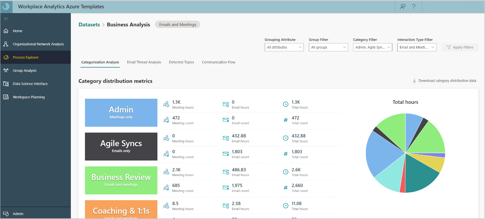
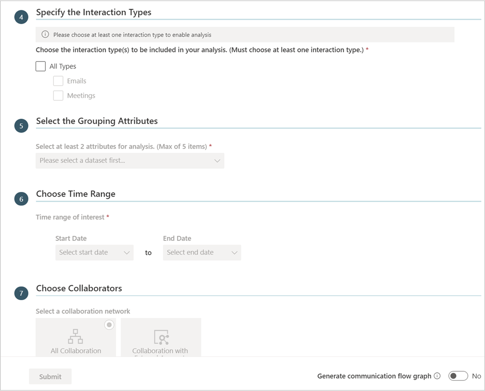
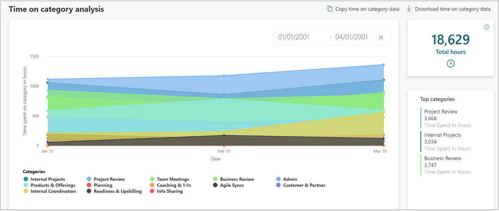
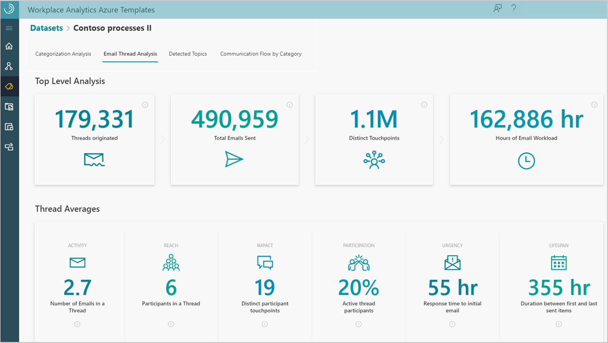
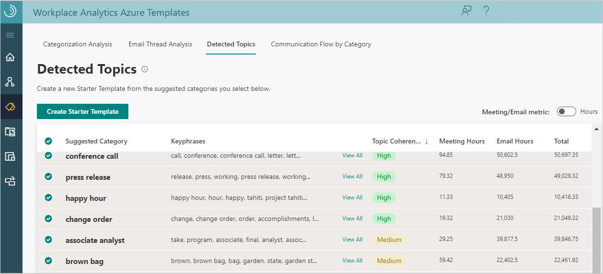
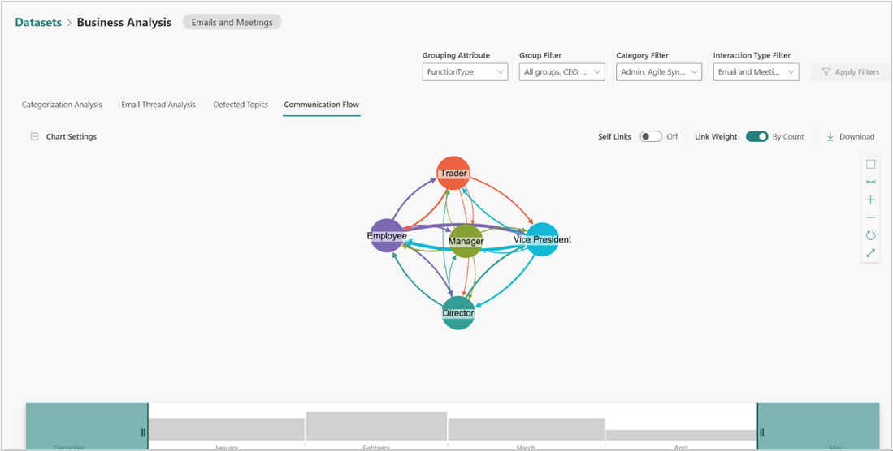

---

ROBOTS: NOINDEX,NOFOLLOW
ms.date: 04/18/2019
title: Process Explorer Azure Template for Workplace Analytics 
description: Learn about the Process Explorer Azure Template for Workplace Analytics and how to use it
author: madehmer
ms.author: helayne
ms.topic: article
ms.localizationpriority: medium 
ms.collection: m365initiative-viva-insights 
ms.service: viva 
ms.subservice: viva-insights 
search.appverid: 
- MET150 
manager: scott.ruble
audience: Admin
---

# Process Explorer Azure Template for Workplace Analytics

_This template is only available as part of a Microsoft service engagement._

Workplace Analytics Azure Templates includes the Process Explorer template that helps you understand where your organization and teams are investing or expending their valuable time.

You can use Process Explorer with your collaboration data in blob (cloud) storage to categorize and analyze processes, projects, meetings, and other activities.

You can use a starter template or a topic detection option to produce analyses. Starter templates include predefined factory and user-defined templates, comprised of categories and associated key phrases.

You can start with a factory template, which was created by data scientists to automatically categorize data into the most common data subjects. You can view and copy the factory starter templates, but you cannot directly edit or delete them.

By copying a factory template to the user-defined library, you can customize it by adding or removing categories and associated key phrases. Or you can create your own user-defined starter template based on your specific organizational data. All starter templates are saved in the **Starter Template Library** for building new analysis.

The following is available after the data is categorized through a starter template.

* **Categorization Analysis** - You can see how the activity data is distributed into predefined categories, including total number of meetings, meeting hours, email, and email hours by category. See [Categorization analysis](#categorization-analysis) for details.

* **Email Thread Analysis** - Shows static summary information about email activity for the selected dataset. See [Email thread analysis](#email-thread-analysis) for details.

* **Detected Topics** - Automatically detects topics and groups them into categories that you can copy over to your own starter template, and customize as needed. See [Detected topics](#detected-topics) for details.

* **Communication Flow by Category** - If the analysis includes an organizational network graph, this page will show you how specific categories are communicated across and within the various groups of an organization. See [Communication flow by category](#communication-flow-by-category) for details.

## To add new analysis

If you want to use an [Account mapping](deploy-configure.md#account-mapping) file to analyze external collaboration within Process Explorer, you need to confirm you have an existing Account mapping file or if not you need to create a new one. You can then use the following steps to add new analysis in Process Explorer.

1. In Workplace Analytics Azure Templates, select **Process Explorer**.
2. Select **Add New Analysis** (top right).
3. In **Define Analysis Settings**, select one of the following:

   * **Starter Template** - Choose and then select a predefined factory or a user-defined starter template in **Select a categorization Starter template**.
   * **Topic Detection only** - This option auto-detects topics in the selected dataset and then shows you the top results on the **Detected Topics** page. After the analysis is created with this option, you can export any relevant topics to a new starter template and customize the categories and key phrases by selecting **Create Starter Template**. With this option, all emails and meetings that are not categorized in the Categorization Analysis, Email Thread Analysis, and Communication Flow by Category pages can then be categorized.

    

4. In **Analysis Name**, enter a unique name for this analysis.
5. Select the applicable path for the dataset to use in this analysis.
6. Select the interaction types to be included in this analysis, including meetings, emails, or both. Note that you must include emails to have access to Email Thread Analysis.

   >[!Note]
   >If you are using the Starter Template Categorization Model and the starter template you selected has specific interaction types selected for each category, this step will override any of the conflicting interaction type selections. For example, if **Category A** only has email data and you select to include **only meetings**, then **Category A** will have no data in the final analysis.

    

7. Select the grouping attributes to include in this analysis. You can filter your data by these attributes in the final analysis.

   >[!Note]
   >Attributes that exceed the maximum allowed values cannot be selected.

8. In **Choose Collaborators**, you can select:

   * **All Collaboration** - All internal collaboration activity as specified for this analysis.
   * **Collaboration with External Accounts** - Analyzes interactions with specified external domains or accounts in addition to analyzing internal collaboration activity.

9. For **All Collaboration**, skip to the next step. Otherwise, in **Choose Account Mapping File**, you can either keep the default of **No Account Mapping File** or select an [account mapping file](deploy-configure.md#account-mapping) for this analysis.
10. If prompted for **External Collaborators**, select which domains or accounts (if using an account mapping file) you want to include in this analysis. For **Apply Filters** or **Apply Filters for Internal Collaborators**, you can optionally select applicable filters to reduce and focus the dataset for analysis.
11. Then do one of the following:

    * **No organizational network graph** - For no graph, leave the default set to **No**, and select **Submit**. Then skip to **Step 13**.
    * **Generate Organizational Network Graph** - If available, change the setting to **Yes** to include **Communication Flow by Category** in the analysis, and then select **Next**.

    >[!Important]
    >With the default **No** setting, **Communication Flow by Category** will not show or be available with this analysis. This setting is not available with the **Collaboration with External Accounts** option.

12. In **Specify the Interaction Types and Thresholds** for **Organizational Network Graph Settings**, select the following.

    * **Choose the interaction type(s)** - Select what to analyze in the dataset, independently or all emails and meetings.
    * **Maximum number of people involved in each interaction** - Select the maximum number of people involved in each interaction.
    * **Maximum duration of a meeting or call** - Select the maximum number of hours of the meeting.
    * **Advanced Settings** - Select to turn it **On** if you want to specify thresholds for interactions, such as a minimum number of emails, meetings, and interactions across both types.

13. In **Select the Grouping Attributes**, select two to five HR attributes to group by for the analysis, and then select **Submit**.
14. Data analysis creation takes a few minutes to complete depending on the size of the dataset. The name will show in the **Analysis** table with the following details and available actions.

    * When the **Status** changes to a green check mark, you can select the analysis to view it.
    * **Model Type** shows analysis was created using a starter template or the topic detection only model.
    * Select the **Parameters** icon to view the settings used when creating the analysis.
    * **Source** shows the dataset the analysis is based on.
    * Select the **Job Details** (i) icon next to **Status** to view the job details.
    * Select a table column heading, such as **Name** or **Submitted**, to sort the list by.
    * Select the **Delete Dataset** (trashcan) icon to delete analysis that you created from the list.
    * If the dataset fails with a **Status** of a **red X**, you need to create a new analysis.

## Categorization analysis

You can analyze both emails and meetings or you can select to analyze only emails or only meetings. You can see how the activity data is distributed into predefined categories, including: total number of meetings, meeting hours, email, and email hours by category. If you select to only analyze meetings, Email Thread Analysis will be unavailable.

You can also select **Download Category Distribution Data** to download a .csv file of this categorized data activity.

You can filter the data by the grouping attributes that you selected when creating this analysis. The chart and metrics will change to reflect the filters you apply. You can also use filters on the **Communication Flow** and **Time on Category Analysis** charts.

The **Time on Category Analysis** chart at the end of this page includes the following data:

* **Total hours** - Shows the total number of hours spent based on the filters selected for the chart data, including the selected categories and communication types (all, email, or meeting activity) that have been categorized for the dataset for the selected period of time.
* **Date filter** - You can select a Start Date and End Date for the time period of data that you want to see in the chart. The default is **All**, which shows all time periods available in the dataset.

 

You can also select **Copy Time on Category Data** or **Download Time on Category Data** for a .csv file of the data.

## Email thread analysis

An email thread includes a sent email and all its succeeding replies. Use **Email Thread Analysis** to analyze email.

In **Process Explorer**, select a data analysis name, and then select **Email Thread Analysis**.

You can see static summary information, including top level analysis, thread averages, and thread metrics for the first 1,000 threads in the selected dataset. In the **Thread Data** section, you can do the following.

* Select **Download** to view data for either the **Thread Summary** or **Thread Details** in a .csv file for all email threads in the dataset.
* Select **Copy Data** to copy a table view of either the **Thread Summary** or **Thread Details** data.

 

   |Thread metric |Description |
   |--------------|-------------|
   |Threads originated |Distinct number of email thread IDs.|
   |Total emails sent |Total number of sent emails.|
   |Distinct touchpoints |Number of participants across all threads multiplied by the number of emails in the thread. |
   |Hours of email workload |Total number of hours spent on email threads.|
   |Average number of emails in a thread |Average number of emails sent within email threads. |
   |Participants in a thread |Average number of all participants in email thread, including passive participants. The average is calculated by dividing the number of participants by the number of email thread IDs.|
   |Distinct participant touchpoints |Total number of touchpoints divided by the number of email thread IDs. |
   |Average participant workload generated |Number of email hours generated by all participants in the thread divided by the number of email thread IDs. |
   |Active thread participants |Number of participants within a thread that send at least one email in the thread divided by the number of all participants. |
   |Response time to initial email |Average time between first email sent in a thread and the first reply. |
   |Duration between first and last sent items |Average duration of time between first email and the last email in a thread. |

## Detected topics

This template uses a natural-language processing algorithm to look at all the uncategorized meetings and emails, detect clusters of associated keywords in the dataset, and categorize them for your review. **Detected topics** shows up to 50 suggested categories, each with 20 associated phrases. By default, suggested categories are sorted by their coherence score, which indicates the likelihood the words within each cluster of associated phrases are related to the suggested category. You can select any of the suggested categories within the table, and then select **Create Starter Template** to include them in a new starter template.

  

If the analysis already includes some categorized emails and meetings, you can select to include these categories and their associated key phrases when creating a new starter template, or you can select to omit them.

  

You can then edit the category name or delete it entirely. For each category, you can change the associated key phrases to include or exclude. You can also add an **asterisk** (*) to a word as a wild card (also known as a word stem). For example, the following graphic shows **resourc** with an asterisk in **Key phrases to include** for the **Team meetings** category. This will include the five shortest uses of a word beginning with “resource” in the subject lines. For example, meetings and emails with the words resources, resourcing, or resource group in the subject lines would be included.

For each category, you can also select which interaction types to include. Note that when creating new analysis, if you select a conflicting interaction type to include, the interaction types selected in that step will override what you selected in the template.

  

After you create a new starter template, you can then use it when creating new analysis.

## Communication flow by category

If you selected to include an organizational network graph when adding new analysis, your analysis will include Communication flow by category. This page shows how specific categories are communicated across and within the various groups of an organization for varying time periods with the following functionality.

* **Self Links** - Turn it on to see how a group communicated with itself on the specified categories.
* **Link Weight by Hours** or **by Count** - Select an option for how you want to see the communication flow and the links will scale accordingly. Link weight is per person for the selected time period, such as hours per person.
* **Graph tools** - Use the tools to the right of the graph to move and adjust graph elements, fit chart to view, zoom in and out, run the layout, and switch between a full screen and window view.
* **Time Bar** - Adjust the bar to show how the communication flows over the selected time period. For example, double click a month in the time bar to select only that month to view in the graph.
* **Play an animation** - Use the **play**, **pause**, and **skip** buttons at the bottom of the time bar to show an animation of how the communication flow evolves for the selected time period. For example, select the **play** button to watch how communication changes in the groups shown in the graph over time.

   

* **Download** - Use to download a .csv file of the communication flow data.

## Related topics

* [Workplace Analytics Azure Templates overview](./overview.md)
* [What's new in Workplace Analytics Azure Templates](./release-notes.md)
* [Deploy and configure Workplace Analytics Azure Templates](./deploy-configure.md)

