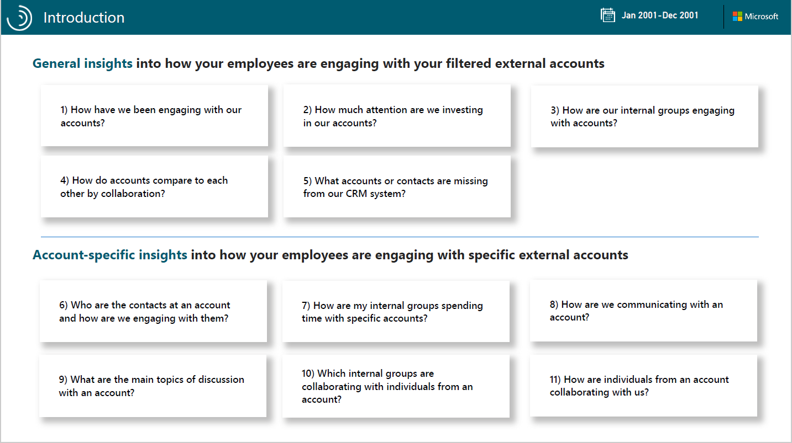
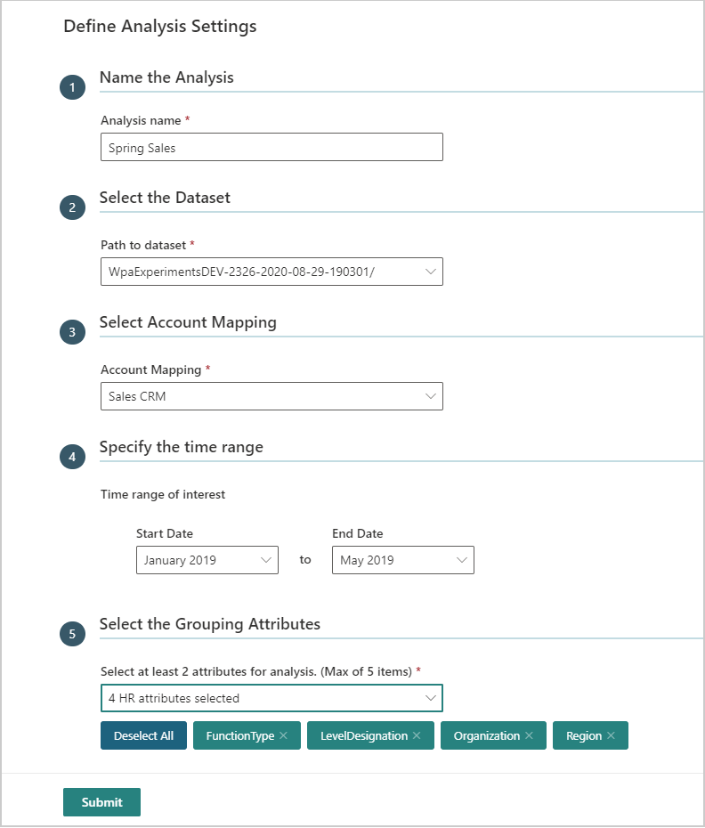
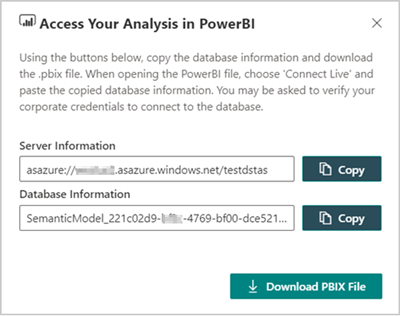

# Relationship Intelligence

_This template is only available as part of a Microsoft service engagement._

Workplace Analytics Azure Templates includes the Relationship Intelligence report for Power BI. You can use this report to analyze relationships your organization has with collaborators external to the company, such as relationships with customers or partners.

Workplace Analytics has a variety of measures to help you visualize and analyze formal and informal relationships within your organization. This report can help you understand how internal groups are communicating and spending their time with ***external*** collaborators.

This report uses account and contact information from a Customer Relationship Management (CRM) platform, such as Dynamics or Salesforce. The CRM data provides account-level focus and insights into relationship patterns. If no account or contact data is available, it analyzes external domain-level collaboration as a proxy for accounts.

The Relationship Intelligence report includes a **General insights** section that shows how your employees are engaging with your customers and an **Account-specific insights** section about how your employees are engaging with a specific account.

1. **How have we been engaging with our accounts?** – Shows what percentage of accounts your organization or select groups were meaningfully engaged with the defined group of accounts. It also shows a chart based on the average connectivity score by account group. When you select a group from the chart on the left, the chart on the right will change to show only the selected account data.
2. **How much attention are we investing in our accounts?** – Shows the level of investment in accounts based on the interaction type, including the total cost and number of hours invested in collaboration with the account over the selected time period. It also shows the average number of internal employees working with accounts. When you select a group to focus on, you’ll see their data highlighted in the charts.
3. **How are our internal groups engaging with accounts?** – Shows the average number of collaboration hours invested with accounts by internal groups and their time investment with accounts over the selected date range.
4. **How do accounts compare to each other by collaboration?** – Includes the following information as related to account collaboration activity, such as email and meeting hours spent with accounts and the last date the organization engaged with them. You can filter and focus the list by using the account name, account size, connectivity tier, and/or connectivity score.

   

   * The **Recent connectivity score** is based on the amount, frequency, and timeliness of collaboration activity with an account. The scores are divided into the following values that can be filtered into any combination.

     * Low: 1 to 29
     * Medium: 30 to 79
     * High: 80 to 100
  
   * The **Account size** filters are based on the estimated number of people in your organization who interacted with or contacted customer accounts. The sizes are divided into the following values that can be filtered into any combination.

     * XS: 1 to 2 contacts
     * X: 3 to 9 contacts
     * M: 10 to 49 contacts
     * L: 50 to 99 contacts
     * XL: 100 to 499 contacts
     * XXL: 500 or more contacts

   * The **Connectivity tiers** categorize each account into one of the following percentiles out of all of the accounts the organization engages with, which you can filter down to any combination of tiers.

     * Bottom 5 percent
     * Bottom 25 percent
     * Bottom 50 percent
     * Top 50 percent
     * Top 25 percent
     * Top 10 percent
     * Top 5 percent

   * The **Connectivity rank by account size** ranks each account by comparing its connectivity score with all the other accounts of a comparable size that your organization interacts with. You might see rank ties between one or more accounts who have the same connectivity score and the same size designation.

5. **What accounts or contacts are missing from our CRM system?** – Shows individuals assigned to an account but that are not in your CRM data. It also shows **Detected domains** that lists individuals included in the data who are missing or incorrect in the CRM or account data. You can select to filter the list by an account or an email address.
6. **Who are the contacts at an account and how are we engaging with them?** – For the selected account, you can evaluate the following:

   * See visuals about the average **Collaboration investment** and **Connectivity Score** and how the score has changed over the selected time and how metrics contributing to the score have changed over the last three months.
   * This page helps you see what type of communication has occurred with contacts over time and who the top individual account contacts are that the organization has collaborated with.
   * It also shows if the contacts you’re communicating with are in the CRM data or not.

7. **How are my internal groups spending time with accounts?** - For the selected account, you can see the top internal groups in the organization who have collaborated with account contacts per month. The **Group Engagement** chart shows the monthly total collaboration hours for the internal groups.
8. **How are we communicating with an account?** – Shows the following details about the selected account:

   * The **Connectivity score over time** chart shows how consistently the internal groups have communicated with the selected account from month to month. You can also see the metrics that were used to determine the connectivity score, including the number of contacts, their collaboration hours, and the recency of the collaboration with the account.
   * The other charts show collaboration trends by interaction type and how meaningful the interactions were over the selected time period.

9. **What are the main topics of discussion with an account?** – The **Topics** word cloud is based on subject lines for meetings and email. It shows the main topics that the account’s collaboration activity was focused on. Use the **Time range selection** to see how the topics in the word cloud change based on what date range is selected.

   >[!Note]
   >If your data does not include subject lines for meetings and email, the word cloud will be empty because of the lack of data.

10. **Which internal groups are collaborating with individuals from an account?** - Shows which groups are collaborating with the selected account. When you select a group, you’ll see the list of the individual account contacts that group collaborated with, including their email addresses, connectivity scores, titles, influence ranks, and other details.
11. **How are individuals from an account collaborating with us?** – You can select a specific account and an individual account contact to see how that person is collaborating with one or more of the organizational groups over the last three months. This page focuses on details, such as their most recent connectivity score, CRM status, job title, latest engagement date, and more details about how and how often they’re collaborating with internal groups.

## Steps to create the report

1. [Prerequisites](#prerequisites) - Confirm or complete all the prerequisites.
2. [Add an account mapping](deploy-configure.md#account-mapping) - Follow the steps to create a new account mapping file for Workplace Analytics Azure Templates.
3. [Add new analysis](#add-new-analysis) - Follow the steps to create the dataset in Workplace Analytics Azure Templates that the Power BI report uses.
4. [Load the data and view the report](#load-the-data-and-view-the-report) - Follow the steps to download the template and load the data in Power BI. You can then use Power BI to visualize the data and drill in and focus on account details.

## Prerequisites

* **CRM data** –  Accounts and contacts exported as .csv files from your CRM, such as Microsoft Dynamics or Salesforce. See [Required CRM file formats](deploy-configure.md#required-crm-file-formats) for details about what the files must include based on the type of CRM.
* **Data export** - The Viva Insights or Workplace Analytics must include  **ExternalCollaboratorIDs** and *unhashed* **Subject lines** in the [Data export from Workplace Analytics](data-export.md#to-export-data). The subject lines are required to view topic results from your organization's email and meetings in the report. If this data is unavailable, that section of the report will show no data.
* **Power BI Desktop** - Have the latest version of Power BI Desktop installed locally. If you have an earlier version of Power BI installed, uninstall it before installing the new version. Then go to [Get Power BI Desktop](https://www.microsoft.com/p/power-bi-desktop/9ntxr16hnw1t?activetab=pivot:overviewtab) to download and install the latest version.
* **Template access** - Have access to the Relationship Intelligence Azure Template, which is required for you to view the data in the Power BI report.

## Add new analysis

After you add an [account mapping file](deploy-configure.md#account-mapping) for your customer accounts and contacts, do the following to create the dataset for the report.

1. In Workplace Analytics Azure Templates, select **Relationship Intelligence** > **Add New Analysis** (at top right).
2. In **Define Analysis Settings**, enter a friendly name for the analysis and select the path to the dataset.

    

3. In **Select Account Mapping**, select the mapping file you created in [Account mapping](deploy-configure.md#account-mapping).
4. To only select a subset of the data, select the applicable start and end dates in **Specify the time range**.
5. In **Select the Grouping Attributes**, select two to five HR attributes to analyze and use to pivot analysis in Power BI. These are the HR attributes imported with the organizational data from Workplace Analytics.
6. Select **Submit**. Creating the dataset will take a few minutes up to a few hours based on the size of the data.
7. In **Relationship Intelligence** > **Analysis**, the analysis table includes the name, the source, the date it was submitted, who submitted it, and the following:

   * **Download** - Select to copy a link to this dataset and download the Power BI template.
   * **Parameters** - Lists details about the job parameters, such as the input path, output folder, excluded keywords, the mapping file name, the HR attributes included, and the person who created this analysis.
   * **Status** - Analysis shows a green check mark when it successfully adds it. A red X means it failed.
   * **Details** - Lists the job details including error messages (far right column) to help troubleshoot a failure.
   * **Delete** - Select to delete analysis that failed or that's no longer needed.

    >[!Note]
    >If you delete the job, the underlying data required for the report is also deleted and any Power BI file that uses this data won’t work or show any data because it uses a link to the live data.

    

    

## Load the data and view the report

1. In **Workplace Analytics Azure Templates** > **Relationship Intelligence** > **Analysis**, when the analysis status has a green check mark, select the **Download** icon for the analysis.
2. You need to copy both the server and database information for this analysis when prompted in Power BI Desktop in **Step 6**.
3. Select **Download PBIX File** to download the Power BI template for the report.
4. Open the downloaded file in Power BI Desktop.
5. If prompted, sign in with your corporate credentials.
6. Do one of the following in Power BI Desktop:

   * If you get a "data unavailable" error, select **Edit**, and then paste the server and database names that you copied for the analysis in **Step 2** in the **Server** and **Database** fields, and then select **OK**.
   * If no error occurs, select **Transform data** > **Data source settings** and paste the server and database names that you copied for the analysis in **Step 2** in the **Server** and **Database** fields, and then select **OK**.

7. If prompted by the Navigator, select **Model**, and then **OK**.
8. It might take a few minutes to load the data from the database into the report. After it loads, you can analyze report data with Power BI tools and visualizations.

## Report settings

After the Relationship Intelligence Report is set up and populated with data, use the following to confirm the report settings.

* **Time period** - Select the specific date range you want analyze within the date range of data included in this report.
* **Employee grouping attribute** - Select an internal organizational attribute to group employees by for the report data. Optionally, select a value to focus the reporting on.
* **Filtered accounts** - Shows the number of accounts included in the dataset based on the selected account attribute settings.
* **Filter accounts** – Select an account attribute and value that you want to filter by for your analysis. Attributes are added based on columns included in the Accounts CRM file.

  For example: If the Account CRM file includes a Region column that indicates where the account is geographically located, the Attribute filter will include “Region” and the value will show them. By selecting a subset of region values, you can focus the report pages to only show account data for the selected regions.

* **Account grouping attribute** - Select an account grouping attribute and value to group accounts by in the **General Insights** report section.

## Power BI tips, troubleshooting, and FAQs

* **General insights** and **Account-specific insights** – The data on pages 1 through 5 show generally how your employees are engaging with your customers. Pages 6 through 13 are specific to the account that you select at the top of each page.
* **Power BI data error** - If you see an error similar to the following, you might not have the correct information copied for the Server and Database fields in Power BI. Repeat the steps in [Load the data and view the report](#load-the-data-and-view-the-report).

    

For details about how to share the dashboard and other Power BI tips, to troubleshoot common issues, or to review the FAQ, see [Power BI templates in Workplace Analytics](/viva/insights/tutorials/power-bi-templates?toc=/viva/insights/use/toc.json&bc=/viva/insights/breadcrumb/toc.json).

For more details about how to use Power BI tools, see [Interact with visuals in reports, dashboards, and apps](/power-bi/consumer/end-user-visualizations).

## About the metrics

The following metrics are used in Relationship Intelligence.

|Metric |Description |
|-------|-----------|
|Connectivity Score |Geometric mean of the inverse of the Latest Engagement, the Total Collaboration Hours, and the Collaboration Participants divided by the number of internal and external people involved in the interactions. Normalized to control for the different account sizes, the score is higher for customers who have more participants and collaboration hours and were more recently contacted.  number of people, total time, and recency of communication between internal groups and external accounts. |
|Email Hours |Total number of hours spent collaborating in emails with an individual, group, or account. |
|Collaboration Participants|Total number of unique participants in an external domain that internal groups are directly connected with or the number of unique internal contacts that external individuals or accounts are interacting with depending on the report table. |
|Influence Rank |Indicates a group or an individual's potential influence on opinions of the network. Essentially, the number and strength of connections for a group or an individual. The values are between 0 and 1. The metric is exposed as a rank within a group where 1 is the most influential. |
|Latest Engagement |The most recent date where an external account or individual was contacted by an internal group. |
|Meaningful Connections |Within any given month, two individuals must have had at least two emails, two meetings, or one email and one meeting to count as a meaningful connection. Emails or meetings must have two to eight participants (including cc'd or bcc'd people). Meetings longer than eight hours or with over 550 participants are excluded. Also, meetings with keywords, such as party, vacation, sick leave, and so on, are also excluded.|
|Meeting Hours |Total number of hours spent collaborating in meetings with an individual, group, or account. |
|Total Collaboration Hours |Total sum of Email Hours and Meeting Hours, which represents the total person hours spent with an individual, group, or account. |

For details about how to share the dashboard and other Power BI tips, to troubleshoot common issues, or to review the FAQ, see [Power BI tips, FAQ, and troubleshooting](/viva/insights/tutorials/power-bi-templates?toc=/viva/insights/use/toc.json&bc=/viva/insights/breadcrumb/toc.json).

## Related topics

* [Workplace Analytics Azure Templates overview](./overview.md)
* [What's new in Workplace Analytics Azure Templates](./release-notes.md)
* [Deploy and configure Workplace Analytics Azure Templates](./deploy-configure.md)
