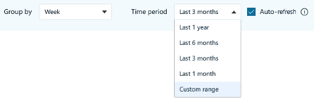

---

title: To create an auto-refresh query
description: How to create an auto-refresh query in advanced insights
author: madehmer
ms.author: helayne
ms.topic: include
ms.localizationpriority: medium 
ms.collection: m365initiative-viva-insights 
ms.service: viva 
ms.subservice: viva-insights 
search.appverid: 
- MET150 
---

**To create an auto-refresh query**

1. In **Analyze** > **Query designer** > **Create**, and then select **Get started** under **Query**. 
2. Select a query type, such as Person query.
3. Name the query and add an optional description.
4. Select a time range, such as one month or one year:

    

   >[!Note]
   >Auto-refresh is available only for the predefined time ranges in the Time period list. If you select **Custom range**, the Auto-refresh option is unavailable.

5. Select **Auto-refresh**.
6. Select **Run**.
