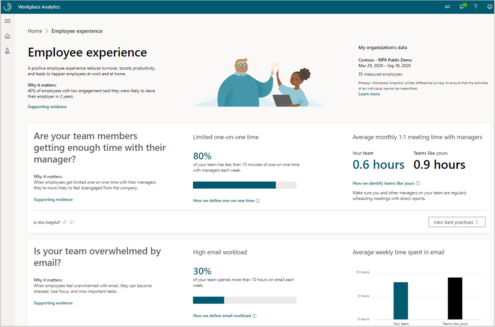

---

title: Introducing Manager insights
description: About Manager insights in Microsoft Viva Insights in Teams and in the advanced insights app and how to use them to help manage your team
author: madehmer
ms.author: v-lilyolason
ms.topic: conceptual
ms.localizationpriority: medium
ms.collection: viva-insights-manager 
ms.service: viva 
ms.subservice: viva-insights 
search.appverid: 
- MET150 
manager: helayne
audience: Admin
---

# Manager insights introduction

Managers like you can discover key insights about your team’s collaboration effectiveness and employee experience in the Microsoft Viva Insights app and on the web, and in Advanced insights.

Managers who are assigned licenses can view their team's [organization trends](../org-team-insights/org-trends.md) within the Viva Insights app.

## How do these insights help

You can use these insights as a first step in understanding collaboration norms in your team, and effectively driving change in collaboration to improve team wellbeing and productivity. The following are a few ways you can leverage insights.

* **Develop a culture of 1:1 coaching** - See how much time team members spend one-on-one with their managers and if it aligns with the culture you're striving for.
* **Improve meeting and email habits** - Help your team reduce excessive meetings and improve email habits to support team effectiveness and productivity.
* **Support team wellbeing** - Check on your team’s after-hours work habits and use these insights to balance their schedule flexibility and the need to disconnect.
* **Cross-team collaboration** - Review how your team is collaborating with the rest of the organization and reflect on how you might help expand your team's network.

## Why it's important

Each insight includes **Supporting evidence** and **Best practices** that link you to related information, such as [Microsoft Workplace Insights](https://insights.office.com/), which are authored by:

* Industry experts based on research
* Organizations that have effectively used Viva Insights to improve their business outcomes

Research helps explain why managers have such a large impact on their team's productivity and wellbeing:

* Managers account for 70 percent of the variance in employee engagement scores.
* Employees tend to model their behaviors after their managers.
* Employees who regularly connect with their manager while working remotely are less impacted by increases in workday span and collaboration hours.

The following shows an example of an employee experience insight about manager one-on-one time and after-hours team collaboration.

## How to get started

* See [Get started](./get-started.md) to sign in and get more details about your team's insights.
* Have questions? Review the [FAQ](./faqs.md).

## Team privacy is important

The apps use de-identified data from emails, meetings, calls, and chats in Outlook and Teams to uncover insights about collaboration in your organization. As a manager, you will only ever see aggregated data about your team with no access to individual insights.

The apps also use differential privacy to keep personal data private. Differential privacy is a technology that allows researchers and analysts to pull useful information from databases containing personal information while simultaneously protecting individual privacy. This is achieved by introducing slight variations to the data to protect privacy while still maintaining accuracy, so managers have confidence in the observed values.

To learn more about differential privacy, see [Differential Privacy](../privacy/differential-privacy.md) and [Differential Privacy for Everyone](https://download.microsoft.com/download/D/1/F/D1F0DFF5-8BA9-4BDF-8924-7816932F6825/Differential_Privacy_for_Everyone.pdf).
