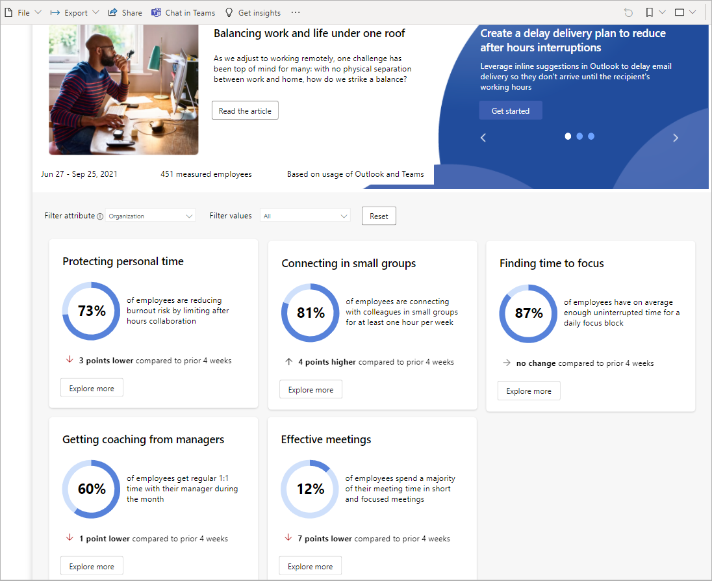
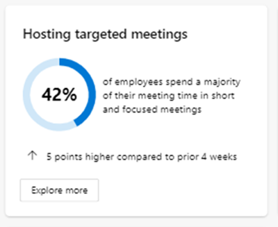

---

title: Employee experience Power BI template from Organization trends
description: Use the Employee experience Power BI template to learn more about focus time, manager coaching, and other key experience indicators for your organization
author: lilyolason
ms.author: v-lilyolason
ms.topic: article
ms.localizationpriority: medium 
ms.collection: 
- m365initiative-viva-insights 
- viva-insights-leader
ms.service: viva 
ms.subservice: viva-insights 
search.appverid: 
- MET150 
manager: anirudhbajaj
audience: Admin

---

# Employee experience Power BI

With the new Power BI template and dashboard from Microsoft Viva Insights, you'll learn more about focus time, manager coaching, and other key experience indicators for your organization. You’ll be able to customize the template by grouping and filtering for parts of the organization, and you’ll receive actionable insights to help improve wellbeing and productivity.

The dashboard in Power BI includes the following reports:

* **Protecting personal time** - Shows the percentage of employees who are successfully protecting their personal time by limiting their after-hours work to less than five hours each week. As digital collaboration becomes our new norm, it’s important to establish communication guidelines and boundaries to encourage employees to balance work and life and maintain good wellbeing.
* **Connecting in small groups** – Shows how much time employees spend interacting at least one hour each week with eight or fewer people to encourage small-group collaboration where most have a voice in the activity.
* **Finding time to focus** - Measures how much uninterrupted focus time your employees get during the workweek, which are one- to two-hour blocks of time with no collaboration activity. People need this valuable time to complete challenging work, think creatively, and generate new ideas.
* **Getting manager coaching** - Measure how much 1:1 time managers spend with their employees on average each month. Research shows that time spent 1:1 with your manager helps keep employees engaged and improves their job performance and career development.
* **Effective meetings** - Shows the percentage of employees who spend most of their time in short or focused meetings, which are less than one hour long with two to eight participants. Research shows short and targeted meetings are more inclusive with higher participation where decisions get made and work gets done.

Each report also includes the following details:

* **How we measure this** - Near the top of each report, you can select "How we measure this" to see what metrics were used to calculate the data and insights provided.
* **Top tools and suggestions** - In the blue area at the top right of each report, you'll see a few suggestions and tool tips that can help support the insights and analysis shown on the page.
* **Supporting articles** - To the right of "Current State," you'll see links to articles about why this analysis matters based on industry research and other businesses experience.
* **Go deeper** - Shows other available reports or options that you can use for more advanced and focused analysis relating to the data shown.
* **Supporting insights** - This section shows the top insights that are important to focus on based on the analysis shown. For example, for Protecting personal time, you might see insights about what activities drive most of your employees' after-hours work and how many hours they spend collaborating.

The following is an example of what you'll see in the Protecting personal time report:

## Prerequisites  

Before you can run the results and populate the dashboard in Power BI, you must:

* Be assigned [Insights Business Leader role](../use/user-roles.md).
* Have the latest version of Power BI Desktop installed. If you have an earlier version of Power BI installed, uninstall it before installing the new version.
Then go to [Get Power BI Desktop](https://www.microsoft.com/p/power-bi-desktop/9ntxr16hnw1t?activetab=pivot:overviewtab) to download and install the latest version.

## Set up the dashboard

>[!Note]
>This dashboard is currently only available in English.

1. In the Viva Insights app, select **Organization trends**, and then go to the **Unlock more insights** card within the **Recommendations** section.
2. Select **Download now**.
3. Open the downloaded **Employee experience** template, and if prompted to select a program, select **Power BI**.
4. If you're already signed in to Power BI with your Viva Insights organizational account, the dashboard visualizations will populate with your data. You are done and can skip the following steps. If not, proceed to the next step.
5. If you're not signed in to Power BI, or if an error occurs when updating the data, sign in to your organizational account again. See [Troubleshooting](../tutorials/power-bi-templates.md#troubleshooting) for more details.

    >[!Important]
    >You must sign in to Power BI with the same account you use to access Viva Insights.

6. In Power BI Desktop, select **Publish** at the top (ribbon), and then sign in with the same email address you use for Microsoft Viva.
7. Follow the online instructions to view these reports in your Power BI workspace.

## Achieved or At Risk KPIs

Because Viva Insights respects user privacy, the Employee experience reports in Power BI do not show information about individual recipients and when necessary to protect privacy, it reports approximated values only. For example, the following shows an approximation about “Hosting targeted meetings.” Groups with less than 10 employees are not shown in the reports. See [De-identification of personal data in Viva Insights](../privacy/de-identify-data.md) for details.

The following lists the minimum and maximum percentage ranges for the value thresholds that are used to categorize employees as **Achieved** as compared to **At Risk**, which fall outside of these ranges.

Number of employees in a group | Value threshold range for Achieved
--------------| ------------
10 | 25 to 75 percent
11 to 20 | 10 to 90 percent
21 or more | 5 to 95 percent

For more information, see [Differential privacy in Viva Insights](../privacy/differential-privacy.md).  

## Organizational data

After the dashboard is set up and populated with data in Power BI, as a first step, confirm the date range and number of measured employees that's shown at the top of each page is what you expected for this analysis.

>[!Important]
>As new data is processed on a weekly basis, select **On** for **Keep your data up to date** in the **Scheduled refresh** section in Power BI if you want the report data to refresh in Power BI each week. For details, see [Configure scheduled refresh](/power-bi/connect-data/refresh-scheduled-refresh#scheduled-refresh).

## Power BI tips, troubleshooting, and FAQs

For details about how to share the dashboard and other Power BI tips, troubleshoot any issues, or review the FAQ, see [Power BI tips, FAQ, and troubleshooting](../advanced/analyst/templates/power-bi-faq-troubleshoot.md).

