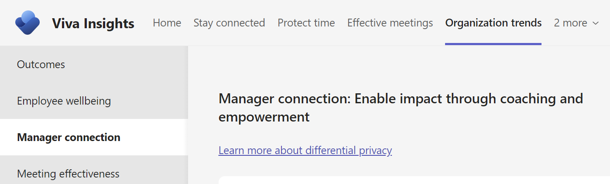
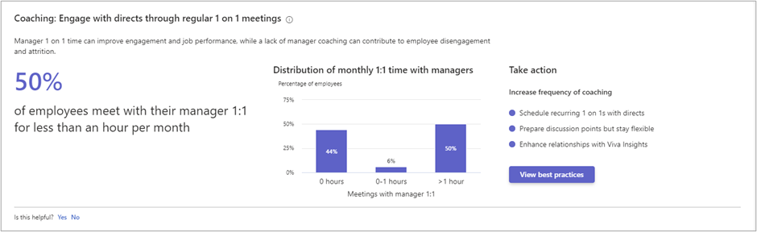

# Manager connection

Because a focus on *coaching* and *empowering* employees sets your team up to deliver their best, Microsoft Viva Insights uses these two elements make up the Manager connection framework. This article explains how to leverage best practices for coaching and empowerment, and how related insights are calculated.

You can find the **Manager connection** page in the Viva Insights app, within the **Organization trends** tab.

<!-- placeholder image-->

## Coaching

### Increase frequency of coaching

#### Insights

For **Coaching**, the **Manager connection** page provides a percentage insight that shows how many employees meet with their manager for less than one hour a month and a visual insight that shows the distribution of monthly 1:1 time with managers.

Here's some information about how those metrics are calculated:

Percentage insight |Metric | Calculation| 
|----------|-----------|----------------|
|Percentage of employees who have less than one hour of 1:1 time with their managers each month| [Meeting hours with manager 1:1](../advanced/analyst/metrics.md#meeting-hours-with-manager-1-1-define)| The percentage of employees who spend less than one hour of coaching time with their managers each month. This percentage is calculated monthly and averaged over the entire time period.|

|Visual insight| Definition|
|--------------|-----------|
Distribution 1:1 time with managers each month| Shows the percentage of employees based on their monthly average number of meeting hours with manager 1:1. They are divided into employees who have no 1:1s, between zero and one hour, and more than one hour of 1:1s with their manager in a month. These percentages are calculated monthly and averaged over the entire time period. This graph also uses the influence metric.

#### Best practices

Manager 1:1 time can improve engagement and job performance, while a lack of manager coaching can contribute to employee disengagement and attrition. According to the research referenced in [What great managers do daily](https://insights.office.com/productivity/what-great-managers-do-daily/): "A Gallup study found that at least 70 percent of the variance in employee engagement scores is driven by who the boss is."

Here are ways to engage with directs through 1:1 meetings:

* Schedule recurring 1:1s. One of the top best practices for promoting coaching and development is to require that managers schedule recurring 1:1 meetings with their direct reports for 30 minutes at least twice a month and hold them accountable for achieving that goal. See [Catch up with your team](../personal/use/use-the-insights.md#catch-up-with-your-team) for help with scheduling and managing your 1:1s.

* Prepare discussion points, but stay flexible. While 1:1s are best with some structure, flexibility allows you and your directs to talk about top-of-mind topics.
* Use Viva Insights to automatically schedule 1:1 time, receive reminders to do so, and follow up on tasks related to direct reports.

For more best practices and how to develop a 1:1 conversation series, see [Best practices for manager coaching](../tutorials/gm-coaching.md).

## Empowerment

### Cultivate autonomy

<!-- placeholder image-->

#### Insights

For **Empowerment**, the **Manager connection** page provides a percentage insight that shows how many employees have their managers attend a majority of their meetings and a visual insight that shows the distribution of manager-coaching relationships.

Here’s some information about how those metrics are calculated:

|Percentage insight |Metric| Calculation|
|-------------------|------|------------|
|Percentage of employees who have a majority of their meetings attended by their manager|[Meeting hours with manager](../advanced/analyst/metrics.md#meeting-hours-with-manager-define) and [meeting hours](../advanced/analyst/metrics.md#meeting-hours-define)|The percentage of employees who spend over 50 percent of their meeting hours with their manager in attendance. This percentage is calculated weekly and averaged over the entire time period.|

|Visual insight| Definition|
|--------------|-----------|
|Distribution of manager-employee coaching relationships |Uses the average time employees spend with their [managers in 1:1s](../advanced/analyst/metrics.md#meeting-hours-with-manager-1-1-define) and the percentage of [meeting hours with the manager](../advanced/analyst/metrics.md#meeting-hours-with-manager-define) in attendance. The different manager-employee coaching relationships are grouped by employee time percentages, which are weekly averages based on monthly calculations: <ul><li>**Coached** – An employee who spends more than 15 minutes in 1:1s and less than 30 percent of their meeting hours with their managers in attendance.</li><li>**Co-attended** – An employee who spends less than 15 minutes in 1:1s and more than 30 percent of their meeting hours with their managers in attendance. </li><li>**Micromanaged** – An employee who spends more than 15 minutes in 1:1s and more than 30 percent of their meeting hours with their managers in attendance. </li><li>**Under-coached** – An employee who spends less than 15 minutes in 1:1s and less than 30 percent of their meeting hours with their managers in attendance. </li> |

#### Best practices

When managers empower their employees to make decisions and tackle new challenges, it provides growth opportunities for employees while freeing up time for managers to get work done.

[How to boost your team’s productivity](https://insights.office.com/productivity/how-to-boost-your-teams-productivity/) explains that "helping your team manage its time well is a critical factor for its success."

Here are ways to promote autonomy through guidance and support:

* Encourage others on your team to take the lead. If you’re unable to attend a meeting, provide some notes in advance and delegate another team member to lead it.
* Use Teams to share meeting recordings and notes about decisions and action items as an alternative way to keep your team informed.

For more best practices and how to set team meeting rules and policy, see [Best practices for meetings](../tutorials/gm-meetings.md).
