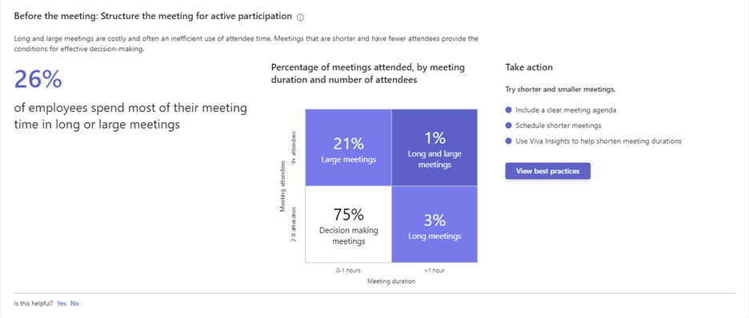

# Meeting effectiveness

Meetings often represent your organization’s largest resource investment. In Microsoft Viva Insights, three elements make up the Meeting effectiveness framework: Before the meeting, during the meeting, and after the meeting. This article explains how to leverage best practices before, during, and after your next meeting to make the most of this time.

You can find the **Meeting effectiveness** tab in the Viva Insights app, under **Organization trends**.

## Before the meeting

### Try shorter meetings

#### Insights

<!-- placeholder image-->

For **Try shorter meetings**, the **Meeting effectiveness** tab provides a percentage insight that shows how many employees spend most of their meeting time in long or large meetings, and a visual insight that shows the percentage meetings attended, divided into four categories.

Here's some information about how those metrics are calculated:

|Percentage insight  |Metric| Calculation  
|----------|-----------|-----------------|
|Percentage of employees who spend a majority of their meeting time in long or large meetings |[Long meetings](../advanced/reference/glossary.md#long-meeting-define), [large meetings](../advanced/reference/glossary.md#large-meeting-define), and [meeting hours](../advanced/analyst/metrics.md#meeting-hours-define) |Percentage of employees who spend a majority of their meeting hours in long meetings, which are more than one hour, or large meetings, which have more than eight attendees. This insight is calculated weekly and averaged for the entire time period. |

#### Best practices

Long and large meetings are costly and often considered a waste of time. Shorter meetings with fewer people can enhance individual and team performance.

The [condensed guide to running meetings](https://insights.office.com/collaboration/how-to-run-effective-meetings-and-stop-wasting-time/) explains a few new ideas that can help make your meetings more effective, such as, "if you want people to have the opportunity to contribute, you need to limit attendance." Here are some other ways to reduce meeting time:

* Include clear meeting agendas. When preparing a meeting agenda, consider your high-level goals and narrow down your talking points to reflect them.
* Schedule shorter meetings. Meeting discussions tend to expand to the full time allotted. Change meeting durations from 60 to 45 minutes and from 30 to 25 minutes to promote efficiency.
* Improve meeting efficiency with the [Outlook Insights add-in](../personal/Use/add-in.md). The Outlook Insights add-in provides reminders to shorten hour-long meetings to 45 minutes, making it easy to implement efficient meeting practices.

For more best practices and change strategies, see [Best practices for meetings](../tutorials/gm-meetings.md).

## During the meeting

### Improve meeting practices

#### Insights

<!-- placeholder image-->

For **Improve meeting practices**, the **Meeting effectiveness** tab provides a percentage insight that shows how many employees spend most of their meeting time in long or large meetings and a visual insight that shows the percentage of meetings attended, divided into four categories.

|Percentage insight  |Metric| Calculation  
|----------|-----------|-----------------|
|Percentage of employees who significantly multitask in meetings |[Multitasking hours](../advanced/analyst/metrics.md#multitasking-hours-define) | Percentage of employees who spend more than 25 percent of their meetings hours multitasking. This insight is calculated weekly and then averaged for the entire time period. |

|Visual insight| Definition|
|--------------|-----------|
 Distribution of weekly time spent multitasking | Percentage of employees based on their weekly [multitasking hours](../advanced/analyst/metrics.md#multitasking-hours-define). They are divided into those who spend between zero and one hour, one and five hours, and more than five hours multitasking in meetings. These percentages are calculated weekly and averaged for the entire time period. |

#### Best practices

Emailing and chatting during meetings can lead to different interpretations of decisions, missed guidance, and inconsistent follow-through on action items.

According to [If you multitask during meetings, your team will, too](https://insights.office.com/productivity/multitask-meetings-team-will/): “Managers that frequently send emails during meetings are, according to our analysis, are 2.2 times more likely to have direct reports who also multi-task in meetings.”

Here are ways to improve meetings:

* Create clear meeting agendas to stay on task. Agendas should clearly state meeting goals and the purpose of each participant's attendance. Framing agenda topics as questions helps to focus and prime discussion.
* Add quick, 15-minute breaks to long meetings to keep meeting participants engaged during longer meetings.
* Use the [Outlook Insights add-in](../personal/use/add-in.md) to help prepare for meetings. The Outlook Insights add-in provides detailed meeting information, related documents, and reminders to book preparation time.

For more best practices and change strategies, see [Best practices for meetings](../tutorials/gm-meetings.md).

## After the meeting

### Reinvent the recurring meeting

#### Insights

<!-- placeholder image-->

For **Reinvent the recurring meeting**, the **Meeting effectiveness** tab provides a percentage insight that shows how many employees spend a majority of their time in recurring meetings and a visual insight that shows the percentage of recurring vs. non-recurring meeting hours.

Here's some information about how those metrics are calculated:

|Percentage insight  |Metric| Calculation  
|----------|-----------|-----------------|
|Percentage of employees who spend a majority of their time in recurring meetings | [Recurring meeting hours](../advanced/analyst/metrics.md#recurring-meeting-hours-define) |Percentage of employees who spend more than 50 percent of their meeting hours in recurring meetings. This insight is calculated weekly and averaged for the entire time period. |

|Visual insight| Definition|
|--------------|-----------|
Recurring vs. non-recurring meeting hours |Percentage of total meeting hours spent in recurring and non-recurring meetings. These hours are summed for the entire time period and then the percentages are calculated. These calculations use the [Recurring meeting hours](../advanced/analyst/metrics.md#recurring-meeting-hours-define) metric.

#### Best practices

Recurring meetings for team updates often consume large amounts of time. Over time they can become bloated with attendees, unproductive, and disconnected from original goals.

As described in [How to finally kill the useless, recurring meeting](https://insights.office.com/digital-transformation/how-to-finally-kill-the-useless-recurring-meeting/), we all know how wasteful a "bloated" weekly meeting can be. But there's hope: "To liberate victims from this seemingly inescapable vicious cycle, it’s necessary to kick-start a virtuous cycle in which everyone is empowered to say no, ask why, and identify strategies to allow everyone in an organization to be more effective on a day-to-day basis." 

Here are some ways to optimize recurring meetings:

* Audit recurring meetings and make sure they’re still necessary. Every quarter, reassess the need for the recurring meetings that consume the most time. Try canceling meetings that have lost relevance, or audit agendas and attendee lists for better focus.
* Experiment with shorter meetings. Fifteen-minute meetings with focused agendas are useful in fast-moving workplaces for quick team planning, updates, and recounting of work events.

For more best practices and change strategies, see [Best practices for meetings](../tutorials/gm-meetings.md).
