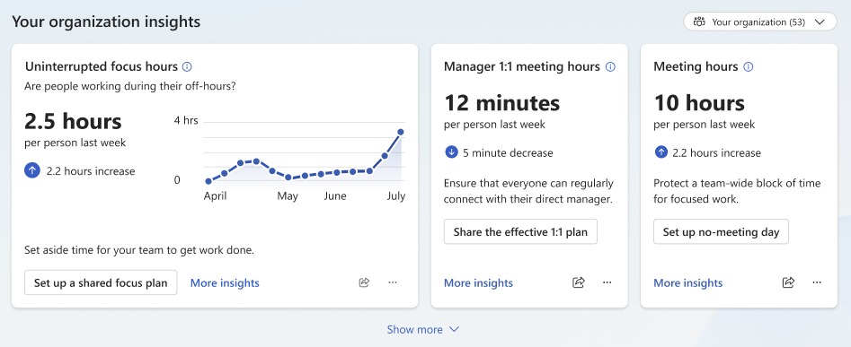
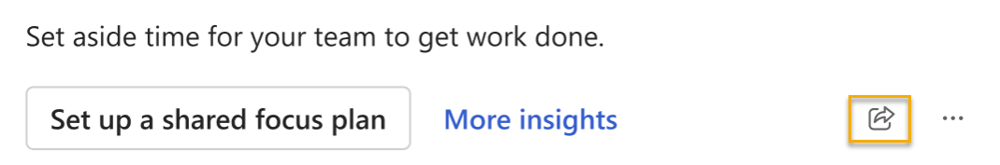

# Home

For a general introduction to organization insights in the Microsoft Viva Insights app--including who can see organization insights and how to navigate them--refer to [Organization insights in the Viva Insights app](org-insights-in-teams.md). The following article talks about organization insights on the **Home** tab.

## Featured insights

Each day, you'll find a different featured insight on the **Home** tab, which draws from this list:

* Uninterrupted focus hours
* Manager 1:1 meeting hours
* Meeting hours
* After-hours collaboration
* No-meeting day impact
* Daily connected hours
* Focus time participation
* Join on-time rate
* Focus time impact
* No-meeting day participation
* Multitasking hours
* Internal network size

Every insight shows the current week's average, and also shows the difference from the last week. 

To access other organization insight cards, select the **Show more** option beneath the visible insight cards.

## To share an insight

If you want to share a link to an insight you found on the **Home** tab, select the share icon on that insight's card. Pick whether you want to share the insight through a Teams chat or share a link to the insight card.

Sharing an insight through a Teams chat sends recipients a Teams chat message with a screenshot of the insight. You can edit the message before you send it.

<!--Do we have a screenshot we can share of this? I couldn't seem to find one on the Figma.-->

Sharing an insight through a link sends recipients directly to the insight card on their own **Home** tab. This method is more suited for people within the same organization who both have permissions to access organization insights.

<!--could we put this in the FAQ? Seems like a bit too much info in this location/situation.

Sending a link doesn't grant anyone permissions to view data, so if recipients don't already have access to organization insights, they won't see anything new when they follow the link. -->

